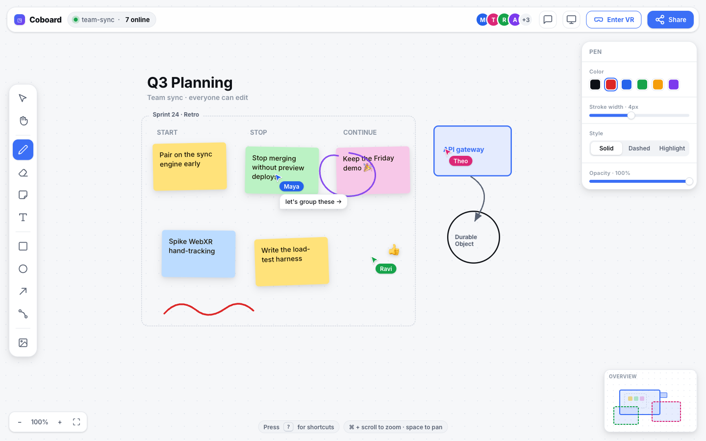
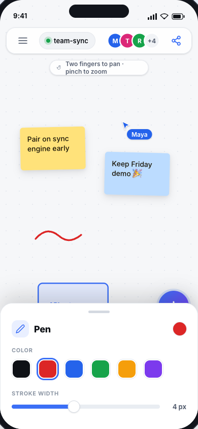
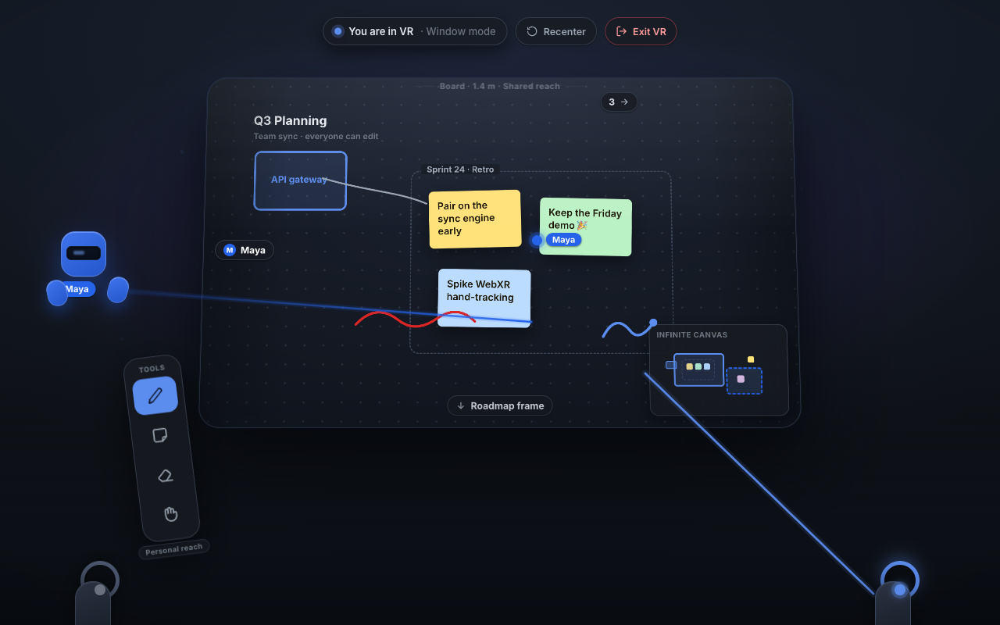
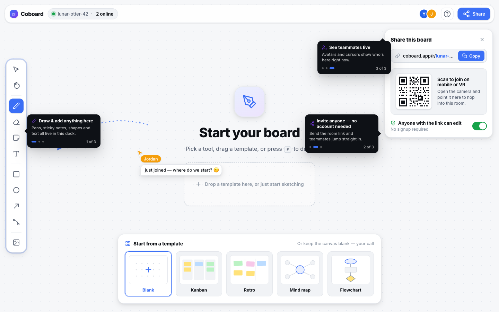
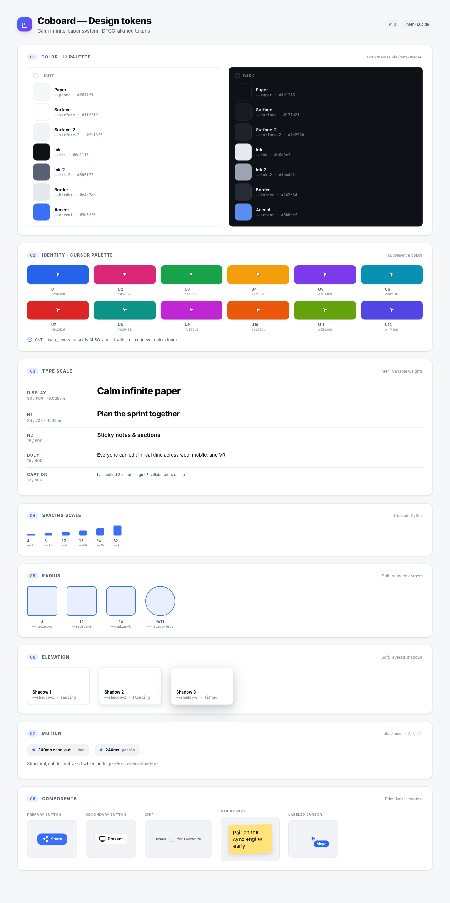
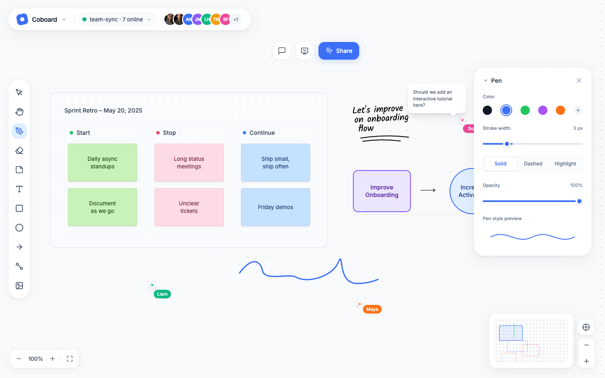

# Coboard — Visual Design, UI & UX

> _The look, feel, and interaction model for Coboard across desktop, mobile/tablet, and VR — design language, tokens, wireframes, shortcuts, presence, comfort, and accessibility._

**Related documents:** [README](../README.md) · [01 Product Vision & References](./01-product-vision-and-references.md) · [02 Features & Scope](./02-features-and-scope.md) · [04 Technical Architecture](./04-technical-architecture.md) · [05 Scaling & Cost](./05-scaling-and-cost.md) · [06 Implementation Roadmap](./06-implementation-roadmap.md) · [07 Engineering Quality, Performance, Security & Accessibility](./07-engineering-quality-security-accessibility.md)

---

## 1. Design language & mood

Coboard's aesthetic is **calm infinite paper**: a quiet, near-neutral canvas that recedes so the user's content is the only thing that draws attention. Chrome is light, floating, and self-effacing; ink and stickies are vivid. The same visual identity holds whether the surface is a browser canvas, a phone, or a 3D plane floating in a VR room.

| Principle | What it means concretely |
| --- | --- |
| **Content-first** | The canvas is the hero. UI is translucent, floats over the canvas, and never occupies a fixed sidebar by default. Tool docks auto-dim when idle. |
| **Calm by default** | Muted neutral canvas (`paper`), restrained accent palette, no decorative gradients on chrome, motion is short and eased. |
| **One identity, three realities** | The same tokens, palette, icon set, and tool model render on 2D web and in VR; VR menus reuse the 2D palette colors/icons on curved panels. |
| **Direct manipulation** | Tools act where the pointer/controller is. Properties appear contextually next to selections, not in a distant inspector. |
| **Progressive disclosure** | MVP surface is a single tool dock + top bar. Advanced features (templates, voting, spotlight) live behind clearly-labelled menus, not always-on toolbars. |
| **Legible everywhere** | Designed first for AA contrast, then for low-DPI headset displays (legibility at ~1–2 m virtual distance), then for sunlight on phones. |
| **Theme parity** | Light and dark themes are first-class; neither is an afterthought. Dark is the default in VR (less eye fatigue in a headset). |

Theme behavior: **light is the web default**, **dark is the VR default**; both follow `prefers-color-scheme` on first load and are then user-overridable (persisted in `localStorage`, not the shared Yjs doc — theme is a per-viewer preference, never synced).

---

## 2. Design tokens

All tokens are defined as CSS custom properties on `:root` (light) and `[data-theme="dark"]`, and mirrored as a TypeScript `tokens.ts` in `packages/shared` so the VR renderer (A-Frame/Three.js materials) consumes identical values.

> **Token format & pipeline.** Tokens are authored to the **DTCG (Design Tokens Community Group) standard** — typed token files (`color`, `dimension`, `duration`, `cubicBezier`, `shadow`) compiled through a **Style-Dictionary-style pipeline** into three targets: the CSS custom-property sheet (`client-web`), the TypeScript `tokens.ts` object (`shared`, consumed by Konva and by A-Frame/Three.js materials in `vr`), and a JSON snapshot for design tooling. One source, three realities — a token change recompiles all renderers so 2D and VR never drift. See [DTCG / design tokens](https://www.uxpin.com/studio/blog/what-are-design-tokens/).

### 2.1 Color palette — UI (light & dark)

| Token | Role | Light | Dark |
| --- | --- | --- | --- |
| `--paper` | Canvas background | `#F7F7F5` | `#15161A` |
| `--paper-grid` | Dot-grid / ruling | `#E6E6E1` | `#26282F` |
| `--surface` | Floating panel/dock bg | `#FFFFFF` | `#1E2026` |
| `--surface-raised` | Popovers, menus | `#FFFFFF` | `#262932` |
| `--surface-overlay` | Scrim behind modals | `rgba(20,21,26,0.45)` | `rgba(0,0,0,0.55)` |
| `--border` | Hairline borders | `#E3E3DE` | `#33363F` |
| `--border-strong` | Active/focus border | `#C9C9C2` | `#4A4E59` |
| `--text` | Primary text | `#1B1C1F` | `#ECECEE` |
| `--text-muted` | Secondary text | `#6B6D75` | `#9A9DA6` |
| `--text-disabled` | Disabled text | `#A9ABB2` | `#5B5E68` |
| `--accent` | Brand / primary action | `#3B6FF6` | `#5B86F7` |
| `--accent-contrast` | Text/icon on accent | `#FFFFFF` | `#0E1014` |
| `--accent-weak` | Accent tint (hover bg) | `#E7EEFE` | `#22304F` |
| `--success` | Confirm / online | `#1F9D63` | `#3BC684` |
| `--warning` | Caution | `#C9870B` | `#E7A93B` |
| `--danger` | Destructive (delete) | `#D8412F` | `#F2685A` |
| `--focus-ring` | Keyboard focus outline | `#3B6FF6` | `#7AA0FF` |

Contrast: `--text` on `--paper`/`--surface` ≥ 12:1; `--text-muted` ≥ 4.6:1; `--accent` on `--surface` and `--accent-contrast` on `--accent` ≥ 4.5:1 — all meet WCAG 2.2 AA (see §9).

### 2.2 Color palette — user / cursor colors

A fixed, ordered palette of **12 distinct, accessible identity colors** assigned round-robin per participant (deterministic from the awareness client id so a user keeps their color on reconnect). Each color ships with a guaranteed-legible **on-color** text token for the name label and is tuned to stay distinguishable for common color-vision deficiencies (no red/green-only adjacency; differ in hue **and** lightness).

**Color is never the sole identity signal.** Colour-vision deficiency affects ~1 in 12 men / ~1 in 200 women, so per [WCAG 2.2 — Use of Color (1.4.1)](https://www.w3.org/TR/WCAG22/#use-of-color) and the [W3C XR Accessibility User Requirements (XAUR)](https://www.w3.org/TR/xaur/) every identity carries **two redundant non-color cues**: (1) an **always-visible name label** on the cursor pill and avatar, and (2) an optional per-user **shape/pattern token** — a small glyph (▲ ● ◆ ■ ✶ …) drawn into the cursor and avatar ring, cycling in lockstep with the 12-color ring so two users are distinguishable in grayscale. Adjacent palette entries are validated to differ by ≥3:1 luminance contrast from one another (Non-text Contrast 1.4.11) so cursors stay separable on the `--paper` surface even when hue is imperceptible.

| # | Name | Hex | Label text | Notes |
| --- | --- | --- | --- | --- |
| 1 | Coral | `#F2542D` | `#FFFFFF` | warm anchor |
| 2 | Amber | `#E8A33D` | `#1B1C1F` | dark label for contrast |
| 3 | Gold | `#D9C32A` | `#1B1C1F` | distinct from amber by lightness |
| 4 | Lime | `#6FBF2B` | `#1B1C1F` | — |
| 5 | Emerald | `#1F9D63` | `#FFFFFF` | — |
| 6 | Teal | `#159A98` | `#FFFFFF` | — |
| 7 | Sky | `#2BB3E8` | `#1B1C1F` | — |
| 8 | Blue | `#3B6FF6` | `#FFFFFF` | matches `--accent` family |
| 9 | Indigo | `#6A5AE0` | `#FFFFFF` | — |
| 10 | Violet | `#9B51E0` | `#FFFFFF` | — |
| 11 | Magenta | `#D6409F` | `#FFFFFF` | — |
| 12 | Rose | `#E8537A` | `#FFFFFF` | — |

Usage: cursor arrow fill, name pill background, selection outline of objects that user is actively editing, and VR avatar tint + laser-pointer color. Color is **never the only** signal — the name label always accompanies it (see §7, §9).

### 2.3 Type scale & font

**Primary typeface: Inter** (variable, weights 400–700) for UI and on-canvas text; **system-ui** fallback stack; **`ui-monospace`/JetBrains Mono** for room codes and any code-ish chips. Inter is self-hosted as a subset `.woff2` on Pages CDN (no third-party font request; supports the `font-feature-settings: "cv05","ss03"` for clean 1/l/I distinction — an accessibility win for room codes).

| Token | rem / px (base 16px) | Weight | Line height | Use |
| --- | --- | --- | --- | --- |
| `--text-2xs` | 0.6875rem / 11px | 500 | 1.3 | Cursor labels, badges |
| `--text-xs` | 0.75rem / 12px | 500 | 1.35 | Tooltips, meta, minimap |
| `--text-sm` | 0.8125rem / 13px | 400/600 | 1.4 | Dock labels, menu items |
| `--text-base` | 0.9375rem / 15px | 400 | 1.5 | Body, panel content |
| `--text-md` | 1.0625rem / 17px | 600 | 1.4 | Section titles, dialog body |
| `--text-lg` | 1.375rem / 22px | 600 | 1.3 | Dialog titles |
| `--text-xl` | 1.875rem / 30px | 700 | 1.2 | Empty-state headline |
| `--font-sticky` | 1rem / 16px (auto-fit) | 500 | 1.35 | Sticky-note default; auto-shrinks to fit |

Room code uses `--font-mono`, letter-spacing `0.08em`, with disambiguated glyphs and an alphabet that omits ambiguous characters (`0/O`, `1/I/l`).

### 2.4 Spacing scale

4-pt base; tokens `--space-N`.

| Token | px | Typical use |
| --- | --- | --- |
| `--space-0` | 0 | reset |
| `--space-1` | 2 | hairline insets |
| `--space-2` | 4 | icon padding |
| `--space-3` | 8 | dense gaps, dock item gap |
| `--space-4` | 12 | control padding |
| `--space-5` | 16 | panel padding, default gap |
| `--space-6` | 24 | section spacing |
| `--space-7` | 32 | dialog padding |
| `--space-8` | 48 | empty-state rhythm |
| `--space-9` | 64 | large layout gutters |

### 2.5 Radius

| Token | px | Use |
| --- | --- | --- |
| `--radius-xs` | 4 | chips, tags |
| `--radius-sm` | 8 | buttons, inputs, menu items |
| `--radius-md` | 12 | dock, panels, popovers |
| `--radius-lg` | 16 | dialogs, sheets |
| `--radius-xl` | 24 | mobile bottom sheet, FAB container |
| `--radius-full` | 9999 | cursor pills, avatars, FAB, high-five |

### 2.6 Elevation / shadows

Floating chrome uses soft, low-spread shadows so it reads as "paper above paper." Dark theme reduces shadow and adds a 1px lightened border for separation.

| Token | Light value | Dark value | Use |
| --- | --- | --- | --- |
| `--elev-0` | none | none | inline on canvas |
| `--elev-1` | `0 1px 2px rgba(20,21,26,.06), 0 1px 1px rgba(20,21,26,.04)` | `0 1px 2px rgba(0,0,0,.4)` + `--border` | dock at rest |
| `--elev-2` | `0 4px 12px rgba(20,21,26,.10), 0 2px 4px rgba(20,21,26,.06)` | `0 4px 14px rgba(0,0,0,.5)` + `--border` | popovers, properties panel |
| `--elev-3` | `0 12px 32px rgba(20,21,26,.16), 0 4px 8px rgba(20,21,26,.08)` | `0 14px 36px rgba(0,0,0,.6)` + `--border-strong` | dialogs, share sheet |
| `--elev-cursor` | `0 2px 6px rgba(20,21,26,.25)` | same | remote cursor pill lift |

### 2.7 Motion & easing

Motion is **structural, not decorative**: every transition communicates *what just happened, what is happening, or what will happen next* (a sheet rising from the FAB it spawned from, a panel sliding from the edge it docks to). Short, purposeful, never bouncy on chrome. The everyday micro-interaction band is **200–300 ms** — the research-backed sweet spot where motion reads as intentional without feeling sluggish (see [Figma — web design trends](https://www.figma.com/resource-library/web-design-trends/)). Sub-200 ms is reserved for instantaneous feedback (hover/press); above 320 ms is reserved for large spatial moves (camera tweens). All motion is gated by `prefers-reduced-motion` (see rule below and §9).

**Duration tokens** (DTCG `duration` type):

| Token | Value | Band | Use |
| --- | --- | --- | --- |
| `--dur-instant` | 80ms | feedback | hover, press, focus ring |
| `--dur-fast` | 140ms | feedback | tooltips, menu open, tool switch |
| `--dur-base` | **220ms** | **micro (200–300)** | panel/sheet open, FAB expand, properties slide-in, toast enter |
| `--dur-emphasized` | **280ms** | **micro (200–300)** | dialogs, share sheet, spotlight hand-off |
| `--dur-slow` | 320ms | spatial | reserved for the largest chrome transitions |
| `--dur-cursor` | 90ms | feedback | remote-cursor / avatar-pose interpolation step (lerp toward latest awareness point) |
| `--dur-camera` | 380ms | spatial | "follow" / zoom-to-fit / go-to-user / frame focus camera tween |

**Easing tokens** (DTCG `cubicBezier` type):

| Token | Value | Use |
| --- | --- | --- |
| `--ease-standard` | `cubic-bezier(.2,0,0,1)` | most enter/exit transitions (symmetric, settled) |
| `--ease-emphasized` | `cubic-bezier(.2,0,0,1)` at `--dur-emphasized` | dialogs, sheets — same curve, longer dwell |
| `--ease-out` | `cubic-bezier(0,0,.2,1)` | incoming elements (decelerate in) |
| `--ease-in` | `cubic-bezier(.4,0,1,1)` | outgoing elements (accelerate out / dismiss) |

**`prefers-reduced-motion` rule (normative):** when the user requests reduced motion, all transform/scale/position transitions collapse to `0ms` (instant); only **opacity** cross-fades survive, shortened to `--dur-fast`. Remote-cursor interpolation degrades to snap-to-latest; reaction bursts render statically; VR auto-camera tweens are disabled. This is encoded once as a global `@media (prefers-reduced-motion: reduce)` token override so no component re-implements it (see §9 and [07 accessibility](./07-engineering-quality-security-accessibility.md)).

Remote cursors and avatar poses interpolate between awareness snapshots over `--dur-cursor` so 20–30 Hz network updates render as smooth motion without buffering (see §7.1 and [04](./04-technical-architecture.md) sync protocol).

---

## 3. Iconography

**Lucide** (ISC license, open source) is the single icon set across web and VR (rendered to texture in VR). Rules:

- Stroke `1.75px` at 24px artboard; `currentColor` so icons inherit theme/accent.
- Tool icons: `MousePointer2` (Select), `Hand` (Pan), `Pen`/`PenLine` (Pen), `Eraser` (Eraser), `StickyNote` (Sticky), `Type` (Text), `Square` (Rectangle), `Circle` (Ellipse), `Minus` (Line), `MoveUpRight`/`ArrowRight` (Arrow), `Spline`/`Waypoints` (Connector), `Image` (Image), `Frame` (Frame/Section).
- Chrome icons: `Share2`, `Users`, `MessageSquare` (comments), `Smile` (stamps), `Undo2`/`Redo2`, `ZoomIn`/`ZoomOut`, `Map` (minimap), `Timer`, `Vote`, `Presentation` (spotlight), `Glasses`/`Headset` (Enter VR), `Sun`/`Moon` (theme).
- Every icon-only control has an accessible name (`aria-label`) and a tooltip with its keyboard shortcut.

---

## 4. Layout & wireframes

Three responsive layouts share one component vocabulary: **Top Bar**, **Tool Dock**, **Properties Panel**, **Minimap**, **Presence cluster**, **Share sheet**. Breakpoints: `≥1024px` desktop, `600–1023px` tablet, `<600px` phone; VR is mode-switched (not breakpoint-driven).

#### High-fidelity mockups

These are rendered screenshots of the clickable HTML mockups in [`/mockups`](../mockups); the ASCII wireframes below are their schematic companions.

**Primary set — desktop, mobile, VR, onboarding**



**Desktop canvas** — floating top bar with presence facepile, left tool dock, contextual Pen panel, bottom-left zoom, bottom-right minimap showing per-user viewport rects, and three live labelled cursors incl. a cursor-chat bubble.
Live HTML: [../mockups/desktop.html](../mockups/desktop.html)



**Mobile / tablet** — compact top bar (deliberately 3-avatar facepile) + share, floating bottom toolbar + accent FAB, a peeking Pen bottom-sheet, and the two-finger pan / pinch-zoom hint.
Live HTML: [../mockups/mobile.html](../mockups/mobile.html)



**VR — window mode** — the infinite canvas seen through a finite, slightly-curved board panel (the viewport window); wrist tool palette in the Personal reach zone; a head+hands avatar firing a laser to a labelled hit-dot; minimap + off-viewport edge indicators; comfort vignette.
Live HTML: [../mockups/vr.html](../mockups/vr.html)



**Onboarding / empty state / share** — blank-canvas ghost prompt, template gallery, share dialog with room URL + QR (scan to join on mobile/VR), and first-run coachmarks.
Live HTML: [../mockups/onboarding.html](../mockups/onboarding.html)

**Supporting references — design tokens & AI alternative**



**Design-token style tile** — light + dark UI palettes, the 12-colour CVD-safe identity/cursor palette, type scale, spacing, radius, elevation, and motion tokens.
Live HTML: [../mockups/tokens.html](../mockups/tokens.html)



**AI-generated alternative (aidesigner MCP · Ultradesign)** — an independent visual direction generated from the same brief via the aidesigner MCP, kept for comparison.
Live HTML: [../mockups/ai/aidesigner-desktop-ultradesign.html](../mockups/ai/aidesigner-desktop-ultradesign.html)

### 4.1 Desktop (≥1024px)

Floating chrome over a full-bleed canvas. Top bar pinned top; tool dock floats bottom-center; properties panel appears top-right contextually; minimap bottom-right.

```
┌───────────────────────────────────────────────────────────────────────────────┐
│ ◧ Coboard  ROOM-K3F9-Q2 [⧉]  ┆ (◐Bea)(◑Ola)(◒+3)  [▷Present][◩ Enter VR][🔗Share] │  ← Top bar (--surface, --elev-1); top-right cluster: Present · Enter VR · Share
├───────────────────────────────────────────────────────────────────────────────┤
│                                                                     ┌─────────┐ │
│                                                                     │Properties│ │  ← contextual,
│             · · · · · · · · · · ·  (dot grid --paper-grid) · · · ·  │ Fill ▢   │ │    top-right,
│             · · · · ┌──────────┐ · · · · · · · · · · · · · · · · ·  │ Stroke ▔ │ │    --elev-2
│             · · · · │ sticky   │ · · · · · ◣Ola · · · · · · · · ·   │ Width  ●─│ │    (only when a
│             · · · · └──────────┘ · · · · · · · · · · · · · · · · ·  │ Opacity ─│ │    selection exists)
│             · · · · · · · · · · · · · · · · · · · · · · · · · · · ·  └─────────┘ │
│                                                                                 │
│             · · · · · · · · · · · · · · · ◤Bea ░cursor-chat░ · · · · · · · · · · │
│                                                                                 │
│                          ┌───────────────────────────────────┐      ┌────────┐ │
│        ⊟ −  100%  + ⊞    │ ▮ V ✋H ✒P ⌫E ▢S T◇ ▭R ◯O ╱L ↗A ∿C│      │minimap │ │  ← Tool dock
│        (zoom HUD, BL)    │       ⌄ more  ·  ↺ ↻  ·  ⚙          │      │  ▢  ◦   │ │    (--surface,
│                          └───────────────────────────────────┘      └────────┘ │    --elev-2),
└───────────────────────────────────────────────────────────────────────────────┘    minimap BR
```

| Region | Contents | Behavior |
| --- | --- | --- |
| **Top bar** | Logo (home), room code chip + copy, presence avatar cluster, **`◩ Enter VR`** headset-icon button (top-right cluster, next to Present/Share — toggles to "Exit VR" in-session; see §4.4), Present/Spotlight, Share button, theme toggle, overflow `⋯` (Export, Templates, Timer, Vote, Spotlight) | Always visible; auto-hides nothing. Presence cluster shows up to 5 avatars then `+N`. The **Enter VR** button is always rendered (enabled/fallback per §4.4). |
| **Tool dock** | Primary tools in shortcut order, `⌄ more` for Connector/Frame/Image/Stamp, undo/redo, settings | Floats bottom-center; horizontally scrolls if narrow; dims to 70% opacity after 3s idle, full on hover/focus. |
| **Properties panel** | Fill, stroke, width, opacity, font, alignment, layer order, sticky color, connector style — only the props relevant to the current selection | Slides in from right when ≥1 object selected; `--elev-2`; collapses when selection cleared. |
| **Zoom HUD** | `−`, percentage (click to reset to 100% / "zoom to fit"), `+` | Bottom-left; keyboard-equivalent to shortcuts. |
| **Minimap** | Scaled board overview, viewport rectangle, remote-cursor dots | Bottom-right; click/drag to jog viewport; toggle with `M`. |

### 4.2 Mobile / tablet (<1024px)

Collapsed, thumb-reachable chrome. A single FAB opens a radial/sheet tool menu; properties become a bottom sheet; gestures replace mouse affordances.

```
┌─────────────────────────────┐        Touch gestures
│ ◧  ROOM-K3F9  (◐◑+3) 🔗  ⋯  │ ← top   • 1 finger: draw / drag selection
├─────────────────────────────┤  bar    • 2 fingers: pan
│ · · · · · · · · · · · · · · ·│        • pinch: zoom
│ · · · ┌────────┐ · · · ◣Ola ·│        • long-press object: context menu
│ · · · │ sticky │ · · · · · · │        • long-press canvas: quick-add
│ · · · └────────┘ · · · · · · │        • two-finger tap: undo
│ · · · · · · · · · · · · · · ·│        • three-finger tap: redo
│ · · · · · · · ◤Bea · · · · · │
│ · · · · · · · · · · · · · · ·│
│                       ┌────┐ │
│   −  90% +            │ ⊕  │ │ ← FAB (--radius-full, --elev-3)
│  (zoom, BL)           └────┘ │    tap = open tool sheet
└─────────────────────────────┘
        FAB expanded (tap):
        ┌─────────────────────┐
        │ ▮V ✋H ✒P ⌫E ▢S      │  ← bottom sheet, large 48px targets,
        │ T◇ ▭R ◯O ╱L ↗A ∿C   │    swipe-down to dismiss
        └─────────────────────┘
        Selection → bottom sheet:
        ┌─────────────────────┐
        │ Fill  Stroke  Width │
        │ ▢ ▣ ▤   ▁▂▃   ●──── │
        │ [Duplicate][Delete] │
        └─────────────────────┘
```

| Region | Mobile behavior |
| --- | --- |
| **Top bar** | Compressed: logo, short room code, presence (3 + `+N`), Share, overflow `⋯` (theme, export, templates, Enter VR). |
| **FAB** | Bottom-right primary action; tap toggles the **tool sheet** (a bottom sheet of large tool buttons); the active tool icon shows inside the FAB. |
| **Tool sheet** | Bottom sheet, two rows, 48×48 targets, `--radius-xl`; swipe-down or tap-scrim to close. |
| **Properties** | Bottom sheet replacing the desktop right panel; appears on selection; drag handle to expand/collapse. |
| **Minimap** | Hidden by default; in overflow menu. |
| **Pan/zoom** | Two-finger pan, pinch zoom; one finger draws/drags (tool-dependent). |

### 4.3 VR (WebXR, in-headset)

The board is a textured 3D plane at the canonical default **~2.0 m wide × ~1.2 m high**, placed at ~1.5 m distance. Tools live on a **wrist palette** (look at the off-hand wrist) and a **radial menu** (thumbstick click). Remote participants appear as head + 2-hand avatars with name labels and laser pointers.

```
                         VR scene (first-person)
        ╔══════════════════════════════════════════════════════╗
        ║                    ◢ Ola (avatar head + hands)        ║
        ║        ┌──────────────────────────────────────┐      ║
        ║        │                                      │      ║   The board:
        ║        │     · · ·  THE BOARD PLANE  · · ·     │      ║   same Yjs doc,
        ║        │     · · · ┌────────┐ · · · · · · ·    │      ║   rendered as
        ║        │     · · · │ sticky │ · · · ·•Ola·     │      ║   CanvasTexture
        ║        │     · · · └────────┘ · · · · · · ·    │      ║   (MVP) → 3D
        ║        │     · · · · · ·•you(laser dot)· · ·   │      ║   stroke geom
        ║        └──────────────────────────────────────┘      ║   (fidelity)
        ║                                                       ║
        ║      ╭─ wrist palette (off-hand) ─╮     ╭─ radial ─╮  ║
        ║      │ ▮V ✒P ⌫E ▢S ▭R ◯O ↗A      │     │  ◜ ◝     │  ║
        ║      │ color ● ● ● ● ●  ↺ ↻       │     │ ◟ ◞ snap │  ║   radial =
        ║      ╰────────────────────────────╯     ╰──────────╯  ║   thumbstick
        ║   ▷ laser from dominant controller ──→ board hit-point║   click
        ╚══════════════════════════════════════════════════════╝
              [comfort: vignette on locomotion · teleport arc · grip to grab/scale board]
```

| Element | Behavior |
| --- | --- |
| **Board plane** | A **finite, fixed-size window onto the infinite canvas** (full model in §8.4): the panel size is fixed in the world; grip-drag **slides** the viewport rect across canvas-space and two-grip pinch **zooms** (changes how much canvas maps onto the panel). Single source of truth = same Yjs doc as 2D, stored in canvas coordinates. MVP renders the visible region to a `CanvasTexture`; fidelity path draws native 3D stroke ribbons for the in-focus region. |
| **Wrist palette** | Curved panel anchored to off-hand wrist; appears when wrist is rotated toward the face; holds tools, current color swatches, undo/redo. |
| **Radial menu** | Thumbstick-click opens an 8-slot radial at the controller; quick tool/color/snap toggles; release to commit. |
| **Drawing** | Dominant controller emits a laser; trigger-down draws onto the board hit-point, writing strokes into the same Yjs structures as 2D. |
| **Avatars** | Head + 2 hands (poses from awareness), tinted with the user's identity color, name label billboarded above head, laser-pointer matching their color. |

### 4.4 Web ↔ WebVR transition

> **One URL, two renderers.** A Coboard room is **always a web page first**: opening the board URL in *any* browser — desktop, phone, or the headset's own browser — lands every user in the **2D canvas core view**. VR is not a separate app or a separate load; it is a **renderer swap** entered through a single toolbar button, and it preserves the one-document single-source-of-truth invariant (§8.4). The WebXR session mechanics (feature detection, `requestSession`, reference spaces, render-loop hand-off) live in [04 Technical Architecture](./04-technical-architecture.md); this section is the **UX/visual** contract for the toggle and the transition.

**The VR toggle (top-bar button).** A **headset-icon button** sits in the **top bar, top-right cluster** (next to Present/Share — see §4.1), labelled **"Enter VR"**. It is **always visible** and reflects state — **"Enter VR" ↔ in-VR / "Exit VR"** — and its enabled-state is driven by capability detection:

| `navigator.xr.isSessionSupported("immersive-vr")` | Button state | Behavior |
| --- | --- | --- |
| resolves **true** (Quest / headset browser, WebXR desktop rig) | **Enabled · "Enter VR"** | Click enters an immersive session (entry flow below). |
| resolves **false** / `navigator.xr` absent (desktop without a headset) | **Enabled · fallback** | Offers a **non-immersive "magic window" preview** (mouse-orbit 3D) and/or a **QR / helper** to open the room on a headset — never a dead button. |

**Entry flow (Enter VR).**
1. **Open the board URL in any browser** → the default **2D canvas core view**. *Everyone* starts here, including inside a headset browser.
2. **Click "Enter VR"** — a **user gesture**. WebXR *requires* a user activation to start an immersive session; this is precisely why entry is a **button, not automatic**.
3. **Lazy-load the A-Frame/Three.js VR bundle on first click** (a brief **"Preparing VR…"** state). The bundle is **pre-warmed on hover**, or eagerly when a headset is detected, so the first entry feels instant. (Bundle-splitting / load budget: [07](./07-engineering-quality-security-accessibility.md).)
4. `navigator.xr.requestSession("immersive-vr")` → the standard **WebXR comfort fade** → the **3D scene mounts** with the board as the curved **viewport-window panel** ~**1.5–2 m** ahead in the **Social reach zone** (§8.4).

**Continuity (the seamless part).** Only the **renderer swaps** — **Konva 2D ↔ A-Frame 3D**. Everything else **carries over** and **nothing reloads**:
- The **room**, the **Yjs document**, and the **user identity + colour** are the same live objects — this is the payoff of the single-source-of-truth invariant (§8.4).
- The **viewport region carries over**: the VR board viewport rect `{x, y, w, h}` is **initialised from the user's 2D camera** (pan/zoom), so they literally **"step into" the same view** rather than landing somewhere unfamiliar.
- **Awareness now also publishes head + hands + viewport** (in addition to cursor/selection). To other users you **do not vanish**: your cursor becomes an **"in VR"-badged marker** / your avatar appears, with a subtle **"X entered VR" toast** (§7.2, §8.4 cross-reality presence).

**Exit.** The **headset exit gesture** or an **in-scene "Exit VR" button** ends the XR session → **fade back** → return to the **2D view at the same region** (the viewport rect carries back the same way it carried in). The top-bar button reverts to **"Enter VR"**.

**Fallbacks by device.**
| Device | What "Enter VR" does |
| --- | --- |
| **Desktop, no headset** | Non-immersive **"magic window" 3D preview** (mouse-orbit) and/or a **QR / helper** to open the room on a headset. |
| **Mobile** | **Magic-window** (gyro-orbit) / **cardboard** stereoscopic mode. |
| **Quest / headset browser** | Full **`immersive-vr`** session (the entry flow above). |

**Performance & comfort.** The **VR bundle is lazy** — loaded only on the first Enter (see [07](./07-engineering-quality-security-accessibility.md)); the **WebXR fade** plays on enter and exit; the board **spawns in the Social reach zone** (§8.4); a **comfort vignette** is on by default (§8.1); the experience is **seated-first**. See [04 Technical Architecture](./04-technical-architecture.md) for the WebXR session lifecycle that backs this UX, and §8.5 for the in-world onboarding card shown on first entry.

---

## 5. Interaction model

### 5.1 Tool palette behavior
- **One active tool** at a time; clicking a dock tool or pressing its shortcut activates it; the active tool is highlighted (`--accent-weak` bg, `--accent` icon) and announced to screen readers (`aria-pressed`).
- **Sticky modifier:** double-press or long-press a tool to "lock" it (stays active after a draw); single activation reverts to **Select (V)** after one shape unless locked. A small lock glyph indicates locked state.
- **Tool memory:** each shape tool remembers its last fill/stroke/width; Pen remembers color + thickness.
- **Quick color/width:** the Properties panel (desktop) / radial (VR) / sheet (mobile) edits the active tool's defaults before drawing, and the selection after.

### 5.2 Pan
- **Desktop:** hold **Space** + drag (cursor → grabbing hand), or middle-mouse drag, or **H** tool. Trackpad two-finger swipe also pans.
- **Mobile/tablet:** two-finger drag.
- **VR:** grip-grab empty board + drag (or thumbstick) **slides the viewport window** across canvas-space — the spatial equivalent of pan (see §8.4); or teleport yourself / use go-to-user.

### 5.3 Zoom
- **Desktop:** scroll wheel (zoom to cursor), `Ctrl/⌘ +`/`-`, `Shift+1` zoom to fit, `Shift+2` zoom to selection, `Shift+0` reset to 100%. Zoom range 10%–400% (configurable).
- **Mobile:** pinch (zoom to pinch midpoint), double-tap to zoom in one step.
- **VR:** two-handed pinch/stretch **zooms the viewport** (changes how much canvas maps onto the fixed-size panel — §8.4); "bring board to me" comfort action recenters the panel at comfortable reach without changing the viewport rect.

### 5.4 Selection & multi-select
- **Click** selects one object; **click empty** deselects.
- **Drag on empty canvas** with Select tool draws a **marquee**; objects fully (or, with `Alt`, partially) inside are selected.
- **Shift-click** adds/removes from selection; **`⌘/Ctrl+A`** select all.
- Selection shows a bounding box with 8 resize handles + a rotate handle; multi-select shows a unified box. Snapping guides appear while moving/resizing (Phase 2).
- The currently-edited object is outlined in the **editor's identity color** for remote viewers (presence on content; see §7).

### 5.5 Contextual menus
- **Desktop:** right-click an object → context menu (Cut/Copy/Paste, Duplicate, Delete, Bring to front/Send to back, Lock, Add comment, Copy link to object). Right-click canvas → Paste, Select all, Add sticky/frame here, Zoom to fit.
- **Mobile:** long-press object → same menu as a popover; long-press canvas → quick-add.
- **VR:** point at object + thumbstick-click → in-world radial with the same core actions.
- Menus are keyboard-navigable (arrow keys, Enter, Esc) and open via the **Menu/Apps key** or `Shift+F10` when an object is focused.

---

## 6. Keyboard shortcuts

Full table. Shortcuts are shown in tooltips and a discoverable `?` overlay. Mac uses `⌘`, Windows/Linux uses `Ctrl`; otherwise identical. Single-letter tool shortcuts require no modifier and are disabled while a text field/sticky is being edited.

### 6.1 Tools

| Key | Action |
| --- | --- |
| `V` | Select / move |
| `H` | Hand / pan |
| `P` | Pen / marker |
| `E` | Eraser |
| `S` | Sticky note |
| `T` | Text |
| `R` | Rectangle |
| `O` | Ellipse |
| `L` | Line |
| `A` | Arrow |
| `C` | Connector |
| `F` | Frame / section |
| `U` | Image / upload |
| `K` | Stamp / reaction (Phase 2) |
| `/` | Cursor chat (type at cursor) |
| `Esc` | Cancel current tool / clear selection / close popover; revert to Select |

### 6.2 Edit & object

| Key | Action |
| --- | --- |
| `⌘/Ctrl + Z` | Undo |
| `⌘/Ctrl + Shift + Z` (or `⌘/Ctrl + Y`) | Redo |
| `⌘/Ctrl + C` / `X` / `V` | Copy / Cut / Paste |
| `⌘/Ctrl + D` | Duplicate (offset +8px) |
| `Delete` / `Backspace` | Delete selection |
| `⌘/Ctrl + A` | Select all |
| `⌘/Ctrl + G` / `⌘/Ctrl + Shift + G` | Group / Ungroup |
| `⌘/Ctrl + L` | Lock / Unlock |
| `⌘/Ctrl + ]` / `[` | Bring forward / Send backward |
| `⌘/Ctrl + Shift + ]` / `[` | Bring to front / Send to back |
| Arrow keys | Nudge 1px; `Shift+Arrow` nudge 10px |
| `Shift` (while drawing) | Constrain (square, circle, 45° lines) |
| `Alt` (while dragging) | Duplicate-drag |
| Hold `Space` + drag | Temporary pan |
| `Enter` | Edit text of selected sticky/text/shape |

### 6.3 View & navigation

| Key | Action |
| --- | --- |
| `⌘/Ctrl + =` / `+` | Zoom in |
| `⌘/Ctrl + -` | Zoom out |
| `Shift + 0` | Reset zoom to 100% |
| `Shift + 1` | Zoom to fit all |
| `Shift + 2` | Zoom to selection |
| `M` | Toggle minimap |
| `\` | Toggle UI chrome (focus mode) |
| `?` | Open keyboard-shortcut / help overlay |

### 6.4 Collaboration & session

| Key | Action |
| --- | --- |
| `/` | Start cursor chat |
| `⌘/Ctrl + Enter` | Send cursor chat / comment |
| `Shift + C` | Add comment at cursor |
| `Shift + E` | Open emoji/stamp picker |
| `Shift + H` | High-five (toward followed/nearest cursor) |
| `Shift + F` | Follow selected participant / stop following |
| `Shift + S` | Toggle spotlight (presenter brings everyone to your view) |
| `Shift + V` | Enter / exit VR (if WebXR available) |
| `⌘/Ctrl + K` | Command palette (search actions, templates, participants) |

---

## 7. Cursors, presence & cursor-chat UX

All presence is **ephemeral awareness** (never persisted — see [04](./04-technical-architecture.md)). Updates are throttled/coalesced to ~20–30 Hz and binary-encoded (the 20:1 inbound-WS billing rule — see [05](./05-scaling-and-cost.md)).

### 7.1 Live cursors
- Each remote participant renders a **filled arrow** in their identity color (§2.2) with a **rounded name pill** trailing it (name + on-color text + non-color shape token; **never color-only** — see §2.2, [WCAG Use of Color](https://www.w3.org/TR/WCAG22/#use-of-color), [XAUR](https://www.w3.org/TR/xaur/)).
- **Decouple send-rate from render-rate.** Cursor positions are *broadcast* throttled to ~20 Hz (the awareness/billing budget — see [05](./05-scaling-and-cost.md)), but remote cursors are *rendered* at the display's full **60 fps via `requestAnimationFrame`**, interpolating toward the latest awareness point over `--dur-cursor` (≈90 ms lerp). The result: cursors **glide** instead of teleporting between network ticks, and the interpolation masks ordinary network latency — a sparse 20 Hz stream looks like smooth 60 fps motion. (Technique per [Liveblocks multiplayer](https://liveblocks.io/multiplayer) and ["Building Figma Multiplayer Cursors"](https://mskelton.dev/blog/building-figma-multiplayer-cursors).)
- **Your own cursor and edits are applied optimistically** (rendered immediately, locally) and reconciled through the Yjs CRDT, so local interaction never waits for a round-trip — the "collaborative concurrency" model (see §7.6).
- A cursor shows a small **tool glyph** when the participant is actively using a tool (e.g., a pen tip while drawing), and a **typing caret** indicator during cursor chat.
- Cursors fade to 55% opacity after 4s of stillness; snap to full on movement.
- Off-screen participants appear as **edge-pointer chips** on the viewport border (name + direction); click to "jog toward" them.

### 7.2 Presence cluster
- Top bar shows an **avatar facepile** of up to 5 **avatar dots** (initial or chosen emoji/Bitmoji-style glyph, ringed in identity color + non-color shape token), then `+N`. The cap difference between form factors is **deliberate**: desktop shows up to **5** in the wider top bar, mobile shows up to **3** before collapsing to `+N` because the compressed top bar has far less horizontal room (see §4.1 vs §4.2).
- Hovering an avatar shows name, color, current activity ("drawing", "idle 2m", "in VR" with a headset glyph), and actions: **Follow**, **Jump to**, **Spotlight** (if you're presenter).
- Join/leave is announced with a brief toast (`"Ola joined"`) and a live-region SR announcement; toasts auto-dismiss (3s) and respect reduced-motion.

### 7.3 Presence on content
- While a participant edits an object, that object's selection outline renders in **their** identity color with a tiny name tag, so everyone sees who's touching what (prevents collisions; Yjs resolves concurrent edits).

### 7.4 Cursor chat
- Press **`/`** (or click "chat at cursor") → an input bubble attaches to your cursor; typing shows live to others next to your cursor (FigJam-style).
- `Enter`/`⌘Enter` sends → the bubble persists ~6s then fades; `Esc` cancels.
- Bubble uses `--surface-raised`, `--text`, identity-color left accent bar; it follows the cursor so the conversation stays spatial.
- Cursor chat is **not** persisted to the document; it is awareness-only. A separate **Comments** tool (Phase 2) anchors threaded, persisted notes to objects/positions.

### 7.5 Reactions
- **Stamps / emotes** (`Shift+E`): pick an emoji that floats up from your cursor and animates briefly for all (ephemeral **reaction burst**). **High-five** (`Shift+H`) sends a quick celebratory burst toward a target cursor. Both respect reduced-motion (show statically, no float).
- Reaction bursts are pure **ephemeral event signals** over awareness (not document state) — alongside cursors, selections, and presence they complete Coboard's presence model: *online users + cursors + selections + ephemeral signals*.

### 7.6 "Collaborative concurrency" — the named pattern
Coboard's realtime interaction model is named **collaborative concurrency**: many people acting on one shared surface at once, each seeing the others' intent live, with **no locking and no turn-taking**. It is the sum of the patterns above, and it is the product's signature feel:

- **Optimistic local + CRDT reconcile** — your edits apply instantly and Yjs merges concurrent changes deterministically (see [04](./04-technical-architecture.md)); the doc is the single source of truth across 2D and VR.
- **Send/render decoupling** — ~20 Hz broadcast, 60 fps interpolated render (§7.1).
- **Presence on content** — identity-colored selection outlines show who is touching what (§7.3), preventing collisions socially rather than with locks.
- **Facepile · follow · spotlight · reaction bursts** — the social affordances that make a shared canvas feel inhabited (§7.2, §7.5, §6.4).

These are the baseline expectations established by [Liveblocks](https://liveblocks.io/multiplayer), [tldraw's sync engine](https://tldraw.dev), Figma/FigJam, and Miro; Coboard treats them as table stakes, not extras.

---

## 8. VR UX

VR is an **immersive** mode (not a viewer). Default theme is dark for headset comfort. The same Yjs doc + awareness drives everything (see [04](./04-technical-architecture.md) VR rendering).

### 8.1 Comfort (defaults on)
| Option | Default | Behavior |
| --- | --- | --- |
| **Vignette on locomotion** | On | Peripheral tunnel-vignette during teleport/board-move to reduce nausea. |
| **Teleport locomotion** | On | Point + thumbstick-forward shows a parabolic teleport arc + target ring; release to jump. Smooth locomotion is opt-in. |
| **Snap turn** | On (30°) | Thumbstick-left/right snap-rotates; smooth turn opt-in. |
| **Board reach/scale** | — | "Bring board to me" recenters the plane at comfortable arm's reach; two-grip pinch scales; grip-drag repositions. |
| **Seated / standing** | Auto, override | Recalibrates board height to the user's eye level. |
| **Height comfort** | On | Board never forces the user to look sharply up/down; auto-tilts slightly toward the viewer. |

### 8.2 Drawing & tools in VR
- **Laser drawing:** dominant controller casts a laser; the hit-point on the board is the "pen tip." Trigger-down starts a stroke, modulating thickness by trigger pressure (if available) or a fixed width; release ends it. Strokes write into the same Yjs stroke structures as 2D, so they appear instantly on every 2D client.
- **Direct draw (near mode):** when the board is scaled close, the controller tip can draw by touching the plane (no laser), for a marker-on-whiteboard feel.
- **Wrist palette:** rotate the off-hand wrist toward your face to reveal a curved tool/color panel (tools, 5 quick colors, width stepper, undo/redo). Reuses §2.2 colors and Lucide icons rendered to texture.
- **Radial menu:** thumbstick-click opens an 8-slot radial near the controller for fast tool/color/snap switching; highlight + release to select.
- **Grab & arrange:** grip *over an object* grabs and moves that sticky/shape in canvas-space; grip *over empty board* **slides the viewport** (pans the window — §8.4). Objects stay constrained to the board surface in MVP (free 3D objects are a stretch goal).

### 8.3 Avatars & presence in VR
- Each participant is **head + 2 hands** posed from awareness, tinted in their identity color, with a billboarded name label and a color-matched laser pointer.
- 2D (non-VR) participants appear in VR as a **floating cursor token + name** hovering at their board position, so VR users see desktop teammates too.
- Spatial voice is a stretch (WebRTC mesh; see [02](./02-features-and-scope.md)/[04](./04-technical-architecture.md)).

### 8.4 Infinite canvas in VR: the viewport window

> **The core model.** You cannot hang an *infinite* surface in a room, so VR shows the infinite canvas through a **finite physical board panel** — a movable, zoomable **window** onto canvas-space. The Yjs document stores all geometry in **canvas coordinates** and is dimension-agnostic; it never references screens, panels, or headsets. A "viewport" is just a **canvas → display transform**, and the VR **board viewport rect** `{x, y, w, h}` (in canvas coords) is the exact same concept as the 2D web camera (pan + zoom). The viewport is **per-user view state** (local; optionally shared via awareness for follow/spotlight), *not* document state — every user can look at a different region, exactly like 2D users scrolling independently. This keeps the **one-document single-source-of-truth** invariant intact across realities. (Full model: [shared canonical decision in 04](./04-technical-architecture.md); culling/LOD performance in [05](./05-scaling-and-cost.md) and [07](./07-engineering-quality-security-accessibility.md).)

**Window / whiteboard mode (default, seated).** The panel is fixed in the world at default **~2.0 m × 1.2 m**, optionally **slightly curved** so its edges stay equidistant from the viewer and easier to focus, floating in the **Social reach zone (~1.5–2 m)** in front of a seated or standing user. The panel size is **fixed in the world**; what changes is the canvas **region** mapped onto it.

| Interaction | Gesture | What it changes |
| --- | --- | --- |
| **Slide (pan)** | Grip-grab + drag the board (or grab-the-world gesture, or thumbstick) | Translates the viewport rect across canvas-space — like sliding a giant sheet behind a fixed window. |
| **Zoom** | Two-handed **pinch / stretch** (Gravity Sketch / Tilt Brush style) or thumbstick | Changes how much canvas maps onto the fixed panel (changes viewport `w`/`h`); the physical panel stays the same size while content scales. |
| **Draw / interact** | Controller raycast → hit point on panel → panel UV `(0..1)` → mapped through the viewport rect → **canvas coordinate** | Writes the stroke/shape into the **same Yjs doc**; it lands at the correct infinite-canvas coordinate and appears instantly for 2D users (and 2D edits appear in VR). |
| **Jump / orient** | Minimap, **zoom-to-fit**, **go-to-user** | Same operations as 2D `Shift+1` / jump-to-user (§6.3, §7.2) — fit-to-content, reset-view, and follow-user work **identically** across 2D and VR. |

**Wayfinding inside the window.** A **minimap / overview** (bottom corner of the panel) shows the full content bounds, **your** viewport rect, and **other users'** viewport rects (color-coded by identity). **Off-viewport participants and content** are shown as **directional edge indicators** on the panel border ("3 →") plus minimap markers, so a VR user is never "lost on the infinite canvas" — the same cure 2D uses (§7.1 edge chips).

**Cross-reality presence (canvas-space overlap).** Because both realities live in canvas-space, presence is computed by **rect overlap**:
- **2D users → VR:** when a 2D user's scroll region overlaps a VR user's viewport rect, their cursor renders as a **labeled dot / marker on the VR panel surface** (with their identity color + name + shape token).
- **VR users → 2D:** a VR user's **laser-pointer hit point** and **avatar** render as a cursor (with an **"in VR" badge**) for 2D users.
- **Outside each other's region:** directional edge indicators ("3 →") + minimap markers point the way.

**Tools vs. board — reach zones.** Per spatial-UX guidance, content and controls live in **different reach zones**: the **board (shared content)** sits in the **Social zone (~1.5–2 m)**; **tools** live on a **wrist / non-dominant-hand panel** in the **Personal zone (0.5–1.2 m)**. Resting the non-dominant hand **steadies aim** for 2D-style tool selection, and keeping frequent gestures close reduces arm fatigue (seated-first comfort). See [UX Planet — spatial UX guide](https://uxplanet.org/designing-for-spatial-ux-in-ar-vr-a-beginner-to-advanced-guide-to-immersive-interface-design-c55f092deb0b).

**VR text legibility (minimums).** On-panel text must subtend **≥2–3° of FOV** at the viewing distance (Meta guidance: keep readable content **≥0.5 m** from the eye; the panel's ~1.5–2 m placement satisfies this), echoing visionOS's ≥17 pt floor. Labels, minimap text, and the wrist palette use the larger end of the §2.3 scale when rendered to texture, and a **"larger label" option** is available (§9). A **slight panel curvature** keeps wide-panel edges equidistant and in focus.

**Stretch form factors.** Two larger embodiments share the identical viewport math (the region just maps onto a bigger world surface):
- **(2) Room-scale wall / table mode** — the viewport region maps onto a large **wall** or horizontal **table** you physically walk along / lean toward; **proximity can act as zoom** (lean in to see detail).
- **(3) Curved panel** — a wider curved board for greater peripheral coverage while keeping edges equidistant.

```
            VR WINDOW MODE — finite curved panel as a window onto the infinite canvas
   ┌──────────────────────────────────────────────────────────────────────────┐
   │  ◢ Ola (avatar, "in VR")                              ◀ 2  (off-left:      │
   │                                                          2 users that way) │
   │     ·  ·  ·  ┌──────────┐  ·  ·  ·  ·  ·  ·  ·  ·  ·  ·  ·  ·  ·  ·  ·      │
   │     ·  ·  ·  │  sticky  │  ·  ·  •Ola(laser hit) ·  ·  ·  ·  ·  ·  ·  ·     │
   │     ·  ·  ·  └──────────┘  ·  ·  ·  ·  ·  ·  ·  ·  ·  ·  ·  ·  ·  ·  ·   3 ▶│ ← edge indicator:
   │     ·  ·  ·  ·  ·  ·  •Bea (2D user, dot on panel) ·  ·  ·  ·  ·  ·  ·      │   3 users off-right
   │     ·  ·  ·  ·  ·  ·  ·  ·  •you (laser dot) ·  ·  ·  ·  ·  ·  ·  ·  ·      │
   │                                                                            │
   │                                                            ┌─────────────┐ │
   │   (fixed ~2.0 m × 1.2 m panel · slight curve · Social zone)│ MINIMAP     │ │ ← your viewport rect
   │                                                            │ ▭you ▫Ola ▫Bea│ │   + others' rects
   │                                                            └─────────────┘ │
   └──────────────────────────────────────────────────────────────────────────┘
        ╭─ wrist palette (non-dominant hand · Personal zone 0.5–1.2 m) ─╮
        │  ▮V ✒P ⌫E ▢S ▭R ◯O ↗A   color ● ● ● ● ●   ⊟ zoom-fit  ◎ go-to │
        ╰───────────────────────────────────────────────────────────────╯
   slide: grip-drag / thumbstick  ·  zoom: two-handed pinch  ·  draw: laser → panel UV → canvas coord
```

### 8.5 Onboarding into VR & desktop→VR handoff
- **Enter VR** appears (button + `Shift+V`) only when `navigator.xr` reports an immersive-VR session is supported; otherwise it's hidden/disabled with an explanatory tooltip.
- First VR entry shows a **30-second in-world tutorial card** on the board: how to teleport, draw (laser + trigger), open the wrist palette, and exit (long-press menu button).
- **Handoff:** the room id is in the URL; entering VR keeps the same session, identity color, and document. Your 2D viewport position is used to place the board comfortably in front of you. Exiting VR returns to the 2D canvas at your last 2D viewport, with all VR-made strokes already present (same doc).
- Headset-first users can also open the room URL in the headset browser and tap **Enter VR** directly.

---

## 9. Accessibility (WCAG 2.2 AA)

Coboard targets **WCAG 2.2 Level AA** for all non-canvas UI and provides meaningful canvas accessibility within the limits of a freeform drawing surface. This section is the UX-level commitment; the **deep accessibility treatment** — test matrix, the offscreen semantic-mirror architecture, ARIA live-region strategy, and emerging XR a11y norms ([XAUR](https://www.w3.org/TR/xaur/)) — lives in [07 Engineering Quality, Performance, Security & Accessibility](./07-engineering-quality-security-accessibility.md).

| Area | Commitment |
| --- | --- |
| **Color contrast** | Text/icons meet ≥4.5:1 (≥3:1 for large text and UI component boundaries / focus indicators). Token palette in §2 is pre-validated for both themes. |
| **Non-color cues** | Identity is always paired with a **name label** and an optional **per-user shape/pattern token** (§2.2), so users stay distinguishable in grayscale; tool/state never conveyed by color alone (active tool also shows fill + `aria-pressed`; errors show icon + text). Satisfies [WCAG Use of Color](https://www.w3.org/TR/WCAG22/#use-of-color) + [XAUR](https://www.w3.org/TR/xaur/). |
| **Keyboard-only operation** | Every control reachable and operable by keyboard. All tools and actions in §6. Object focus traversal with `Tab`/`Shift+Tab` among on-canvas objects (DOM-mirrored a11y tree), `Enter` to edit, arrows to nudge, `Shift+F10`/Menu key for context menu. |
| **Focus order & visible focus** | Logical order: Top bar → Tool dock → Properties → Minimap → canvas objects. `--focus-ring` 2px outline + 2px offset, never removed; meets WCAG 2.2 **2.4.11 Focus Not Obscured** (chrome won't cover the focused control). |
| **Target size** | WCAG 2.2 **2.5.8**: interactive targets ≥24×24px (desktop), and ≥44–48px on touch (FAB, tool sheet, sheet handles). |
| **Screen-reader labels** | Icon-only buttons have `aria-label` + tooltip; dock is a `toolbar` role with `aria-pressed` tools; dialogs use `role="dialog"`, focus trap, labelled title. A polite live region announces presence (join/leave), tool changes, undo/redo, and "comment added". |
| **Canvas semantics** | Objects exposed via an off-screen, synced accessibility tree (each object = a labelled element: "Sticky note: 'Ship Friday' by Ola"); arrow-key navigation reads object type + text. Provides an **outline/list panel** of all objects as an alternative navigation. |
| **Reduced motion** | `prefers-reduced-motion: reduce` ⇒ durations → instant (opacity fades shortened, not bouncy); cursor interpolation reduces to snap; stamps/high-fives show statically; VR forces vignette + teleport + snap-turn and disables auto-camera tweens. |
| **Text & zoom** | UI reflows and remains usable to 200% browser zoom; canvas text respects min legible sizes; sticky text auto-fits but never below `--text-xs` equivalent. |
| **Forms & errors** | Share/room dialogs have associated labels, error text tied via `aria-describedby`, and clear instructions (room code is read with disambiguated glyphs). |
| **VR accessibility** | Comfort defaults on; high-contrast board option; **larger label option** (raises on-panel text well past the ≥2–3° FOV minimum — §8.4); one-handed mode (all tools reachable from a single radial); seated mode; captions for cursor chat shown on the board for VR users. Tracks the [W3C XR Accessibility User Requirements (XAUR)](https://www.w3.org/TR/xaur/); see [07](./07-engineering-quality-security-accessibility.md). |
| **No keyboard traps / timeouts** | `Esc` always exits modes/popovers; no action depends on a timing the user can't control (toasts are non-essential; their info is also in the presence list). |

---

## 10. Onboarding, empty state & share flow

> **Why this matters (evidence).** A blank canvas triggers genuine "what do I do now?" anxiety; the cure is **starter content + lightweight first-action prompts**, not an empty void ([LogRocket — empty-states UX](https://blog.logrocket.com/ux-design/empty-states-ux-examples/)). Coboard applies this with a template gallery, a ghost prompt, first-run coachmarks, an optional demo room, and a `?` shortcuts overlay (detailed below and in §11).

### 10.1 First-open onboarding (anonymous, zero-signup)
- Opening `coboard.app` (or any room URL) **lands you in a room immediately** with a generated, human-readable room code (`ROOM-K3F9-Q2`), an assigned identity color, and a friendly default name (`"Guest Otter"`, editable inline). No modal blocks the canvas.
- A dismissible set of **first-run coachmarks** points to: the Pen tool ("Press P and draw"), the Share button ("Invite anyone — they just open the link"), the presence cluster ("See who's here"), and **pan/zoom + invite** basics. Dismiss with `Esc` or "Got it"; never shown again (localStorage flag).
- A **template gallery** is offered on a *new, empty* room (kanban, retro, mindmap, flowchart — Phase 2), so the first action can be "drop a template" instead of facing a blank page.
- An optional **demo / sample room** ("Take a tour") lets a first-time user poke at real content with zero stakes before creating their own board.
- A subtle **`?` help / shortcuts overlay** + command palette (`⌘K`) keep discovery available without clutter.

### 10.2 Empty state
- The empty canvas shows the dot grid plus a **subtle ghost prompt** — a centered, low-emphasis illustration + line ("Pick a tool, drag a template, or press **P** to draw") that disappears on first interaction. Friendly, not anxious; it names the three fastest first actions:

```
            ┌───────────────────────────────────────┐
            │            ✒  Start drawing            │   ← --text-xl headline
            │                                        │
            │   Pick a tool below, or press  P  to   │   ← --text-base, muted
            │   draw,  S  for a sticky,  T  for text │
            │                                        │
            │     [ 🔗 Invite people ]   [ Use a     │   ← two low-key CTAs
            │                            template ]  │
            └───────────────────────────────────────┘
```

- "Use a template" opens the template picker (Phase 2: kanban, retro, mindmap, flowchart). "Invite people" opens the share sheet.
- Empty state is fully keyboard-reachable and announced to screen readers.

### 10.3 Share flow
- **Share button** (top bar) opens a sheet (`--elev-3`):

```
┌──────────────────────────────────────┐
│  Share this board               ✕    │
│                                      │
│  Anyone with the link can edit       │  ← default access (anonymous, no signup)
│  ┌────────────────────────────────┐  │
│  │ https://coboard.app/r/K3F9-Q2  │ ⧉│  ← copy button, "Copied!" toast
│  └────────────────────────────────┘  │
│                                      │
│  Room code:  K 3 F 9 - Q 2   ⧉       │  ← mono, disambiguated glyphs
│                                      │
│  [ ▣ QR code ]   [ ✉ Email ]   [ ⟳ ] │  ← QR for headset/phone, mailto, new code
│                                      │
│  ◔ In VR? Open this link in your     │
│     headset browser, tap “Enter VR”. │
└──────────────────────────────────────┘
```

- **QR code** is the fast path to get a phone or a VR headset into the room (open URL → Enter VR). The link and code are both copyable; "Copied!" is announced politely to screen readers.
- Default access is **open edit, anonymous** (matches the no-signup reference model). Optional named accounts / private boards are a later, opt-in capability (see [02](./02-features-and-scope.md), [04 Auth](./04-technical-architecture.md)) — when present, the sheet gains access controls (view/edit, "named users only").
- Joining via a link/QR places the new participant at a sensible viewport (zoom-to-fit content, or the inviter's view if they're spotlighting), with a join toast for everyone.

---

## 11. Evidence-based UX principles (research-backed)

Every decision below is grounded in published UX research and industry practice, restated as a **concrete Coboard design decision** with its source. These principles also govern the choices throughout §2, §3, §7, §8, and §10; deep accessibility rationale lives in [07](./07-engineering-quality-security-accessibility.md).

### 11.1 Infinite-canvas wayfinding
**Decision:** ship live cursors + viewport-following + cursor chat as *baseline*, plus a **minimap showing every user's viewport rect**, **zoom-to-fit / reset-view**, **find-everyone / jump-to-user**, **semantic / LOD zoom**, and **snapping + alignment guides**; treat **frames as wayfinding landmarks** with a frame breadcrumb / outline.
**Where:** minimap §4.1 / §8.4; zoom-to-fit & jump-to-user §6.3, §7.2, §8.4; snapping §5.4; LOD §8.4. The cure for "lost on an infinite canvas" is jump-to-user + minimap markers + directional edge indicators.
**Source:** [tldraw](https://tldraw.dev), Excalidraw, Miro, Figma — their sync engines ship exactly these as expectations.

### 11.2 Multiplayer presence — "collaborative concurrency"
**Decision:** **decouple send-rate from render-rate** — broadcast cursors throttled to **~20 Hz** but **interpolate remote cursors at 60 fps with `requestAnimationFrame`** so they glide, masking latency; apply local edits **optimistically** and reconcile via the CRDT; presence model = *online users + cursors + selections + ephemeral signals (reactions)*; ship the patterns **avatar facepile, per-user color, name-on-cursor, follow-a-user, spotlight/present, ephemeral reaction bursts**. The interaction pattern is named **"collaborative concurrency"** (§7.6).
**Where:** §7.1 (60 fps interpolation), §7.2 (facepile/follow/spotlight), §7.5 (reaction bursts), §7.6 (named pattern), §2.7 (`--dur-cursor`).
**Source:** [Liveblocks — multiplayer](https://liveblocks.io/multiplayer), ["Building Figma Multiplayer Cursors"](https://mskelton.dev/blog/building-figma-multiplayer-cursors).

### 11.3 Spatial / VR UX
**Decision:** keep on-panel **text ≥2–3° of FOV** (Meta: readable content **≥0.5 m** from the eye; Apple visionOS ≥17 pt); use a **slight curvature** on wide panels so edges stay equidistant and in focus; place content by the **three reach zones** — Intimate (0.2–0.4 m), **Personal (0.5–1.2 m) for tools**, **Social/Public (>1.5 m) for shared content**; design **seated-first** for comfort, keeping frequent gestures easy on the hands and avoiding fine print.
**Where:** §8.4 (panel size/curvature, reach zones, text minimums), §8.1 (comfort defaults), §4.3 (wrist palette in Personal zone, board in Social zone).
**Source:** [UX Planet — spatial UX guide](https://uxplanet.org/designing-for-spatial-ux-in-ar-vr-a-beginner-to-advanced-guide-to-immersive-interface-design-c55f092deb0b); Meta + Apple visionOS guidance.

### 11.4 XR + color accessibility
**Decision:** **never rely on color alone** — the identity/cursor palette is colorblind-distinguishable **and** carries a **non-color cue** (always-visible name label + optional per-user shape/pattern token); maintain **≥3:1 non-text contrast** for UI/graphics; provide a full keyboard path and an **offscreen semantic mirror** (DOM list of canvas objects + ARIA live region for presence/changes) so screen readers can perceive a canvas app; track emerging XR a11y norms.
**Where:** §2.2 (palette + shape token), §7.1 (cursor labels), §9 (keyboard, semantic tree, live regions, VR a11y). ~1 in 12 men / ~1 in 200 women have CVD.
**Source:** [W3C XR Accessibility User Requirements (XAUR)](https://www.w3.org/TR/xaur/); [WCAG 2.2 — Use of Color & Non-text Contrast (≥3:1)](https://www.w3.org/TR/WCAG22/#use-of-color). Deep treatment in [07](./07-engineering-quality-security-accessibility.md).

### 11.5 Onboarding & empty states
**Decision:** a blank canvas triggers anxiety, so cure it with **starter content** — **template gallery** on a new room, a subtle **ghost prompt** on the empty board ("Pick a tool, drag a template, or press **P** to draw"), a friendly illustration, **lightweight first-action prompts**, an optional **demo / sample room**, **first-run coachmarks** for pan/zoom/invite, and a **`?` shortcuts overlay**.
**Where:** §10.1 (coachmarks, template gallery, demo room, `?` overlay), §10.2 (ghost prompt), §6.3 (`?`).
**Source:** [LogRocket — empty-states UX](https://blog.logrocket.com/ux-design/empty-states-ux-examples/), UXPin, Eleken.

### 11.6 Visual design & motion (2026 direction)
**Decision:** use **DTCG-standard design tokens** (color / type / spacing / elevation / **motion**) through a **Style-Dictionary-style pipeline** (§2 intro); make **motion 200–300 ms** the micro-interaction sweet spot and **structural** (it communicates what happened / is happening / will happen next), always gated by `prefers-reduced-motion` (§2.7); treat **dark mode** as first-class (**near-black surfaces, not pure `#000`** — see `--paper` `#15161A` in §2.1; slightly desaturated accents; OLED energy win); follow the **2026 calm / quiet-UI** direction (less visual theatrics, transparent AI), which matches Coboard's "infinite paper" language.
**Where:** §1 (calm by default), §2 intro (DTCG pipeline), §2.1 (near-black dark surfaces), §2.7 (200–300 ms structural motion + reduced-motion rule).
**Source:** [UXPin — design tokens](https://www.uxpin.com/studio/blog/what-are-design-tokens/), [Figma — web design trends](https://www.figma.com/resource-library/web-design-trends/), Supernova, "calm interfaces" (envato).

---

_Design tokens in this document are the canonical source for `packages/shared/tokens.ts` and the CSS custom-property sheet consumed by `client-web` and `vr`. Any visual change starts here, then propagates to both renderers so 2D and VR stay identical. See [04 Technical Architecture](./04-technical-architecture.md) for how the shared document drives both, and [07 Engineering Quality, Performance, Security & Accessibility](./07-engineering-quality-security-accessibility.md) for the deep accessibility, performance, and security treatment that these UX decisions feed into._
