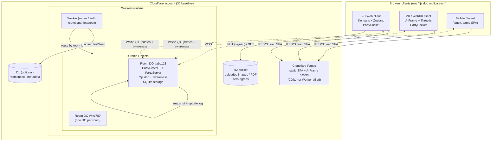
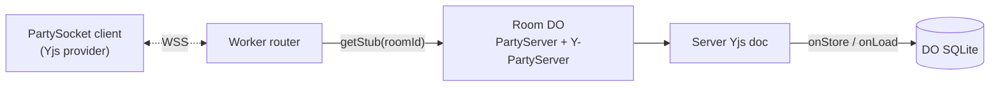
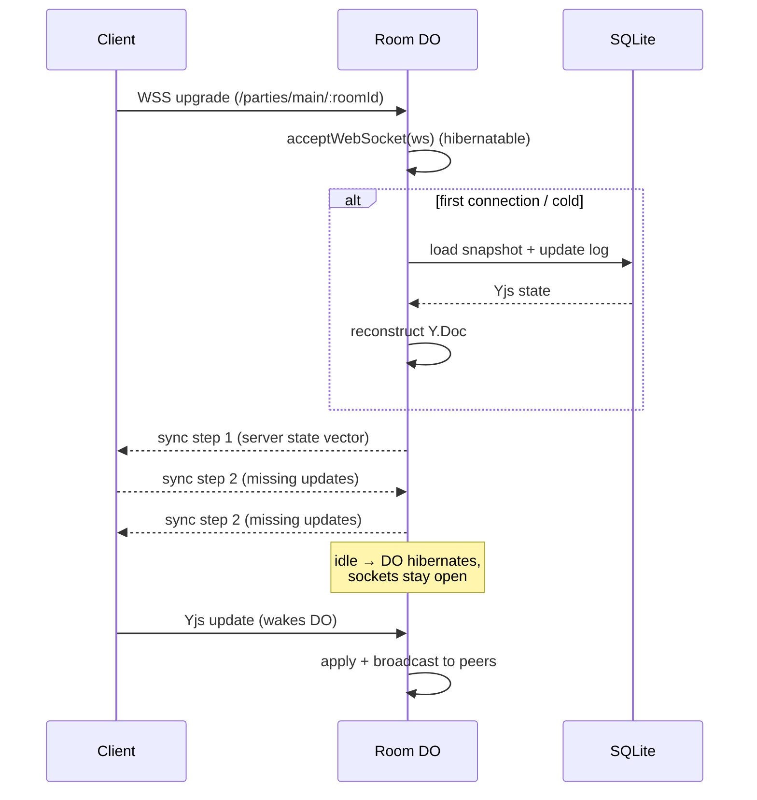
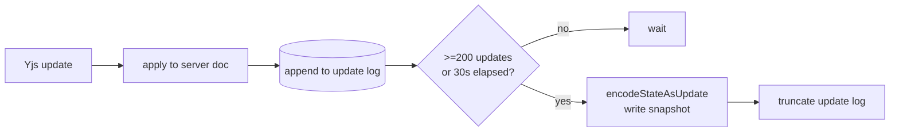
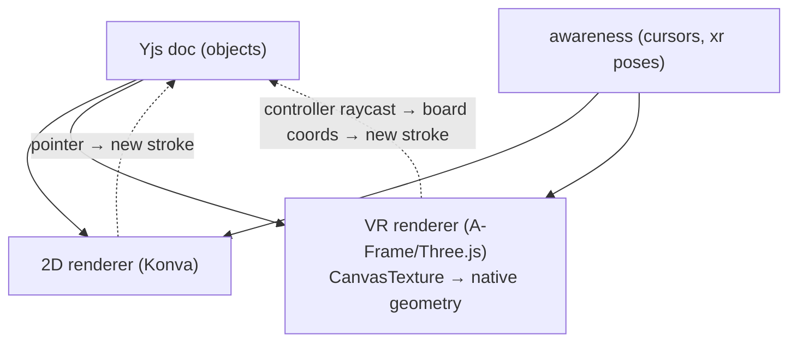
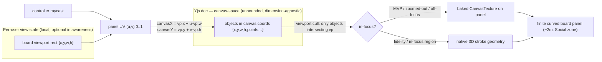
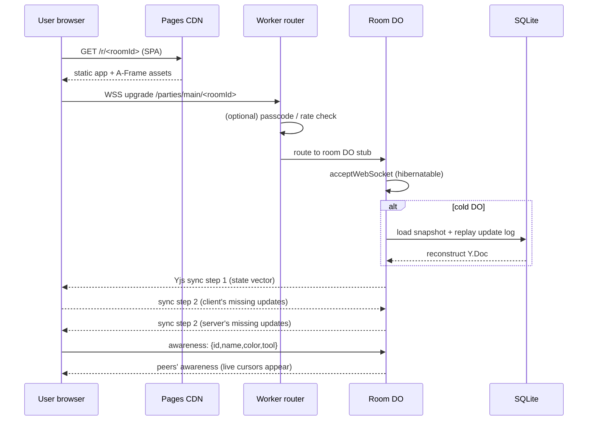
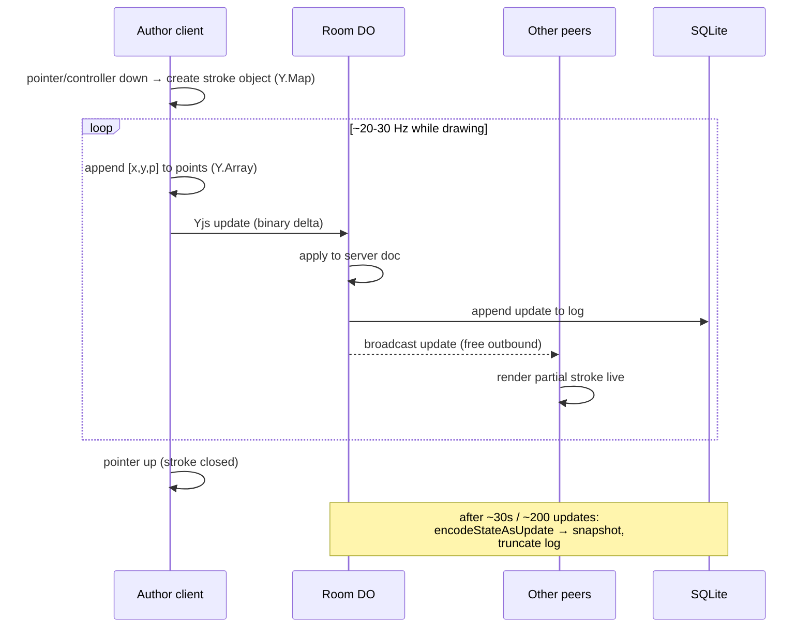
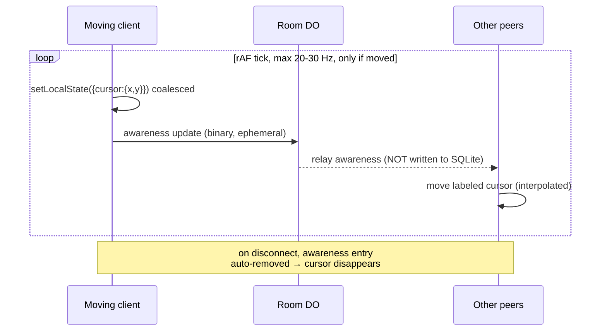

# Coboard — Technical Architecture

> _The authoritative engineering blueprint: how one Yjs document per room flows from Cloudflare's edge into a 2D canvas and an immersive VR scene, at $0 baseline cost._

**Related documents:** [README](../README.md) · [01 — Product Vision & References](./01-product-vision-and-references.md) · [02 — Features & Scope](./02-features-and-scope.md) · [03 — Visual Design / UI / UX](./03-visual-design-ui-ux.md) · [05 — Scaling & Cost](./05-scaling-and-cost.md) · [06 — Implementation Roadmap](./06-implementation-roadmap.md) · [07 — Engineering Quality, Performance, Security & Accessibility](./07-engineering-quality-security-accessibility.md)

---

## 1. System Context & Component Diagram

Coboard is a single-page application served as static assets from **Cloudflare Pages** (free global CDN), talking to a realtime backend of **Cloudflare Workers + Durable Objects**. Every room is exactly one Durable Object (DO), hosted via **PartyServer**, holding one **Yjs** document bound through **Y-PartyServer**. The same Yjs document is consumed by both the **2D web renderer** (Konva.js) and the **VR renderer** (A-Frame + Three.js). Assets (images/PDF) live in **R2**; an optional **D1** table indexes rooms.



**Traffic split (a cost invariant — see [05](./05-scaling-and-cost.md)):**

| Path                                   | Served by                       | Billed against                     |
| -------------------------------------- | ------------------------------- | ---------------------------------- |
| SPA HTML/JS/CSS, A-Frame, fonts, icons | Pages CDN                       | Nothing (unlimited static)         |
| Realtime Yjs updates + awareness       | Room DO over WSS                | DO requests (20:1 inbound-WS rule) |
| Image/PDF upload + fetch               | R2 (signed PUT, public/CDN GET) | R2 ops (zero egress)               |
| Room existence/index lookups           | D1 (optional)                   | D1 reads/writes (free tier)        |

---

## 2. The Shared Document Model (Yjs)

**One Yjs document per room is the single source of truth.** Both renderers bind to it; there is no separate "VR document" or "2D document." Content lives in the Yjs doc (CRDT, persisted); ephemeral presence lives in awareness (never persisted — see §3).

### 2.1 Top-level structure

| Key       | Yjs type          | Purpose                                                                                                                                                                                                                                                    |
| --------- | ----------------- | ---------------------------------------------------------------------------------------------------------------------------------------------------------------------------------------------------------------------------------------------------------- |
| `objects` | `Y.Map<Y.Map>`    | All board objects keyed by `id` (the content store).                                                                                                                                                                                                       |
| `zorder`  | `Y.Array<string>` | Render order: array of object `id`s, front-to-back.                                                                                                                                                                                                        |
| `meta`    | `Y.Map`           | Board metadata: `name`, `createdAt`, `schemaVersion`, `background` (board surface style — `dot-grid` default, `blank`, or a solid color), `defaultBounds` (optional `{x,y,w,h}` hint used to frame zoom-to-fit / the initial view on a new or empty room). |
| `assets`  | `Y.Map<Y.Map>`    | Asset references (R2 keys) keyed by `assetId`.                                                                                                                                                                                                             |

Each object is a nested `Y.Map` (so that concurrent edits to different fields of the same object merge rather than clobber). Stroke point arrays use `Y.Array` so additive freehand drawing converges without conflict.

### 2.2 Common object schema

Every object in `objects` shares this base shape:

```ts
interface BaseObject {
  id: string; // nanoid(10), client-generated
  type:
    | "stroke"
    | "sticky"
    | "rect"
    | "ellipse"
    | "line"
    | "arrow"
    | "text"
    | "connector"
    | "image"
    | "frame";
  x: number; // board coords (infinite plane, origin = 0,0)
  y: number;
  w: number; // bounding box width  (board units)
  h: number; // bounding box height (board units)
  rotation: number; // radians, about object center
  z: number; // fractional z-rank (see §2.4); mirrors zorder
  style: Style; // see below
  authorId: string; // stable per-room author token (client-generated, persisted in localStorage);
  // survives reload so attribution / sort-by-author stays stable — NOT the
  // ephemeral awareness id (§3.1)
  createdAt: number; // epoch ms
  updatedAt: number; // epoch ms
}

interface Style {
  stroke?: string; // CSS color
  fill?: string; // CSS color or 'none'
  strokeWidth?: number; // board units
  opacity?: number; // 0..1
  dash?: number[]; // dash pattern
  fontSize?: number;
  fontFamily?: string;
  textAlign?: "left" | "center" | "right";
}
```

### 2.3 Type-specific fields

| `type`                | Extra fields                                                                               | Notes                                                                                                                                                                                                                   |
| --------------------- | ------------------------------------------------------------------------------------------ | ----------------------------------------------------------------------------------------------------------------------------------------------------------------------------------------------------------------------- |
| `stroke` (pen/marker) | `points: Y.Array<number>` (flat `[x0,y0,p0, x1,y1,p1,…]` with pressure), `closed: boolean` | Points stored relative to `x,y`. Live drawing appends to the `Y.Array` so partial strokes stream. Pressure `p` ∈ 0..1.                                                                                                  |
| `sticky`              | `text: Y.Text`, `color: string`                                                            | `Y.Text` enables concurrent multi-user text editing inside one note. `w,h` auto-grow.                                                                                                                                   |
| `rect` / `ellipse`    | _(base only)_                                                                              | Driven entirely by `x,y,w,h,rotation,style`.                                                                                                                                                                            |
| `line` / `arrow`      | `a: {x,y}`, `b: {x,y}`, `arrowHead: 'none'\|'end'\|'both'`                                 | Endpoints in board coords; `x,y,w,h` is derived bbox.                                                                                                                                                                   |
| `connector`           | `from: Endpoint`, `to: Endpoint`, `routing: 'straight'\|'orthogonal'\|'curved'`            | `Endpoint = { objectId?: string; anchor?: 'top'\|'right'\|'bottom'\|'left'\|'center'; x?: number; y?: number }`. If `objectId` set, the connector snaps and re-routes when that object moves (resolved at render time). |
| `text`                | `text: Y.Text`                                                                             | Standalone text block.                                                                                                                                                                                                  |
| `image`               | `assetId: string`                                                                          | References `assets[assetId]` → R2 key.                                                                                                                                                                                  |
| `frame`               | `text: Y.Text` (title), `childIds: Y.Array<string>`                                        | Section/frame; children move with it.                                                                                                                                                                                   |

### 2.4 Z-order

`zorder` is the canonical `Y.Array<string>` of ids, front-to-back; renderers iterate it directly. Each object also caches a **fractional z-rank** (`z: number`) so a peer can reorder a single object by writing one number (e.g. midpoint between two neighbors) without rewriting the whole array — the array is reconciled lazily and remains the tiebreak authority. This avoids array-move conflicts under concurrency.

### 2.5 Coordinates

All geometry is in **board / canvas coordinates** on an infinite, unbounded plane (origin `0,0`). The Yjs doc is **dimension-agnostic** — it never references screens, panels, or headsets. The 2D viewport applies pan/zoom transforms locally; the VR renderer maps a region of the same plane onto a finite board panel via a **per-user viewport rect** (§6.5). Because coordinates are renderer-agnostic, a stroke drawn in VR appears in the exact spot on the 2D canvas and vice versa.

### 2.6 Versioning & migration

`meta.schemaVersion` (integer) gates client-side migrations. Yjs's structural merging means additive schema changes (new optional fields, new object types) are forward/backward compatible; a client that does not understand a `type` renders a neutral placeholder rather than dropping data.

---

## 3. Awareness Protocol (ephemeral presence)

Presence uses **`y-protocols/awareness`** — a separate, **ephemeral** state channel that is broadcast to peers but **never written to SQLite**. When a peer disconnects, their awareness entry is removed automatically. This is what powers live cursors, selections, and VR avatars cheaply.

### 3.1 Per-peer awareness payload

```ts
interface AwarenessState {
  // identity (set once on join)
  id: string; // ephemeral connection/awareness id (changes every session/reload)
  authorId: string; // stable per-room author token (matches objects' authorId, §2.2)
  name: string; // "Wandering Otter" (random) or chosen name
  color: string; // assigned label/cursor color
  tool: string; // 'pen' | 'select' | 'sticky' | ... (current tool)

  // 2D presence (high frequency)
  cursor?: { x: number; y: number }; // board coords, NOT screen px
  selection?: string[]; // selected object ids
  chat?: { text: string; ts: number }; // cursor-chat line (FigJam-style)

  // VR presence (only present in immersive mode)
  xr?: {
    head: Pose; // headset pose
    hands: [Pose | null, Pose | null]; // left, right controller poses
    laser?: { origin: Vec3; dir: Vec3; hit?: { x: number; y: number } };
  };

  // viewport rect (BOTH 2D and VR; ephemeral per-user view state — see §6.5)
  // canvas-space rectangle currently mapped onto the user's screen / VR board panel.
  // Published for follow / spotlight, minimap "other users' viewports", and
  // off-screen edge indicators. NEVER document state.
  viewport?: { x: number; y: number; w: number; h: number };
}

type Vec3 = [number, number, number];
type Pose = { p: Vec3; q: [number, number, number, number] }; // position + quaternion
```

### 3.2 Frequency, throttling & coalescing

| Signal                                                  | Max update rate                                                        | Coalescing                                                                                                                                                                                                                                     |
| ------------------------------------------------------- | ---------------------------------------------------------------------- | ---------------------------------------------------------------------------------------------------------------------------------------------------------------------------------------------------------------------------------------------- |
| 2D cursor                                               | **20–30 Hz**                                                           | One pending frame; replace, don't queue. Sent on `requestAnimationFrame` tick only when moved.                                                                                                                                                 |
| Selection change                                        | On change (debounced ~100 ms)                                          | Latest wins.                                                                                                                                                                                                                                   |
| Cursor chat text                                        | On keystroke, debounced ~150 ms                                        | Latest line replaces previous.                                                                                                                                                                                                                 |
| VR head pose                                            | **20–30 Hz**                                                           | Send only if moved > threshold (1 cm / 1°).                                                                                                                                                                                                    |
| VR hand poses                                           | **20–30 Hz**, coalesced with head into one awareness update            | Single combined `xr` write per tick.                                                                                                                                                                                                           |
| VR laser ray                                            | Same tick as hands                                                     | Bundled in `xr`.                                                                                                                                                                                                                               |
| Viewport rect (2D pan/zoom **and** VR board-panel rect) | On change, debounced ~150 ms (it changes far less often than a cursor) | Latest `{x,y,w,h}` replaces previous. VR clients publish their board-panel viewport rect alongside the `xr` head/hands/laser poses (same coalesced tick) so follow/spotlight and off-screen edge indicators work identically across 2D and VR. |

All awareness updates for a peer are **coalesced into a single `setLocalState` call per animation frame** and emitted as **one binary update**, so the worst case is ~30 inbound messages/sec/user regardless of how many fields changed. This is the core lever for staying inside the **20:1 inbound-WS billing rule** (see [05](./05-scaling-and-cost.md)). Awareness deltas are binary-encoded by `y-protocols`, not JSON.

> **Canonical presence-rate budget (referenced package-wide).** "~20–30 Hz" across these docs means **target ~20 Hz, hard ceiling 30 Hz** (the testable cap in [02](./02-features-and-scope.md)); [05](./05-scaling-and-cost.md) cost-models a conservative **15 msg/s** per active drawer. These are one budget — target / ceiling / cost-model point — not three competing numbers.

> **Invariant:** cursors and VR poses are awareness only. They are never persisted and never count as Yjs document history.

---

## 4. Realtime Backend Design

### 4.1 Room === Durable Object, via PartyServer

Each room maps to **one DO instance**, addressed by the room id string, using **PartyServer** (`partyserver`). PartyServer gives us lifecycle hooks (`onConnect`, `onMessage`, `onClose`, `onError`) and broadcast helpers over a DO. **Y-PartyServer** (`y-partyserver`) layers on top to bind a single server-side Yjs document per room, handle the Yjs sync protocol, relay awareness, and call our persistence hooks.



### 4.2 Connection lifecycle with WebSocket Hibernation

We use the **WebSocket Hibernation API**: connections are accepted via `state.acceptWebSocket(ws)` so the DO can be **evicted from memory while clients stay connected**. Duration (GB-s) charges stop while idle; the DO re-hydrates on the next inbound message (loading its Yjs doc from SQLite if needed).



- **Hibernation pings** (protocol-level) keep sockets alive and are **not billed**.
- A single DO comfortably holds **thousands of WebSocket connections** (128 MB/instance budget); broadcasting is O(connections). Beyond a few hundred concurrent peers per room, we shard with **partysub** (§5.4 / [05](./05-scaling-and-cost.md)).

### 4.3 Broadcast model

- A client's Yjs update arrives → Y-PartyServer applies it to the server doc → broadcasts the binary update to **all other** connected sockets (sender excluded).
- Awareness updates are relayed the same way but **not applied to persisted state**.
- **Inbound** WS messages are billed (20:1); **outbound** broadcasts are **free** — so fan-out to many peers is cheap; the cost driver is purely how many messages clients _send_. This is why §3 throttling matters.

### 4.4 Client resilience — PartySocket

The client uses **PartySocket** as the WebSocket transport behind the Yjs provider: automatic reconnect with exponential backoff, message buffering while offline, and connection-state events that drive the UI presence banner. On reconnect, Yjs re-runs the sync protocol (state-vector exchange) so the client converges to current state without losing locally-buffered edits.

---

## 5. Persistence

### 5.1 Yjs in DO SQLite (free, durable, co-located)

The room DO owns SQLite storage. We persist with a **hybrid update-log + snapshot** strategy via Y-PartyServer's `onLoad` / `onStore` hooks:

| Mechanism              | What                                                                                                        | Cadence                                                                                                                     |
| ---------------------- | ----------------------------------------------------------------------------------------------------------- | --------------------------------------------------------------------------------------------------------------------------- |
| **Update log**         | Append each incoming Yjs binary update as a row (`updates(seq INTEGER PK, data BLOB, ts)`).                 | Every edit (cheap append).                                                                                                  |
| **Compacted snapshot** | Encode the full doc state (`Y.encodeStateAsUpdate`) into one `snapshot` blob, then truncate the update log. | Debounced: every **~30 s of activity** OR every **~200 buffered updates**, whichever first; also on last-client-disconnect. |
| **Asset metadata**     | R2 keys + content-type in `assets` rows.                                                                    | On upload completion.                                                                                                       |

**Load-on-first-connection:** when the first client connects to a cold DO, `onLoad` reads `snapshot` then replays any post-snapshot update rows to reconstruct the live `Y.Doc`. Subsequent clients sync from the in-memory doc.



Snapshotting bounds storage growth and keeps cold-start replay fast. SQLite-backed DO storage is free-tier eligible (storage billing began Jan 2026 with a free allotment — verify current GB/row figures against Cloudflare docs; see [05](./05-scaling-and-cost.md)).

### 5.2 Asset uploads to R2 (signed flow)

Images/PDFs do **not** travel through the Yjs doc or the WS channel — only a small `assetId → R2 key` reference does. Binary upload uses a signed PUT so it never touches DO request budget meaningfully.

```mermaid
sequenceDiagram
  participant C as Client
  participant W as Worker
  participant R2 as R2
  participant DO as Room DO
  C->>W: POST /rooms/:id/assets (filename, contentType, size)
  W->>W: validate size (<= configured max; 30MB default) + type
  W->>R2: create signed PUT URL (scoped key)
  W-->>C: { uploadUrl, assetId, getUrl }
  C->>R2: PUT bytes (direct, zero egress on GET)
  C->>DO: Yjs update: add image object + assets[assetId]={key,...}
  DO-->>C: broadcast → peers fetch getUrl from CDN
```

The per-upload size cap is **configurable; 30 MB by default** — a **product choice** matching common whiteboard limits (consistent with [02](./02-features-and-scope.md)), **not** an R2/Cloudflare constraint (R2 objects can be far larger). It is enforced at the signed-URL Worker before R2 is touched.

### 5.3 Optional D1 room index

A single D1 table `rooms(id PK, code UNIQUE NULL, createdAt, lastSeenAt, objectCount, passcodeHash NULL)` supports a "your recent rooms" list, **short join-code → room-id alias resolution (§8)**, abuse throttling, and TTL cleanup of dead rooms. It is **optional** — Coboard functions with rooms addressed purely by URL; D1 is a convenience/index, never the source of truth.

### 5.4 partysub escape hatch

For a room exceeding a single DO's comfortable connection/broadcast zone (~a few hundred concurrent), **partysub** backs one logical room with N DOs and pub/subs Yjs/awareness updates across them. This is the documented horizontal-scale lever; details and capacity math live in [05](./05-scaling-and-cost.md).

---

## 6. VR Architecture

The VR client renders the **same Yjs document** — there is no separate sync path. A-Frame (declarative WebXR over Three.js) provides the scene, controllers, and headset integration; our networking is **not** networked-aframe's transport — we **adapt NAF's avatar/laser patterns but drive them from our Yjs + awareness layer** so 2D and VR share one source of truth. Both clients implement a single shared **`Renderer` interface** — `bind(doc, viewport)` → pixels/geometry — so app, tools, selection, undo, and presence logic stay renderer-agnostic and the two realities cannot diverge by construction (its maintainability role is detailed in [07 §3.3](./07-engineering-quality-security-accessibility.md)).

### 6.0 Session entry — the VR toggle and the 2D ↔ WebVR transition

**Everyone starts in 2D.** Opening the board URL in **any** browser — including the headset's own browser — lands in the default 2D canvas core view (Konva, §1). VR is **never** entered automatically: it is gated behind a **headset-icon toggle in the top bar's top-right cluster** (beside Present/Share), labelled **"Enter VR"**, because `requestSession("immersive-vr")` requires a **user gesture**. The toggle is **always visible** and **reflects state** ("Enter VR" ↔ in-VR/"Exit VR").

**Toggle enablement + fallback.** On mount the app calls `navigator.xr?.isSessionSupported("immersive-vr")`; the toggle is **enabled** only if it resolves `true` (Quest/headset browser). Otherwise it offers a **non-immersive fallback** — a "magic window" preview and/or a **QR/helper** to open the room on a headset (see fallback matrix below).

**Lazy-load on first Enter.** The A-Frame/Three.js VR bundle is **code-split and loaded only on the first click** of the toggle (a brief "Preparing VR…"; pre-warmed on hover or when a headset is detected). This keeps the 2D core view's initial bundle lean — the VR engine never ships to users who never enter VR (the lazy-VR-bundle budget lives in [07](./07-engineering-quality-security-accessibility.md)).

**Entry flow (renderer swap, no reload):**

1. User clicks **"Enter VR"** (the required gesture) → lazy-load the VR bundle if not already loaded.
2. `navigator.xr.requestSession("immersive-vr")` → standard WebXR comfort **fade** → mount the A-Frame scene with the board as the curved viewport-window panel ~1.5–2 m ahead (Social reach zone, §6.5).
3. **Only the renderer swaps (Konva ↔ A-Frame).** Both renderers bind to the **same in-memory Yjs doc + awareness** (the same replica that was already syncing in 2D — §2, §3); **nothing reloads**, no new socket, no second document. The room, the Yjs doc, and the user's **identity/colour** all carry over unchanged.
4. **Viewport-rect continuity:** the VR board viewport rect `{x,y,w,h}` is **initialised from the user's current 2D camera (pan/zoom)** via the same canvas↔display transform (§6.5), so the user "steps into" the exact region they were looking at.
5. Awareness now **also publishes `xr` (head + hands + laser) plus the board-panel `viewport`** (§3.1); the user does **not** vanish to peers — their 2D cursor becomes an **"in VR"-badged marker / avatar**, with a subtle "X entered VR" toast.

**Exit.** The headset exit gesture or an in-scene **"Exit VR"** button ends the XR session → fade back → unmount the A-Frame scene and re-bind the **Konva** renderer to the **same** Yjs doc → the 2D view resumes **at the same canvas region** (the viewport rect carries back). The toggle flips back to "Enter VR".

**Fallbacks (non-immersive magic window).** When `immersive-vr` is unsupported, the same lazy VR bundle still powers a **non-immersive "magic window"** preview rendered into a normal `<canvas>` (mouse-orbit / device-orientation on mobile), so desktop and phone users get a 3D preview of the panel without a headset; a **QR/helper** deep-links the room onto a Quest. The session API differs (`inline` / no `requestSession("immersive-vr")`) but the renderer, Yjs binding, and viewport-rect model are identical.

| Device                  | Path                                                                      | Toggle behaviour                      |
| ----------------------- | ------------------------------------------------------------------------- | ------------------------------------- |
| Quest / headset browser | full `immersive-vr` session                                               | enabled → fade into immersive scene   |
| Desktop, no headset     | non-immersive **magic window** (mouse-orbit) + **QR/helper** to a headset | shows preview / "open on headset"     |
| Mobile                  | **magic window** / cardboard (device-orientation)                         | enabled where supported; else preview |

The session-entry sequence is diagrammed in §10.4; the world-space panel, viewport rect, and raycast→canvas math it lands in are in §6.5.

### 6.1 Two rendering fidelities

| Path                              | How                                                                                                                                                                                                                                                                  | When                                                                    |
| --------------------------------- | -------------------------------------------------------------------------------------------------------------------------------------------------------------------------------------------------------------------------------------------------------------------- | ----------------------------------------------------------------------- |
| **MVP — CanvasTexture mirror**    | Render the existing 2D board (the Konva/offscreen canvas) to a Three.js `CanvasTexture`, mapped onto a board-plane quad in 3D. Instant in-VR view of the live board; drawing maps controller raycast hits back to board coords and writes the same `stroke` objects. | Phase 3 entry — fastest route to "see and draw on the board in VR."     |
| **Fidelity — native 3D geometry** | Build Three.js line/tube geometry directly from `stroke.points`, sticky planes, shape meshes, etc., subscribed to the same Yjs `objects` map. Crisp at any zoom, depth-correct, no texture resolution ceiling.                                                       | Iterative upgrade after MVP; object-type renderers added incrementally. |

Both paths subscribe to identical Yjs events; the difference is purely how an object becomes pixels.

### 6.2 Drawing in VR

1. Controller raycasts a laser onto the board plane.
2. The hit point (a 3D point on the quad) is converted to **board coordinates** via the inverse of the board's plane transform.
3. On trigger, a new `stroke` object is created and its `points` `Y.Array` is appended at 20–30 Hz (same path as a 2D pen) — so the stroke streams live to every 2D and VR peer.

### 6.3 Avatars + laser over awareness

VR presence (`xr` in §3.1) carries head pose, two hand poses, and the laser ray. Each remote peer renders:

- a **head avatar** (simple headset/face mesh) at `xr.head`,
- **two hand/controller meshes** at `xr.hands`,
- a **laser pointer** + cursor dot at `xr.laser.hit` on the board.

These update at 20–30 Hz from awareness (ephemeral, never persisted), with interpolation between frames for smoothness. 2D peers see the same VR users as labeled cursors at `xr.laser.hit` (or `cursor`), so a desktop user and a headset user point at the same spot.



### 6.4 Comfort

Vignette on locomotion, teleport movement, and board reachability/scaling are rendering-layer concerns (see [03](./03-visual-design-ui-ux.md)) and do **not** affect the document model.

### 6.5 Infinite canvas in VR — the viewport-window model

> The hard question — _"you cannot have an infinite surface in VR"_ — is answered by **embodiment**: the infinite canvas is shown through a **finite physical board panel** that acts as a movable, zoomable **window** onto an unbounded coordinate space.

**Canvas-space is the only geometry the document knows.** As established in §2.5, the Yjs doc stores **all** geometry in **canvas coordinates** (unbounded 2D plane, origin `0,0`) and is **dimension-agnostic** — it never references screens, panels, or headsets. This is what preserves the one-document single-source-of-truth invariant across 2D and VR.

**A "viewport" is just a canvas→display transform — and it is _per-user view state_, not document state.** The 2D web camera (pan `x/y` + zoom) and the VR **board viewport rect** `{x, y, w, h}` (in canvas coords) are the **same concept**. The viewport is **local** state (Zustand on 2D; the VR scene's board controller in VR), optionally mirrored into **awareness** for follow/spotlight/edge-indicators (§3.1, §3.2) — but it is **never** written to the Yjs doc. Every user can look at a different canvas region, exactly like 2D users scrolling independently. fit-to-content, reset-view, and follow-user therefore work identically across 2D and VR because they all just set a viewport rect.

**Embodiment — the finite board panel.** The viewport rect is mapped onto a **finite physical panel** (default **~2.0 m × 1.2 m**, optionally **slightly curved** so its edges stay equidistant from the viewer and easier to focus) floating in the **Social reach zone (~1.5–2 m)** in front of a seated/standing user (reach-zone rationale and text-legibility specs live in [03](./03-visual-design-ui-ux.md) and [07](./07-engineering-quality-security-accessibility.md)). **The panel size is fixed in world space; what changes is the canvas region mapped onto it** — the board is a window, not the canvas itself. Tools live on a **wrist / non-dominant-hand panel** in the Personal zone (0.5–1.2 m); shared content (the board) stays in the Social zone.

| Gesture             | Action                                                                     | Effect on viewport rect                                                                                                                           |
| ------------------- | -------------------------------------------------------------------------- | ------------------------------------------------------------------------------------------------------------------------------------------------- |
| **Slide (pan)**     | grip-grab + drag (or grab-the-world, or thumbstick)                        | Translates `vp.x` / `vp.y` across canvas-space — like sliding a giant sheet behind a fixed window. Minimap / zoom-to-fit / go-to-user give jumps. |
| **Zoom**            | two-handed pinch/stretch (Gravity Sketch / Tilt Brush style) or thumbstick | Scales `vp.w` / `vp.h` (how much canvas maps onto the fixed panel). The **physical panel stays the same size**; content scales.                   |
| **Draw / interact** | controller raycast → panel hit → panel UV → canvas coords                  | Writes a stroke/shape into the **same Yjs doc** at the correct infinite-canvas coordinate (see formula below).                                    |

**The raycast → canvas-coordinate transform.** A controller raycast hits the panel, yielding a panel **UV** in `0..1`; the UV is mapped through the current viewport rect to a canvas coordinate, which is written as stroke/shape points into the same Yjs doc (the §6.2 drawing path, restated precisely):

```ts
// vp = current board viewport rect in canvas coords { x, y, w, h }
// (u, v) = panel hit in UV space, 0..1 (origin top-left of the panel)
canvasX = vp.x + u * vp.w;
canvasY = vp.y + v * vp.h;
// inverse (render a canvas point onto the panel):
u = (canvasX - vp.x) / vp.w;
v = (canvasY - vp.y) / vp.h;
```

A stroke drawn in VR thus lands at the correct infinite-canvas coordinate and **instantly appears for 2D users**; 2D edits appear in VR — because both are just reads/writes of canvas-space geometry through their own viewport.



**Viewport culling + LOD (ties to [05](./05-scaling-and-cost.md) and [07](./07-engineering-quality-security-accessibility.md)).** VR renders **only objects whose canvas coords intersect or are near the current viewport rect** — viewport culling. LOD then chooses how those objects become pixels:

- **MVP** renders the visible region as a baked **`CanvasTexture`** (the §6.1 mirror — cheap, pixel-identical to 2D).
- **Fidelity path** renders **native 3D stroke geometry** for the in-focus region and **falls back to texture** when zoomed out or off-focus.

This pairing — cull to the viewport rect, then pick texture vs native by focus — is what lets a **50k-object canvas hold 72–90 fps** in VR; the frame-budget math is in [07](./07-engineering-quality-security-accessibility.md).

**Cross-reality presence (canvas-space overlap drives visibility).** Because all viewports live in the same canvas-space, "do these two users see each other?" is just **rectangle overlap**:

- When a 2D user's scroll region and a VR user's viewport rect **overlap**, they see each other: **2D cursors render as labeled dots/markers on the VR panel surface** (their `cursor` canvas coords mapped to panel UV via the inverse formula); **VR laser-pointer hit points + avatars render as cursors** (with an **"in VR" badge**) for 2D users.
- Users **outside** each other's region get **directional edge indicators** ("3 →") plus **minimap markers** instead of an on-canvas cursor.

This is powered entirely by the ephemeral `viewport` + `cursor` + `xr` awareness fields (§3.1) — no document writes, so the single-source-of-truth invariant holds.

**Form factors.** (1) **Window/whiteboard mode** — default, seated, comfortable (the spec above). (2) Stretch: **room-scale wall/table mode** — the viewport region maps to a large wall or horizontal table you physically walk along / lean toward; proximity can act as zoom. (3) Stretch: **curved panel** for wide peripheral coverage. All three are pure rendering/embodiment choices over the **same** viewport-rect → canvas-space mapping; none touch the document model.

---

## 7. Transport, Reconnection & Conflict Handling

- **Transport:** WSS only (TLS), `/parties/main/:roomId` routed by the Worker to the room DO. Binary frames carry Yjs sync/awareness messages. Received-message limit is **32 MiB** (raised 2025-10-31); see §8 caps.
- **Reconnection:** PartySocket auto-reconnects (exponential backoff + jitter); on reopen, the Yjs provider re-runs sync step 1/2. Edits made while offline are buffered locally in the client's Yjs doc and flushed on reconnect.
- **Conflict handling (CRDT convergence):** Yjs is a CRDT, so concurrent edits **merge deterministically without a server arbiter** — every replica that has seen the same set of updates converges to byte-identical state. Object-level edits use nested `Y.Map`s (per-field merge), text uses `Y.Text` (character-level merge), and freehand uses additive `Y.Array` points (no conflict on append). Deletes are tombstoned. There is no last-write-wins data loss for independent fields; only genuinely-concurrent writes to the _same scalar field_ resolve by Yjs's internal deterministic ordering.

---

## 8. Security & Abuse

> The threat model, security review checklist, and accessibility commitments (keyboard paths, offscreen semantic mirror, colorblind-safe presence, XR a11y) are detailed in [07 — Engineering Quality, Performance, Security & Accessibility](./07-engineering-quality-security-accessibility.md); this section covers the architecture-level mitigations they build on.

| Concern            | Mitigation                                                                                                                                                                                                                                                                                                                                                                                                                                                                                                                                                                                                        |
| ------------------ | ----------------------------------------------------------------------------------------------------------------------------------------------------------------------------------------------------------------------------------------------------------------------------------------------------------------------------------------------------------------------------------------------------------------------------------------------------------------------------------------------------------------------------------------------------------------------------------------------------------------- |
| Room guessability  | The **share URL carries a high-entropy room id** — CSPRNG, URL-safe, ~128-bit class (e.g. `nanoid(21)`), never sequential — so a "secret link" is a meaningful (if soft) access boundary. The short, human-typable **join code** shown in the UI (e.g. `K3F9-Q2`, disambiguated alphabet) is a separate **alias** resolved to the room id via the D1 index (§5.3) for joining from a headset/phone; being low-entropy it is **rate-limited and rotatable** ("new code" in the share sheet) and is **never** the security boundary. Consistent with [07 §4.2](./07-engineering-quality-security-accessibility.md). |
| Private rooms      | Optional **passcode**: `passcodeHash` (PBKDF2/Argon2-lite) stored in D1; the Worker gates the WS upgrade, rejecting before the DO is touched.                                                                                                                                                                                                                                                                                                                                                                                                                                                                     |
| Message flooding   | Per-connection **rate limiting in the DO**: token bucket on inbound messages (e.g. cap ~60 msg/s/conn — above the 30 Hz design rate, below abuse); offenders are throttled then disconnected. Protects both stability and the request budget.                                                                                                                                                                                                                                                                                                                                                                     |
| Oversized payloads | Hard **input caps**: reject WS frames near the **32 MiB** limit; cap per-object size (e.g. stroke points length), sticky/text length, and uploads (**configurable; 30 MB default** — a product choice matching common whiteboard limits, not an R2/Cloudflare constraint — validated at the signed-URL Worker before R2; consistent with [02](./02-features-and-scope.md)).                                                                                                                                                                                                                                       |
| Storage bloat      | Snapshot compaction (§5.1) + TTL cleanup of idle rooms via D1 `lastSeenAt`.                                                                                                                                                                                                                                                                                                                                                                                                                                                                                                                                       |
| Content moderation | **Hooks** at the DO `onMessage` boundary (and at upload time) for optional text/image scanning; pluggable, off by default to preserve the $0 anonymous model.                                                                                                                                                                                                                                                                                                                                                                                                                                                     |
| PII                | **No-PII anonymous model**: no accounts required, no email/IP stored in the doc; display names are random or self-chosen and live only in ephemeral awareness. Optional named auth (GitHub OAuth / Clerk free tier) is additive and out of MVP scope.                                                                                                                                                                                                                                                                                                                                                             |
| Transport security | WSS/TLS end-to-end; signed, scoped R2 URLs that expire.                                                                                                                                                                                                                                                                                                                                                                                                                                                                                                                                                           |

---

## 9. Library Table

| Name                                     | Role                                                                      | Why chosen                                                                                                                        | License                   |
| ---------------------------------------- | ------------------------------------------------------------------------- | --------------------------------------------------------------------------------------------------------------------------------- | ------------------------- |
| **Yjs**                                  | CRDT shared document (single source of truth)                             | Battle-tested, tiny binary updates, deterministic convergence, rich shared types (`Map`/`Array`/`Text`); same doc drives 2D + VR. | MIT                       |
| **y-protocols** (`awareness`)            | Ephemeral presence (cursors, selections, VR poses, cursor-chat)           | Standard Yjs awareness; binary-encoded, auto-cleanup on disconnect; never persisted.                                              | MIT                       |
| **PartyServer** (`partyserver`)          | One room === one Durable Object with lifecycle hooks + broadcast          | Cloudflare-maintained DO wrapper; near-zero startup, stateful, routed by room id string.                                          | MIT (Apache-2.0 portions) |
| **Y-PartyServer** (`y-partyserver`)      | Binds one server-side Yjs doc per room to PartyServer + persistence hooks | Turns a DO into a Yjs sync server with `onLoad`/`onStore`; matches our hybrid persistence design.                                 | MIT                       |
| **PartySocket**                          | Resilient client WebSocket under the Yjs provider                         | Auto-reconnect, backoff, buffering — keeps multiplayer robust on flaky/mobile networks.                                           | MIT                       |
| **partysub**                             | Shard one logical room across N DOs (pub/sub)                             | Horizontal-scale escape hatch beyond a single DO's connection comfort zone.                                                       | MIT                       |
| **Cloudflare Workers + Durable Objects** | Realtime edge compute + per-room stateful instance                        | Free tier incl. SQLite-backed DOs; WS Hibernation; globally addressable single-threaded state.                                    | Proprietary (free tier)   |
| **Cloudflare Pages**                     | Static SPA + A-Frame asset hosting (CDN)                                  | Free, effectively unlimited static requests that don't bill Worker quota.                                                         | Proprietary (free tier)   |
| **Cloudflare R2**                        | Image/PDF asset storage                                                   | ~10 GB free, generous ops, **zero egress** — assets stay free to serve.                                                           | Proprietary (free tier)   |
| **Cloudflare D1**                        | Optional room index / metadata                                            | Free SQLite at the edge for recents/TTL/passcode lookups.                                                                         | Proprietary (free tier)   |
| **A-Frame**                              | Declarative WebXR scene framework                                         | Fast WebXR on Quest/Vive/Cardboard + desktop/mobile fallback; adapts NAF avatar patterns.                                         | MIT                       |
| **Three.js**                             | 3D engine under A-Frame; native stroke geometry                           | Industry-standard WebGL; CanvasTexture (MVP) and tube/line geometry (fidelity).                                                   | MIT                       |
| **Konva.js**                             | 2D canvas renderer bound to Yjs                                           | Mature Canvas2D scene graph (hit detection, transforms) for fast MVP; renders the CanvasTexture VR mirror.                        | MIT                       |
| **PixiJS** _(migration note)_            | WebGL 2D renderer if object counts demand                                 | Documented upgrade path from Konva when Canvas2D object counts hurt FPS; same Yjs binding.                                        | MIT                       |
| **Vite**                                 | Bundler / dev server                                                      | Fast HMR, ESM, first-class TS + monorepo support.                                                                                 | MIT                       |
| **TypeScript**                           | Language across all packages                                              | Type-safe shared schema between client-web, vr, worker, shared.                                                                   | Apache-2.0                |
| **Lucide**                               | Icon set                                                                  | Clean open-source icons for toolbar/panels.                                                                                       | ISC                       |
| **Zustand**                              | Light client state store                                                  | Minimal local UI state (tool, viewport) outside the Yjs doc; no heavy framework needed.                                           | MIT                       |
| **Vitest**                               | Unit testing                                                              | Vite-native, fast; tests schema + CRDT helpers.                                                                                   | MIT                       |
| **Playwright**                           | E2E + multiplayer + headless WebXR smoke tests                            | Drives multiple browser contexts to validate realtime sync and VR emulation.                                                      | Apache-2.0                |

---

## 10. Sequence Diagrams

### 10.1 Join a room



### 10.2 Draw a stroke (and how it persists)



### 10.3 Move a cursor (awareness — not persisted)



### 10.4 Enter VR

```mermaid
sequenceDiagram
  participant U as User (already in room)
  participant XR as WebXR / headset
  participant Y as Yjs doc (same replica)
  participant DO as Room DO
  participant B as Peers
  U->>U: isSessionSupported('immersive-vr')? → enable toggle
  U->>U: tap top-right "Enter VR" toggle (user gesture)<br/>lazy-load A-Frame/Three.js bundle (first time)
  U->>XR: requestSession('immersive-vr') → comfort fade
  XR-->>U: XR session + controllers
  U->>U: renderer swap Konva→A-Frame (no reload);<br/>VR viewport rect ← current 2D camera (pan/zoom)
  U->>Y: re-bind SAME doc + awareness → render objects<br/>(CanvasTexture MVP → native geometry)
  loop 20-30 Hz
    U->>DO: awareness xr:{head,hands,laser}
    DO-->>B: relay (2D peers see cursor at laser hit)
  end
  U->>DO: trigger draw → new stroke (same path as 10.2)
  DO-->>B: broadcast → 2D + VR peers converge
```

---

## 11. Planned Repo Structure (pnpm monorepo)

```text
coboard/
├─ pnpm-workspace.yaml
├─ package.json                  # root scripts (dev, build, test, deploy)
├─ tsconfig.base.json
├─ README.md                     # → ./README.md (doc map)
├─ docs/                         # 01..07 + adr/ (this doc = 04)
├─ packages/
│  ├─ shared/                    # framework-agnostic core
│  │  ├─ src/
│  │  │  ├─ schema.ts            # Yjs object types, Style, helpers (§2)
│  │  │  ├─ awareness.ts         # AwarenessState type + encode/throttle (§3)
│  │  │  ├─ ids.ts               # nanoid room/object id helpers
│  │  │  └─ coords.ts            # board↔screen / board↔3D plane math
│  │  └─ package.json
│  ├─ client-web/                # 2D SPA (Konva + Zustand + Lucide)
│  │  ├─ src/
│  │  │  ├─ renderer/            # Konva scene bound to Yjs (→ PixiJS path)
│  │  │  ├─ tools/               # pen, sticky, shape, select, text…
│  │  │  ├─ net/                 # PartySocket + Yjs provider
│  │  │  ├─ presence/            # cursors, labels, cursor-chat
│  │  │  └─ ui/                  # toolbar, panels, share
│  │  ├─ index.html
│  │  └─ vite.config.ts
│  ├─ vr/                        # A-Frame + Three.js immersive renderer
│  │  ├─ src/
│  │  │  ├─ scene/               # board quad, lighting, comfort
│  │  │  ├─ render/              # CanvasTexture (MVP) + native geometry
│  │  │  ├─ avatars/             # head+hands+laser from awareness
│  │  │  └─ input/               # controller raycast → board coords → stroke
│  │  └─ package.json
│  └─ worker/                    # Cloudflare Worker + Durable Objects
│     ├─ src/
│     │  ├─ index.ts             # router; routes /parties/main/:room, /assets
│     │  ├─ room.ts              # PartyServer + Y-PartyServer DO (hibernation)
│     │  ├─ persistence.ts       # SQLite update log + snapshot (§5.1)
│     │  ├─ assets.ts            # R2 signed upload flow (§5.2)
│     │  ├─ index-d1.ts          # optional D1 room index (§5.3)
│     │  └─ sharding.ts          # partysub integration (§5.4)
│     ├─ wrangler.toml           # DO bindings, R2, D1, routes
│     └─ package.json
├─ e2e/                          # Playwright (multiplayer + WebXR emulator)
└─ .github/workflows/            # CI: wrangler deploy (worker) + Pages deploy
```

`shared` is the seam that guarantees the architecture invariant: the **exact same** `schema.ts` and `awareness.ts` are imported by `client-web`, `vr`, and `worker`, so all three agree on the one Yjs document.
