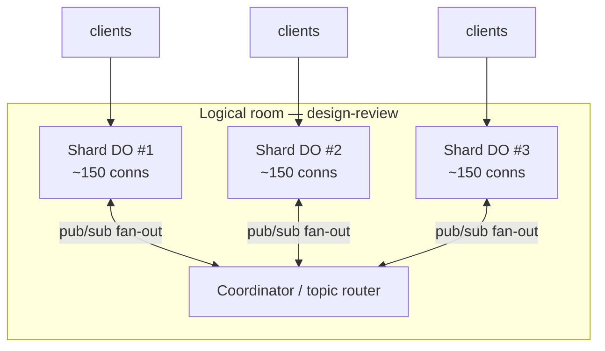

# Coboard — Scaling & Cost

> _How Coboard maximizes concurrent users while running at $0: the free-tier limit math, a capacity model with explicit arithmetic, per-room sharding, cost-control techniques, the first paid upgrade, and provider comparison._

**Related documents:** [README](../README.md) · [01 — Product Vision & References](./01-product-vision-and-references.md) · [02 — Features & Scope](./02-features-and-scope.md) · [03 — Visual Design / UI / UX](./03-visual-design-ui-ux.md) · [04 — Technical Architecture](./04-technical-architecture.md) · [06 — Implementation Roadmap](./06-implementation-roadmap.md) · [07 — Engineering Quality, Performance, Security & Accessibility](./07-engineering-quality-security-accessibility.md)

---

## 0. North star for this document

Coboard's hard constraint (see [01 — Product Vision & References](./01-product-vision-and-references.md)): **hostable AND runnable for $0 on free tiers, at meaningful concurrency.** This document derives a defensible headline number — **~450 sustained concurrent collaborators under a balanced (~50%-active-editor) mix, scaling to ~1,000–2,000 under a realistic viewer-heavy mix, across many rooms per Cloudflare account per day for $0** (see §3.2) — and shows the arithmetic, the assumptions, and the levers that move it.

> ⚠️ **All figures change.** _(Figures in this doc are current as of June 2026.)_ Every number below is a snapshot for design purposes and **must be re-verified against current Cloudflare documentation before launch.** Cloudflare adjusts free allotments, billing ratios, and limits regularly (the WS size limit and SQLite-DO storage billing both changed in late 2025 / Jan 2026). Treat this doc as a model, not a contract. Primary sources to check:
>
> - Workers limits & pricing: <https://developers.cloudflare.com/workers/platform/limits/> · <https://developers.cloudflare.com/workers/platform/pricing/>
> - Durable Objects limits & pricing: <https://developers.cloudflare.com/durable-objects/platform/limits/> · <https://developers.cloudflare.com/durable-objects/platform/pricing/>
> - WebSocket Hibernation API: <https://developers.cloudflare.com/durable-objects/api/websockets/>
> - Pages limits: <https://developers.cloudflare.com/pages/platform/limits/>
> - R2 pricing: <https://developers.cloudflare.com/r2/pricing/>
> - D1 pricing: <https://developers.cloudflare.com/d1/platform/pricing/>

---

## 1. Free-tier limits (per Cloudflare service)

Coboard uses only Cloudflare services so the whole system bills against **one free account**. Static assets are served from Pages (a separate, effectively-uncapped meter), so only realtime WS + uploads + API hit the billed Workers/DO meters.

| Service                               | Free-tier allotment (verify!)                                                                                                             | What consumes it in Coboard                                                                                           | Notes / billing quirks                                                                                                                                                                                             |
| ------------------------------------- | ----------------------------------------------------------------------------------------------------------------------------------------- | --------------------------------------------------------------------------------------------------------------------- | ------------------------------------------------------------------------------------------------------------------------------------------------------------------------------------------------------------------ |
| **Workers (requests)**                | ~100,000 requests/day (resets daily, UTC); ~10 ms CPU/request typical guidance                                                            | Initial WS upgrade (`fetch`), HTTP API calls (create room, asset presign), each **inbound** WS message routed to a DO | A WS **upgrade** = 1 request. Inbound WS **messages** bill on the DO meter (below), not here. Static assets do **not** count (served by Pages).                                                                    |
| **Durable Objects (requests)**        | ~100,000 requests/day (shared concept with Workers free; DO now free-tier eligible when **SQLite-backed**)                                | One DO per room; each inbound WS message + each alarm/storage op = DO requests (with the WS ratio)                    | **20:1 inbound-WS ratio:** 1M inbound WS messages bill as 50k DO requests. ⇒ **100k DO requests/day ≈ 2,000,000 inbound WS messages/day.** **Outbound** WS messages are **free**. Protocol **pings** are **free**. |
| **Durable Objects (duration / GB-s)** | Free allotment of compute-duration; **128 MB memory per instance** (shared across same-class instances on a machine)                      | Wall-clock time a DO is resident in memory while holding connections                                                  | **Hibernation API** evicts the DO from memory while clients stay connected ⇒ **idle duration charges stop accruing.** This is the single most important free-tier lever.                                           |
| **Durable Objects SQLite storage**    | Free allotment of **GB stored + rows read/written** (storage billing for SQLite DOs began **Jan 2026** — verify current GB + row figures) | Yjs update log + periodic compacted snapshot per room                                                                 | Co-located with the DO (no separate DB round-trip). Compaction keeps row count bounded (see §5).                                                                                                                   |
| **Cloudflare Pages**                  | Free static hosting + global CDN; effectively unlimited static asset requests; build-minute cap on the free plan                          | SPA bundle, A-Frame/Three.js assets, fonts, icons                                                                     | Asset requests **do not** consume Worker requests — this keeps the Worker meter reserved for realtime traffic only.                                                                                                |
| **Cloudflare R2**                     | ~10 GB storage + generous Class A/B ops; **zero egress**                                                                                  | Uploaded images/assets (Phase 2)                                                                                      | Zero egress means serving uploaded images never costs bandwidth — ideal for a media-heavy board.                                                                                                                   |
| **Cloudflare D1 (SQLite)**            | Free tier: rows read/written + GB storage allotment                                                                                       | Optional room **index/metadata** only (not hot-path board data)                                                       | Board state lives in per-room DO SQLite, not D1; D1 is just a directory if we need one.                                                                                                                            |

**Key consequence:** the binding constraint for realtime is the **DO request budget**, and because of the 20:1 inbound-WS ratio that budget translates to **~2,000,000 inbound WebSocket messages/day for free.** Everything in §2–§3 is derived from that ceiling.

> ⚠️ **Verify the meter model.** This document treats the Durable Objects request budget as ~100k/day. Whether DO requests draw from the **same** Workers free 100k/day counter or a **separate** DO free allotment has shifted historically — **confirm the current free-tier accounting in the [Cloudflare DO pricing docs](https://developers.cloudflare.com/durable-objects/platform/pricing/) before committing to the headline.** If DO has its own allotment, real headroom is _higher_ than modeled here; if it shares the Workers counter, it is as modeled. The capacity numbers below are deliberately conservative against the shared-counter assumption.

---

## 2. Cost model math

### 2.1 The headline conversion

```
DO request budget (free)            = 100,000 DO requests / day
Inbound-WS billing ratio            = 20 inbound WS messages : 1 DO request
Free inbound WS message ceiling     = 100,000 × 20
                                    = 2,000,000 inbound WS messages / day
```

### 2.2 What is and isn't billed

| Traffic type                                                    | Billed?                          | Implication for design                                                                                                             |
| --------------------------------------------------------------- | -------------------------------- | ---------------------------------------------------------------------------------------------------------------------------------- |
| **Inbound** WS messages (client → DO)                           | **Yes**, at 20:1 on the DO meter | This is the meter we optimize. Throttle/coalesce/batch everything the client sends.                                                |
| **Outbound** WS messages (DO → clients, i.e. broadcast fan-out) | **No**                           | Broadcasting a cursor to 200 peers is **free**. Cost scales with **senders**, not **receivers**. Huge for read-heavy viewer rooms. |
| WS protocol **pings** (keepalive)                               | **No**                           | Hibernation keepalives don't erode the budget.                                                                                     |
| WS **upgrade** (connection open)                                | Yes (1 Worker request)           | One-time per connection; negligible vs message volume.                                                                             |
| DO **duration** (GB-s while resident)                           | Yes — **but**                    | **Hibernation** drops resident time to ~0 while idle, so a room with no active drawers costs ~nothing even with people connected.  |

> **Design corollary — "cost follows the pen, not the eyeballs."** Because outbound is free and inbound is throttled, **idle viewers are nearly free** and **active drawers are the only meaningful cost.** Coboard's pricing math is therefore dominated by _simultaneously-active-drawers_, not raw room population.

### 2.3 Per-user message budget

We split user activity into two send-rate classes (content edits + awareness/cursor combined, after client-side coalescing — see §5):

| User class        | Behaviour                                                    | Inbound msgs/sec (after coalescing)                           | Inbound msgs/min |
| ----------------- | ------------------------------------------------------------ | ------------------------------------------------------------- | ---------------- |
| **Active drawer** | Drawing strokes, dragging shapes, moving cursor continuously | **10–20** (cursor/awareness coalesced to ~15 Hz + Yjs deltas) | **600–1,200**    |
| **Light editor**  | Occasional sticky/shape edit, intermittent cursor motion     | ~2                                                            | ~120             |
| **Idle viewer**   | Watching, mostly still cursor                                | ~0.1 (hibernation keepalive ≈ free)                           | ~6               |

We model with a **conservative active-drawer rate of 15 msg/s = 900 msg/min** as the worst-case sustained sender — the cost-model point of the canonical presence-rate budget (target ~20 Hz / ceiling 30 Hz; see [04 §3.2](./04-technical-architecture.md)).

---

## 3. Capacity table (with arithmetic)

**Assumptions, stated explicitly:**

- Free inbound ceiling = **2,000,000 inbound WS msgs/day** (§2.1).
- Outbound/broadcast is free, so receivers don't count against the budget.
- A "session" of meaningful collaborative activity ≈ **30 minutes** of being connected; within it, an active drawer isn't drawing every second — assume an **active duty cycle of ~50%** (half the session actually sending at the drawer rate, half idle/viewing). Idle viewers cost ≈ 0.
- Rates are **after** client-side coalescing (§5). Without coalescing these numbers fall ~5–10×.

**Per-active-drawer daily message cost (worst case, one 30-min session, 50% duty):**

```
active sending time   = 30 min × 50%            = 15 min of active drawing
msgs while active      = 15 min × 900 msg/min    = 13,500 msgs
msgs while idle-in-room (15 min × ~6 msg/min)    ≈      90 msgs
─────────────────────────────────────────────────────────────
per active-drawer-session                        ≈ 13,590 inbound msgs  (≈ 13.5k)
```

**Per light-editor session (30 min, 120 msg/min × 50% duty):** `30 × 120 × 0.5 ≈ 1,800 msgs`.
**Per idle viewer session (30 min):** `≈ 180 msgs` (≈ free).

### 3.1 Scenario table

| Scenario                                                                                                | Active drawers | Light editors | Idle viewers | Inbound msgs/day (arithmetic)                                | Fits in 2.0M free?         |
| ------------------------------------------------------------------------------------------------------- | -------------- | ------------: | -----------: | ------------------------------------------------------------ | -------------------------- |
| **Classroom of 30** (1 session)                                                                         | 8              |            12 |           10 | `8×13.5k + 12×1.8k + 10×0.18k = 108k + 21.6k + 1.8k ≈ 131k`  | ✅ ~6.5% of budget         |
| **100-person workshop** (1 session)                                                                     | 25             |            50 |           25 | `25×13.5k + 50×1.8k + 25×0.18k = 337.5k + 90k + 4.5k ≈ 432k` | ✅ ~22% of budget          |
| **Whole-day classroom usage** (the 30-person room, 6 sessions back-to-back)                             | 8×6            |          12×6 |         10×6 | `6 × 131k ≈ 786k`                                            | ✅ ~39% of budget          |
| **Many small rooms in parallel** (50 rooms × ~4 active + 6 viewers each, 1 session)                     | 200            |             0 |          300 | `200×13.5k + 300×0.18k = 2.70M + 54k ≈ 2.75M`                | ⚠️ ~138% — **over** budget |
| **Tuned small-room fleet** (same 500 people, but cursor coalesced harder to ~4 msg/s active + 30% duty) | 200            |             0 |          300 | `200×(30×0.30×240) + 54k = 200×2.16k + 54k ≈ 486k`           | ✅ ~24% of budget          |

### 3.2 Headline numbers

```
Budget                              = 2,000,000 inbound msgs / day
Cost of one worst-case active drawer ≈ 13,590 msgs / session
Max worst-case active-drawer sessions = 2,000,000 / 13,590
                                      ≈ 147 simultaneous heavy-draw sessions/day at full tilt
```

But "concurrent users" ≠ "worst-case all-day drawers." Realistic boards are mostly viewers + light editors with bursty drawing. Mixing the classroom profile (≈131k/30-person-room-session, of which ~30 are concurrently connected):

```
Concurrent users per "balanced" room-session ≈ 30
Room-sessions affordable per day             = 2,000,000 / 131,000 ≈ 15 such room-sessions/day
But sessions are 30 min ⇒ 48 slots/day; rooms overlap in time.
Sustained concurrent (balanced mix), conservative  ≈ 30 users × ~15 concurrent rooms ≈ 450 truly-concurrent
Sustained concurrent (viewer-heavy mix)            ≈ 1,000–2,000 truly-concurrent
```

> ### 📌 Headline: **~450 concurrent users for $0 under a "balanced classroom" mix (≈50% active editors), scaling to ~1,000–2,000 concurrent for $0 under a realistic viewer-heavy mix** — because outbound broadcast is free and idle viewers cost ≈ nothing. The number is bounded by _simultaneously-active-drawers_, not room population. Push it higher by coalescing cursors harder (§5) or moving to the $5 paid tier (§6).

**Assumptions baked into the headline:** 30-min sessions; ~50% active duty cycle for the balanced case; 15 msg/s coalesced active rate; outbound free; hibernation eliminating idle duration; viewers ≈ free. Change any of these and re-run §3.1's arithmetic.

---

## 4. Per-room scaling

### 4.1 A single DO is comfortable into the low hundreds of connections

- One **Durable Object = one room** (via PartyServer + Y-PartyServer; see [04 — Architecture](./04-technical-architecture.md)).
- A DO is single-threaded with **128 MB** memory and can hold **thousands of WebSocket connections**; the practical limit isn't sockets, it's **broadcast fan-out CPU per inbound message**.
- **Fan-out cost:** when one client sends a cursor update to a room of `N` peers, the DO does `O(N)` outbound sends. Outbound is **unbilled**, but it's **CPU** on a single thread. At ~10 ms CPU/request guidance, a room of a few hundred connections each sending coalesced cursors stays within comfort; beyond **~a few hundred concurrent senders** the per-message fan-out work serializes and latency rises.

```
fan-out work per inbound msg ≈ N peers × (encode + send)
room of 300, 200 active senders @ 15 msg/s ⇒ ~3,000 inbound msg/s × 300 fan-out
⇒ DO thread becomes the bottleneck well before the request budget does
```

⇒ **A single DO is the right unit up to ~200–300 concurrent active participants per room.**

### 4.2 partysub — sharding one hot room across N DOs

When a _single_ room exceeds the single-DO comfort zone, **partysub** backs one logical room with **N Durable Objects** in a pub/sub topology:



- Each shard DO holds a slice of the connections; cross-shard updates are relayed via partysub's pub/sub so all participants still see one shared Yjs doc + awareness.
- This trades a little extra inbound relay traffic for **horizontal fan-out parallelism**, lifting a single room past the few-hundred ceiling toward thousands.
- **Documented escape hatch only:** the common case (many independent rooms) never needs it.

### 4.3 Horizontal scale via many independent rooms (the natural sharding)

Coboard's normal scaling is **embarrassingly parallel**: every room is its own DO with its own memory, CPU, and isolation. 1,000 rooms = 1,000 DOs, each tiny, each hibernating when idle. There is **no shared hot path** between rooms — the platform shards by room id for free. This is why the realistic concurrency ceiling (§3.2) is dominated by the **account-wide message budget**, not by any single instance's limits.

---

## 5. Cost-control techniques

These are the levers that turn the raw 2M-msg budget into hundreds–thousands of concurrent users. Listed by impact:

| Technique                      | Mechanism                                                                                                        | Effect on cost                                                                                                         |
| ------------------------------ | ---------------------------------------------------------------------------------------------------------------- | ---------------------------------------------------------------------------------------------------------------------- |
| **Cursor throttle / coalesce** | Sample pointer at native rate but **emit at ~15–20 Hz max**, dropping intermediate positions (send latest only). | Caps the single largest inbound source. Turns a 120 Hz mouse into ≤20 msg/s — a **6×** reduction before anything else. |
| **Binary Yjs deltas**          | Yjs emits tiny binary update vectors, not JSON document diffs.                                                   | Each edit is a few bytes; many edits fit under the 32 MiB WS frame and minimize message count.                         |
| **Awareness batching**         | Coalesce cursor + selection + avatar-pose into **one awareness frame per tick**, not one message per field.      | A VR avatar (head + 2 hands + laser) becomes **1 msg/tick**, not 4.                                                    |
| **WebSocket Hibernation**      | DO evicts from memory while clients stay connected; wakes on next message.                                       | **Eliminates idle duration (GB-s) charges** — a room full of viewers costs ~0 while no one draws. The keystone lever.  |
| **Snapshot compaction**        | Periodically replace the Yjs **update log** with a single compacted **snapshot** in DO SQLite; prune old rows.   | Bounds SQLite **rows + GB** (storage is billed since Jan 2026); keeps cold-start replay fast.                          |
| **Statics from Pages CDN**     | Serve SPA + A-Frame/Three.js assets from Pages, never the Worker.                                                | Asset requests **don't touch the Worker meter** — reserves the 100k/day requests for realtime only.                    |
| **R2 for assets, zero egress** | Uploaded images stored in R2, served directly.                                                                   | No bandwidth cost; large media never burdens the DO or Worker.                                                         |
| **Lazy room loading**          | Spin up a room DO only on first connection; let it hibernate/evict when empty.                                   | No standing cost for created-but-empty rooms; cost is strictly proportional to live activity.                          |

Combined, these are what make the "tuned small-room fleet" row in §3.1 fit (24% of budget) where the naïve version blew past 138%.

---

## 6. What the first $5/month buys (Workers Paid)

Flip to **Workers Paid (~$5/month base)** when the **account-wide daily message ceiling** (not any single room) is the recurring bottleneck — i.e., you're regularly hitting the 2M-inbound/day wall mid-day.

| Dimension             | Free                            | Workers Paid (~$5/mo, verify current figures)                                            |
| --------------------- | ------------------------------- | ---------------------------------------------------------------------------------------- |
| Workers requests      | ~100k/day                       | **10M/month included**, then ~$0.30 per additional million                               |
| DO requests           | ~100k/day (free, SQLite-backed) | **1M/month included**, then ~$0.15 per additional million (×20:1 WS ratio still applies) |
| DO duration           | small free allotment            | **400,000 GB-s/month included**, then metered (hibernation keeps this low)               |
| SQLite storage / rows | free allotment                  | larger included allotment + low overage                                                  |
| Practical effect      | bursty/hobby scale              | **steady production scale**; message budget becomes effectively elastic                  |

> ⚠️ **These paid-tier figures are a snapshot — verify before relying on them.** The included allotments and overage rates above (10M Workers req/mo, 1M DO req/mo, ~$0.30 and ~$0.15 per additional million, 400,000 GB-s/mo) are exactly the kind of numbers Cloudflare adjusts; the DO included-request amount and overage rate in particular drift. Re-check the [Workers pricing](https://developers.cloudflare.com/workers/platform/pricing/) and [Durable Objects pricing](https://developers.cloudflare.com/durable-objects/platform/pricing/) pages before any budget commitment.

**When to flip:** you see Workers Analytics requests approaching 100k/day on consecutive days, OR a flagship room needs partysub sharding at sustained scale, OR you want headroom for spiky launch traffic. **$5/mo turns the daily cliff into a smooth metered curve** — and because outbound is still free and hibernation still applies, the per-user economics from §3 stay favorable, just without the daily reset cap.

---

## 7. Alternative free realtime stacks — comparison & verdict

| Stack                                               | Free realtime model                                                                                    | Idle cost                                       | Per-room isolation          | Edge/global                      | CRDT/Yjs fit                       | Verdict for Coboard                                                                                                          |
| --------------------------------------------------- | ------------------------------------------------------------------------------------------------------ | ----------------------------------------------- | --------------------------- | -------------------------------- | ---------------------------------- | ---------------------------------------------------------------------------------------------------------------------------- |
| **Cloudflare DO + PartyServer** _(chosen)_          | WS in a stateful DO per room; **outbound free**, 20:1 inbound, hibernation                             | **~0 when idle** (hibernation)                  | **Native — 1 DO/room**      | **Yes, global edge**             | **First-class** (Y-PartyServer)    | ✅ **Wins:** per-room isolation, free outbound fan-out, zero idle cost, co-located SQLite persistence, $0 baseline.          |
| **Supabase Realtime (free)**                        | Postgres-backed channels/broadcast; concurrent-connection + message caps                               | Low but connection-capped                       | Channel-based, shared infra | Regional (single region on free) | Yjs only via custom broadcast      | ❌ Connection caps + single region hurt cross-reality presence; no per-room compute isolation.                               |
| **Firebase RTDB / Firestore (free)**                | Listener-based sync; daily connection + read/write caps; egress-billed                                 | Low; but reads bill on every fan-out            | Document/path, shared       | Google edge (regional reads)     | Awkward — fights the CRDT model    | ❌ **Reads bill per receiver** — opposite of our "outbound free" economics; fan-out gets expensive fast.                     |
| **Ably / Pusher (free)**                            | Managed pub/sub; **message + peak-connection caps** (e.g. ~100–200 peak conns, ~ low-millions msgs/mo) | Low                                             | Channels, shared            | Global                           | Transport only (Yjs over messages) | ❌ Tight peak-connection caps throttle presence-heavy rooms; no compute/persistence layer (still need a backend).            |
| **Self-hosted y-websocket on free VM (Fly/Render)** | Run the canonical Yjs WS server on a free-tier VM                                                      | **Pays for idle** (VM runs 24/7 or cold-starts) | Process-level, manual       | Single region                    | **Perfect** (native Yjs)           | ❌ Free VMs sleep/cold-start, single region, you operate it; **idle cost + ops burden** break the "$0, no-ops, global" goal. |

**Verdict:** Cloudflare Durable Objects + PartyServer is the only option that simultaneously gives **(a)** native per-room compute isolation, **(b)** free outbound broadcast (cost scales with senders, not receivers), **(c)** **zero idle cost via hibernation**, **(d)** co-located free SQLite persistence, and **(e)** global edge placement — exactly the four properties Coboard's economics depend on. The alternatives each break at least one (idle cost, per-receiver billing, connection caps, or single-region).

---

## 8. Monitoring & SLO note

| Concern                      | Tooling (all free-tier)                                                      | What we watch                                                                 |
| ---------------------------- | ---------------------------------------------------------------------------- | ----------------------------------------------------------------------------- |
| **Request/DO budget burn**   | **Cloudflare Workers & DO Analytics** dashboards                             | Daily inbound-WS-equivalent vs the 2M ceiling; alert at ~70%/85%.             |
| **Live debugging**           | **`wrangler tail`** (live log stream)                                        | Per-room errors, hibernation wake/sleep events, malformed-message rejects.    |
| **App errors / regressions** | **Sentry (free tier)** in client + Worker                                    | Client crashes, reconnect storms, awareness-decode failures.                  |
| **Capacity drift**           | Custom DO metric (active senders/room, msgs/min) emitted to Analytics Engine | Detect rooms approaching the §4.1 single-DO ceiling ⇒ candidate for partysub. |

**SLOs (targets, see [06 — Roadmap](./06-implementation-roadmap.md) for verification):**

- Cursor round-trip P95 **< 150 ms** intra-region; **< 300 ms** cross-region.
- Room cold-start (hibernated → first paint) **< 1 s**.
- Daily message budget utilization **< 85%** before triggering the §6 paid flip or §5 tightening.
- Zero data loss on reconnect (snapshot + update-log replay from DO SQLite).

---

_All numbers in this document are design-time estimates and **must be re-verified against current Cloudflare documentation** (links in §0) before any capacity commitment. See [04 — Technical Architecture](./04-technical-architecture.md) for the sync/awareness protocol these costs are derived from, and [06 — Implementation Roadmap](./06-implementation-roadmap.md) for the load-test milestones that validate them._
