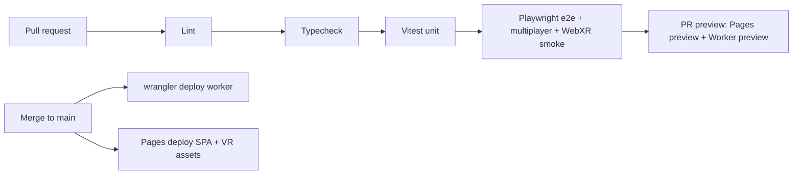

# Coboard — Implementation Roadmap

> _Purpose: the build plan — milestones M0–M5 mapped to the three canonical phases, granular GitHub-style task checklists, repo layout, CI/CD, testing strategy, a risk register, and the KPIs that define success._

**Related documents:** [README](../README.md) · [01 Product Vision & References](./01-product-vision-and-references.md) · [02 Features & Scope](./02-features-and-scope.md) · [03 Visual Design / UI-UX](./03-visual-design-ui-ux.md) · [04 Technical Architecture](./04-technical-architecture.md) · [05 Scaling & Cost](./05-scaling-and-cost.md) · [07 Engineering Quality, Performance, Security & Accessibility](./07-engineering-quality-security-accessibility.md)

---

## 1. Milestone overview

Six milestones map onto the three canonical phases. Each milestone is shippable on its own and leaves `main` deployable to Cloudflare Pages + Workers at $0.

| Milestone | Phase | Goal (one line) | Definition of Done (DoD) |
|---|---|---|---|
| **M0 — Foundations** | Pre-Phase 1 | Stand up the monorepo, tooling, CI/CD, and a deployed "hello" Worker + Pages SPA. | `pnpm install && pnpm build && pnpm test` green from a clean clone; PR previews deploy; `main` auto-deploys a live Pages SPA that opens a WS to a live Worker/DO and echoes a message. |
| **M1 — Realtime canvas core** | Phase 1 (MVP) | The full Phase-1 feature set: infinite canvas, pen/sticky/shape/text tools, select/move/resize/delete, undo/redo, realtime Yjs sync, labeled cursors + presence, anonymous rooms by URL, desktop mouse + touch. | Two browsers in the same room draw, edit, and see each other's strokes + labeled cursors live; a third joiner sees the existing board; works on desktop mouse and a touch device; two-client convergence + presence Playwright tests pass in CI. |
| **M2 — Persistence & rooms hardening** | Phase 1 → 2 bridge | Boards survive reconnect/DO eviction; snapshot/compaction; reconnection UX; room lifecycle + abuse guards. | Reload/disconnect/redeploy a busy room and the board is intact after reconnect; DO hibernates when idle and rehydrates from SQLite; update-log compaction runs; reconnection is invisible to the user; basic rate-limit + room-size cap enforced. |
| **M3 — Collaboration & polish** | Phase 2 | The Phase-2 catalog: cursor chat, stamps/reactions + high-five, comments, snapping connectors, frames/sections, templates, image upload (R2), eraser, sticky Sort, alignment guides, export PNG/SVG/PDF, follow + spotlight, timer, dot voting, minimap, optional WebRTC voice. | Each Phase-2 feature meets its doc-02 acceptance criteria; export round-trips; image upload lands in R2 and renders for all peers; follow/spotlight drives every viewport; feature e2e suite green. |
| **M4 — Cross-reality VR** | Phase 3 | Enter VR from any WebXR headset; render the same Yjs board as a 3D surface; 3D avatars (head + hands) + laser cursors via awareness; draw in VR by controller raycast; radial/wrist palette; comfort options. | On a WebXR headset (and the emulator), a user enters VR, sees the live 2D-edited board, draws strokes that appear for 2D peers, and sees other users' avatars + laser cursors; comfort options work; WebXR smoke test green in CI. |
| **M5 — Scale & cost hardening + AI stretch** | Cross-cutting | Prove and protect the free-tier capacity envelope (hibernation, batching, partysub sharding), add observability, and ship the AI-assist stretch. | Load test sustains the doc-05 target concurrency at $0 with hibernation + binary-batched awareness verified; partysub sharding path demonstrated for a hot room; dashboards + SLO alerts live; AI "summarize board / auto-cluster stickies" runs behind a flag. |


> Sequencing rule: **M2 ships before any Phase-2 feature** — persistence and reconnection are foundational, and building collaboration polish on a board that loses state would be wasted work.

---

## 2. Milestone task checklists

Tasks use GitHub task-list syntax so they parse into an interactive checklist. Each milestone groups work into **Setup · Client · Worker/DO · Persistence · Tests · Docs**.

### M0 — Foundations

**Setup**
- [ ] Create the GitHub repo `coboard` and protect `main` (require PR + green CI).
- [ ] Initialize a **pnpm workspaces** monorepo with `pnpm-workspace.yaml` referencing `packages/*`.
- [ ] Scaffold packages: `packages/client-web`, `packages/vr`, `packages/shared`, `packages/worker`.
- [ ] Add root **TypeScript** project references + a shared `tsconfig.base.json` (strict mode on).
- [ ] Configure **Vite** for `client-web` and `vr`; configure **Wrangler** for `worker`.
- [ ] Add ESLint + Prettier + `lint-staged` + Husky pre-commit (lint + typecheck).
- [ ] Add **Vitest** (unit) and **Playwright** (e2e) at the root with per-package projects.
- [ ] Add `pnpm` scripts: `dev`, `build`, `lint`, `typecheck`, `test`, `test:e2e`, `deploy`.

**Client**
- [ ] Bootstrap the `client-web` SPA shell (router, room-id-from-URL parsing, empty canvas placeholder).
- [ ] Add **PartySocket** and prove a round-trip: connect to the Worker, send a ping, log the echo.
- [ ] Add a minimal Zustand store + Lucide icon set placeholder toolbar.

**Worker/DO**
- [ ] Create a "hello" Worker that routes `/parties/main/:roomId` to a **PartyServer** Durable Object.
- [ ] Implement an echo `onMessage` in the DO using the **WebSocket Hibernation API** from day one.
- [ ] Declare the DO binding + SQLite migration stub in `wrangler.toml`.

**Persistence**
- [ ] Enable SQLite-backed DO storage and write/read a single smoke-test key to confirm durability.

**Tests**
- [ ] Vitest: a trivial `shared` unit test wired into CI.
- [ ] Playwright: one smoke e2e that loads the SPA and asserts the WS echo round-trips.

**Docs**
- [ ] Write the dev quickstart in `README.md` (`pnpm i`, env vars, `wrangler dev`, `pnpm dev`).
- [ ] Document the wrangler/Pages project names + required Cloudflare account secrets.

---

### M1 — Realtime canvas core (Phase 1 MVP)

**Setup**
- [ ] Add **Yjs** + `y-protocols/awareness` to `shared`; add **Y-PartyServer** to `worker`.
- [ ] Add **Konva.js** to `client-web`.
- [ ] Define the canonical Yjs document schema in `shared` (per doc-04 data model) and export typed accessors.

**Client (canvas + tools)**
- [ ] Build the infinite **pan/zoom** canvas (Konva stage; wheel/pinch zoom, drag/space-pan).
- [ ] Bind a Konva render layer **directly to the Yjs doc** (reconcile shapes ↔ Y.Map/Y.Array on change).
- [ ] Implement **freehand pen/marker** (color + thickness) writing stroke points into Yjs.
- [ ] Implement **sticky notes** (color + editable text).
- [ ] Implement **basic shapes**: rectangle, ellipse, line, arrow.
- [ ] Implement the **text tool**.
- [ ] Implement **select / move / resize / delete** (transformer handles; multi-select marquee).
- [ ] Wire **undo/redo** to `Y.UndoManager` (scoped to local-origin changes).
- [ ] Implement responsive input: **mouse** (desktop) + **touch** (mobile/tablet) pointer abstraction.

**Client (presence)**
- [ ] Publish local cursor + selection + user label/color via **awareness**.
- [ ] Render **live labeled cursors** for remote peers + a presence avatar stack with join/leave.
- [ ] Throttle/coalesce cursor publishes to **~20–30 Hz** and binary-encode (per architecture invariant).

**Worker/DO**
- [ ] Host one **Y-PartyServer**-bound Yjs doc per room (one DO per room id).
- [ ] Broadcast Yjs updates + awareness to all room sockets via hibernation-safe handlers.
- [ ] Generate a shareable **room code/URL** on first visit (anonymous, no signup).

**Persistence**
- [ ] Persist the Yjs update log into DO SQLite on edit (full snapshot/compaction deferred to M2).

**Tests**
- [ ] Vitest: CRDT/document-logic tests in `shared` (apply update → expected shape state; undo/redo).
- [ ] Playwright: **two-client multiplayer convergence test** — client A draws a stroke + sticky, assert client B's DOM/canvas converges to the same object set.
- [ ] Playwright: **presence/cursor test** — assert client A sees client B's labeled cursor move and the join/leave avatar update.
- [ ] Playwright: touch-emulation test for pan/zoom + draw on a mobile viewport.

**Docs**
- [ ] Document the Yjs schema + tool→Yjs mapping in doc-04 (link, don't duplicate).
- [ ] Add a "create a room and invite" usage note to `README.md`.

---

### M2 — Persistence & rooms hardening

**Setup**
- [ ] Define a snapshot cadence + update-log compaction policy in `shared` config.

**Client**
- [ ] Add reconnection UX: "reconnecting…" banner, optimistic local edits buffered by **PartySocket**, seamless resync on reconnect.
- [ ] Show a "board restored" state on cold rehydrate; handle empty/unknown room ids gracefully.

**Worker/DO**
- [ ] Verify **WebSocket Hibernation** evicts the idle DO and rehydrates document state from SQLite on next message.
- [ ] Implement room lifecycle: create-on-first-connect, TTL/idle handling, last-writer state flush.
- [ ] Add a basic **room-size cap** and **per-connection rate limit** (abuse guard).
- [ ] Add an optional **D1** room index/metadata table (room id, created-at, last-active).

**Persistence**
- [ ] Implement periodic **compacted snapshot** + truncate update log in DO SQLite.
- [ ] Implement load path: on DO wake, hydrate Yjs from latest snapshot + replay residual updates.
- [ ] Validate storage stays within the SQLite free allotment; add a size watchdog log.

**Tests**
- [ ] Playwright: **persistence test** — populate a room, force disconnect/reload, assert full board reload.
- [ ] Playwright: **redeploy/eviction test** — simulate DO restart, assert no data loss.
- [ ] Vitest: snapshot-then-replay equals live-doc state (compaction correctness).
- [ ] Load probe: connect N sockets, idle, confirm hibernation (no GB-s accrual) then resume.

**Docs**
- [ ] Document persistence + snapshot/compaction + hibernation in doc-04 and the cost impact in doc-05.

---

### M3 — Collaboration & polish (Phase 2)

**Setup**
- [ ] Add **Cloudflare R2** bucket + signed-upload Worker route for image/asset uploads.
- [ ] Add a templates module in `shared` (kanban, retro, mindmap, flowchart definitions).

**Client (collaboration)**
- [ ] **Cursor chat** (type at cursor; ephemeral via awareness).
- [ ] **Emoji stamps / reactions** + **high-five**.
- [ ] **Comments** (anchored threads, persisted in Yjs).
- [ ] **Follow** + **spotlight/presentation** mode (drive remote viewports via awareness).
- [ ] **Minimap** overview + viewport indicator.
- [ ] **Timer** and **dot voting** widgets (shared state in Yjs).

**Client (canvas polish)**
- [ ] **Connectors** that snap to shape anchors and re-route on move.
- [ ] **Frames/sections** (grouping + clipping).
- [ ] **Templates** picker that seeds a board.
- [ ] **Image upload** → R2 → render image node for all peers.
- [ ] **Eraser** tool.
- [ ] **Sticky Sort** (by color/author/reactions/theme).
- [ ] **Alignment/snapping guides**.
- [ ] **Export** PNG / SVG / PDF.

**Worker/DO**
- [ ] Serve R2 upload signing + asset URL resolution; enforce size/type limits (per doc-04).
- [ ] (Optional) WebRTC **voice** signaling over the DO for small rooms.

**Persistence**
- [ ] Persist comments, votes, timer, connectors, frames as Yjs structures (covered by snapshots).
- [ ] Store uploaded assets in R2; keep only references in the Yjs doc.

**Tests**
- [ ] Playwright: cursor-chat + reactions visible to a second client.
- [ ] Playwright: image upload appears for a peer (R2 round-trip).
- [ ] Playwright: follow/spotlight drives a follower's viewport.
- [ ] Vitest: connector snapping + sticky-Sort ordering logic.
- [ ] Playwright: export produces a non-empty PNG/SVG/PDF artifact.

**Docs**
- [ ] Update doc-02 acceptance criteria status; document R2 flow + voice signaling in doc-04.

---

### M4 — Cross-reality VR (Phase 3)

**Setup**
- [ ] Build out `packages/vr` with **A-Frame + Three.js** (WebXR) consuming the shared Yjs doc.
- [ ] Add a **headless WebXR emulator** harness for CI smoke tests.

**Client (VR)**
- [ ] Render the board as a **textured 3D surface**; MVP path = render the 2D Konva canvas to a `CanvasTexture` for an instant in-VR view.
- [ ] Implement the **infinite-canvas viewport window**: map the finite board panel to a movable, zoomable `{x, y, w, h}` **viewport rect in canvas-space** — per-user view state (awareness/local), **not** document state, so each user can look at a different region (like 2D scroll).
- [ ] **Slide + zoom** the viewport: grip-drag / thumbstick to pan the rect over the infinite canvas; **two-handed pinch** (or thumbstick) to zoom; add a **minimap**, **zoom-to-fit**, and **go-to-user**.
- [ ] **Viewport culling + LOD**: render only objects intersecting the viewport rect; CanvasTexture for the visible region (MVP) → native stroke geometry for the in-focus region (fidelity) so a dense canvas stays at 72–90 fps.
- [ ] **Cross-reality presence mapping**: show 2D peers' cursors as labeled dots on the VR panel and VR lasers/avatars as 2D cursors when viewports overlap; add directional edge indicators for off-viewport users.
- [ ] **Enter VR** from any WebXR headset via the browser (session request + fallback to desktop/mobile preview).
- [ ] Implement **controller raycast → board plane** drawing: map the hit **UV → viewport rect → canvas coordinates**, writing strokes into the **same Yjs doc** so they land at the correct infinite-canvas position for 2D peers.
- [ ] Render **3D avatars** (head + 2 hands) + **laser-pointer cursors** synced via **awareness**.
- [ ] Build an in-VR **radial / wrist tool palette**.
- [ ] Add **comfort options**: vignette, teleport, board reachability/scaling.
- [ ] (Fidelity path) native 3D stroke geometry instead of CanvasTexture — flag-gated.

**Worker/DO**
- [ ] Extend awareness payload schema for VR avatar **head+hands poses** + laser cursor (ephemeral, never persisted).
- [ ] Confirm awareness pose updates respect the cursor batching/throttling budget.

**Persistence**
- [ ] Confirm VR-authored strokes persist identically to 2D strokes (same Yjs path; no VR-specific store).

**Tests**
- [ ] WebXR **emulator smoke test**: enter a session, assert the board surface renders and a synthetic raycast stroke lands in Yjs.
- [ ] Playwright: a stroke drawn in the VR path appears for a 2D client (cross-reality convergence).
- [ ] Vitest: awareness pose encode/decode round-trip.

**Docs**
- [ ] Document VR rendering architecture + the shared-doc invariant + comfort UX in doc-04 and doc-03.

---

### M5 — Scale & cost hardening + AI stretch

**Setup**
- [ ] Add a load-testing harness (scripted WS clients simulating draw + cursor traffic).
- [ ] Wire observability: per-room connection count, inbound WS msg rate, DO request count, GB-s.

**Client**
- [ ] Tune awareness batching/coalescing + binary encoding to minimize **inbound** WS messages.
- [ ] Add client-side adaptive cursor rate (back off under high room population).

**Worker/DO**
- [ ] Implement the **partysub** sharding path: fan one hot room across N DOs above the per-DO comfort threshold.
- [ ] Add graceful degradation (shed cursor updates before content updates under pressure).

**Persistence**
- [ ] Verify SQLite storage stays within free allotment under sustained load; alert near thresholds.

**AI (stretch, flagged)**
- [ ] **Summarize board** (extract action items from stickies/text).
- [ ] **Auto-cluster stickies** into themes.

**Tests**
- [ ] Load test: sustain the doc-05 target concurrency at $0; assert hibernation + budget math hold.
- [ ] Test: partysub sharding preserves convergence across shards.
- [ ] Test: AI summarize/cluster behind a feature flag returns deterministic-shaped output.

**Docs**
- [ ] Publish the measured capacity table + SLO/monitoring note in doc-05; record the "$0 today / first $5" path.

---

## 3. Planned repo layout

```text
coboard/
├─ pnpm-workspace.yaml
├─ package.json                # root scripts: dev, build, lint, typecheck, test, test:e2e, deploy
├─ tsconfig.base.json          # strict, shared compiler options
├─ .github/workflows/ci.yml    # lint → typecheck → unit → e2e → deploy
├─ playwright.config.ts        # e2e + multiplayer + WebXR-emulator projects
├─ docs/                       # 01..07 + adr/ (this set)
├─ README.md
└─ packages/
   ├─ shared/                  # Yjs schema + typed accessors, awareness types, CRDT logic, templates
   │  ├─ src/
   │  └─ vitest/               # CRDT/document-logic unit tests
   ├─ client-web/              # Vite SPA: Konva 2D renderer, toolbar, Zustand store, PartySocket
   │  └─ src/
   ├─ vr/                      # A-Frame + Three.js WebXR renderer (binds the SAME shared Yjs doc)
   │  └─ src/
   └─ worker/                  # Cloudflare Worker + PartyServer DO + Y-PartyServer + R2/D1 routes
      ├─ src/
      └─ wrangler.toml         # DO binding, SQLite migrations, R2/D1 bindings
```

- **`shared`** is the contract layer: the Yjs document model, awareness payload types, and CRDT logic live here so `client-web`, `vr`, and `worker` cannot diverge.
- **`client-web`** and **`vr`** both render the **same** `shared` document — no parallel state stores.
- **`worker`** is the only package that talks to Durable Objects, R2, and D1.
- See [doc-04 §11](./04-technical-architecture.md) for the detailed `worker/src` file tree (it enumerates the optional D1 room-index and **partysub** sharding modules); this layout intentionally summarizes it.

---

## 4. CI/CD



- **Pipeline (GitHub Actions, `ci.yml`):** `pnpm install` → `lint` → `typecheck` → `vitest` (unit) → `playwright` (e2e incl. two-client multiplayer + presence + WebXR emulator). All four gates must pass before merge.
- **Preview deployments per PR:** every PR deploys a **Cloudflare Pages preview** for the SPA/VR assets and a **Worker preview** (`wrangler deploy` to a preview environment) so reviewers can click a live multiplayer link.
- **Deploy on merge to `main`:** `wrangler deploy` (Workers + Durable Objects) and **Pages deploy** (static SPA + A-Frame/VR assets). Static assets on Pages CDN do **not** bill Worker requests.
- **Secrets:** `CLOUDFLARE_API_TOKEN` + `CLOUDFLARE_ACCOUNT_ID` stored as GitHub Actions secrets; no other paid services required for the $0 baseline.
- **Concurrency/caching:** cache the pnpm store + Playwright browsers; cancel superseded PR runs.

---

## 5. Testing strategy

| Layer | Tool | What it covers |
|---|---|---|
| **Unit** | **Vitest** | CRDT/document logic in `shared`: apply-update → expected state, undo/redo via `Y.UndoManager`, snapshot↔replay equality, connector snapping + sticky-Sort ordering, awareness encode/decode round-trip. |
| **E2E — multiplayer** | **Playwright** | **Two-client convergence test:** client A draws stroke + sticky, assert client B converges to the same object set. **Presence/cursor test:** client B sees A's labeled cursor move + join/leave avatar updates. |
| **E2E — persistence** | **Playwright** | Disconnect/reload/redeploy a populated room → board reloads intact (covers hibernation + snapshot rehydrate). |
| **E2E — touch** | **Playwright** | Mobile-viewport pan/zoom/draw via touch emulation. |
| **VR smoke** | **Headless WebXR emulator** (in Playwright project) | Enter a WebXR session, render the board surface, fire a synthetic controller raycast, assert the stroke lands in Yjs and reaches a 2D peer. |
| **Load** | Scripted WS client harness (M5) | Sustain target concurrency at $0; verify the 20:1 inbound-WS budget, batching, and hibernation hold. |

**Principles**
- Multiplayer convergence and presence are **first-class CI gates** from M1 onward — they encode the core product promise.
- The VR smoke test runs in CI on the emulator; real-headset verification is a manual release-checklist item per milestone.
- Cross-reality convergence (VR stroke → 2D peer) is its own e2e once M4 lands, guarding the single-source-of-truth invariant.

---

## 6. Risk register

| Risk | Likelihood | Impact | Mitigation |
|---|---|---|---|
| **Free-tier limit overrun** (100k DO req/day, ~2M inbound WS msgs/day, SQLite allotment) | Medium | High | Binary-encode + throttle/coalesce cursor updates to ~20–30 Hz; rely on the 20:1 inbound-WS ratio and outbound-not-billed rule; observability dashboards + alerts (M5); per-room caps; documented "$0 today / first $5" upgrade path in doc-05. |
| **Hot-room broadcast cost / single-DO bottleneck** | Medium | High | WebSocket Hibernation to stop GB-s while idle; awareness shed-under-pressure (drop cursors before content); **partysub** sharding to spread one logical room across N DOs above ~a few hundred connections (M5). |
| **VR ↔ 2D state divergence** | Medium | High | One Yjs doc as the single source of truth — VR writes via the same `shared` schema/accessors, never a parallel store; cross-reality convergence e2e (M4); awareness-only for ephemeral VR poses. |
| **CRDT memory / storage growth** (Yjs update-log unbounded) | Medium | Medium | Periodic compacted snapshots + update-log truncation in DO SQLite (M2); 128 MB/DO memory ceiling watched; storage size watchdog + alerts; tombstone-aware compaction. |
| **Abuse / spam** (anonymous rooms, no signup) | Medium | Medium | Per-connection rate limits; room-size caps; R2 upload size/type limits; D1 room index for flagging/TTL; optional auth (GitHub OAuth / Cloudflare Access) for private boards later. |
| **Browser WebXR compatibility** (Quest/Vive/Cardboard + desktop/mobile fallback) | Medium | Medium | A-Frame's broad device coverage + graceful desktop/mobile preview fallback; CanvasTexture MVP path for instant in-VR view before native 3D geometry; WebXR emulator in CI; documented supported-headset matrix. |

---

## 7. KPIs / success metrics

| Metric | Target | How measured |
|---|---|---|
| **Sync latency p95** (edit → visible on a peer) | < 250 ms intra-region | Client timestamp on Yjs update → render on peer; sampled in load tests + RUM. |
| **Cursor round-trip (RTT)** | < 150 ms p95 intra-region (matches the doc-05 SLO) | Awareness echo timing; verifies the 20–30 Hz batching feels live. |
| **Max concurrent room size on free tier** | Meets doc-05 capacity target per DO; partysub beyond | M5 load test against the budget math (inbound WS msgs, GB-s, requests). |
| **Time-to-first-draw** | < 3 s from cold link open to a usable, drawable board (includes the doc-05 `< 1 s` DO cold-start rehydrate as a component, not a competing target) | Synthetic Playwright timing from navigation to first stroke accepted. |
| **Crash-free sessions** | > 99% | Client error reporting / session telemetry over rolling window. |
| **Reconnect success rate** | > 99% with no data loss | Persistence e2e + production reconnect telemetry (M2). |
| **Cross-reality convergence** | 100% of VR-authored strokes appear for 2D peers (and vice versa) | M4 cross-reality e2e + manual headset checklist. |

---

## 8. Definition of Done — per milestone (summary)

- **M0:** clean-clone `pnpm install && pnpm build && pnpm test` green; PR previews live; `main` deploys a Pages SPA that round-trips a WS echo through a hibernation-enabled DO.
- **M1:** two browsers draw/edit/see-cursors live in one room; third joiner inherits the board; desktop + touch; two-client convergence + presence e2e green.
- **M2:** reload/disconnect/redeploy a busy room → board intact; DO hibernates + rehydrates from SQLite; compaction runs; reconnection invisible; rate-limit + size cap enforced.
- **M3:** every Phase-2 feature meets doc-02 acceptance criteria; R2 image round-trip works for peers; export round-trips; follow/spotlight drives viewports; feature e2e green.
- **M4:** VR entry on a headset + emulator; same board renders in 3D; VR strokes reach 2D peers; avatars + laser cursors sync via awareness; comfort options work; WebXR smoke green.
- **M5:** load test sustains the doc-05 concurrency target at $0 with hibernation + binary batching verified; partysub sharding demonstrated for a hot room; dashboards + SLO alerts live; AI summarize/auto-cluster behind a flag.
