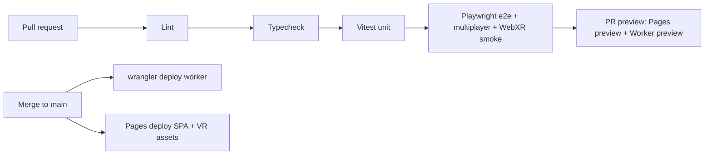

# Komuboard — Implementation Roadmap

> _Purpose: the build plan — milestones M0–M5 mapped to the three canonical phases, granular GitHub-style task checklists, repo layout, CI/CD, testing strategy, a risk register, and the KPIs that define success._

**Related documents:** [README](../README.md) · [01 Product Vision & References](./01-product-vision-and-references.md) · [02 Features & Scope](./02-features-and-scope.md) · [03 Visual Design / UI-UX](./03-visual-design-ui-ux.md) · [04 Technical Architecture](./04-technical-architecture.md) · [05 Scaling & Cost](./05-scaling-and-cost.md) · [07 Engineering Quality, Performance, Security & Accessibility](./07-engineering-quality-security-accessibility.md)

---

## 1. Milestone overview

Six milestones map onto the three canonical phases. Each milestone is shippable on its own and leaves `main` deployable to Cloudflare Pages + Workers at $0.

| Milestone                                    | Phase              | Goal (one line)                                                                                                                                                                                                                                                                 | Definition of Done (DoD)                                                                                                                                                                                                                                        |
| -------------------------------------------- | ------------------ | ------------------------------------------------------------------------------------------------------------------------------------------------------------------------------------------------------------------------------------------------------------------------------- | --------------------------------------------------------------------------------------------------------------------------------------------------------------------------------------------------------------------------------------------------------------- |
| **M0 — Foundations**                         | Pre-Phase 1        | Stand up the monorepo, tooling, CI/CD, and a deployed "hello" Worker + Pages SPA.                                                                                                                                                                                               | `pnpm install && pnpm build && pnpm test` green from a clean clone; PR previews deploy; `main` auto-deploys a live Pages SPA that opens a WS to a live Worker/DO and echoes a message.                                                                          |
| **M1 — Realtime canvas core**                | Phase 1 (MVP)      | The full Phase-1 feature set: infinite canvas, pen/sticky/shape/text tools, select/move/resize/delete, undo/redo, realtime Yjs sync, labeled cursors + presence, anonymous rooms by URL, desktop mouse + touch.                                                                 | Two browsers in the same room draw, edit, and see each other's strokes + labeled cursors live; a third joiner sees the existing board; works on desktop mouse and a touch device; two-client convergence + presence Playwright tests pass in CI.                |
| **M2 — Persistence & rooms hardening**       | Phase 1 → 2 bridge | Boards survive reconnect/DO eviction; snapshot/compaction; reconnection UX; room lifecycle + abuse guards.                                                                                                                                                                      | Reload/disconnect/redeploy a busy room and the board is intact after reconnect; DO hibernates when idle and rehydrates from SQLite; update-log compaction runs; reconnection is invisible to the user; basic rate-limit + room-size cap enforced.               |
| **M3 — Collaboration & polish**              | Phase 2            | The Phase-2 catalog: cursor chat, stamps/reactions + high-five, comments, snapping connectors, frames/sections, templates, image upload (R2), eraser, sticky Sort, alignment guides, export PNG/SVG/PDF, follow + spotlight, timer, dot voting, minimap, optional WebRTC voice. | Each Phase-2 feature meets its doc-02 acceptance criteria; export round-trips; image upload lands in R2 and renders for all peers; follow/spotlight drives every viewport; feature e2e suite green.                                                             |
| **M4 — Cross-reality VR**                    | Phase 3            | Enter VR from any WebXR headset; render the same Yjs board as a 3D surface; 3D avatars (head + hands) + laser cursors via awareness; draw in VR by controller raycast; radial/wrist palette; comfort options.                                                                   | On a WebXR headset (and the emulator), a user enters VR, sees the live 2D-edited board, draws strokes that appear for 2D peers, and sees other users' avatars + laser cursors; comfort options work; WebXR smoke test green in CI.                              |
| **M5 — Scale & cost hardening + AI stretch** | Cross-cutting      | Prove and protect the free-tier capacity envelope (hibernation, batching, partysub sharding), add observability, and ship the AI-assist stretch.                                                                                                                                | Load test sustains the doc-05 target concurrency at $0 with hibernation + binary-batched awareness verified; partysub sharding path demonstrated for a hot room; dashboards + SLO alerts live; AI "summarize board / auto-cluster stickies" runs behind a flag. |

```mermaid
gantt
    title Komuboard milestone sequence
    dateFormat  X
    axisFormat %s
    section Phase 1 (MVP)
    M0 Foundations            :m0, 0, 1
    M1 Realtime canvas core   :m1, after m0, 3
    M2 Persistence & rooms    :m2, after m1, 2
    section Phase 2
    M3 Collaboration & polish :m3, after m2, 4
    section Phase 3
    M4 Cross-reality VR       :m4, after m3, 3
    section Cross-cutting
    M5 Scale & cost + AI      :m5, after m4, 2
```



> Sequencing rule: **M2 ships before any Phase-2 feature** — persistence and reconnection are foundational, and building collaboration polish on a board that loses state would be wasted work.

---

## 1a. Current status (2026-06-22)

> _A "you are here" snapshot. The granular checklists in §2 predate the M1 audit, the renderer migration, and the stamp work, so some boxes there lag reality — this section is the reconciled source of truth; §2 boxes are being ticked off against it._

**Done — M1 core authoring + presence.** Infinite pan/zoom canvas, pen, sticky, shapes (rect/ellipse/line/arrow), text, **select/move/resize/delete + rotate**, multi-select marquee, **copy/paste/duplicate**, undo/redo, mouse + touch input, the dotted grid, zoom-to-cursor + zoom HUD, the Hand tool, labeled live cursors + presence facepile, and the tool dock / top bar / colour + width controls. Two-client convergence, presence, live drag/draw/resize, and copy-paste are covered by Playwright.

**Pulled forward from Phase 2 (M3) and shipped early — _ahead of M2, against the sequencing rule above_.** **Connectors** (snap to shape anchors, re-route on move), the **eraser**, and a full **stamp tool** (FigJam radial wheel + emoji/mark/avatar stickers, placement, transform, and **host attachment** — a stamp dropped on a sticky/shape rides its move/rotate/resize and is deleted with it, live for peers). These were valuable but mean persistence now lags the feature set it should have preceded.

**Major architecture change — [ADR-0009](./adr/0009-render-model-dom-unification.md), Phases 0–3 done.** The 2D board migrated off the Konva canvas to a **DOM-unified renderer**: every object (text/shape/sticky/stamp/stroke/connector) is a DOM element z-ordered by `orderArray`, giving true FigJam per-object placement stacking. `Konva.Transformer` and all Konva object layers were retired (only the camera/cursor stages + a transient-chrome overlay remain on Konva). The Yjs model was untouched — view-layer only. Several §2 lines describing a "Konva render layer bound to Yjs" are now historical.

**Biggest open gaps (in priority order):**

1. **M2 — persistence & rooms hardening (barely started).** Basic SQLite DO durability exists, but snapshot/compaction, reconnection UX, hibernate-rehydrate verification, room slugs, the share flow + permissions, and abuse guards are not built. This is the foundational gap and the stated prerequisite for the Phase-2 work already shipped.
2. **ADR-0009 Phase 4 — performance.** No viewport culling yet (pan/zoom and mount cost scale with _total_ board size, not visible count); LOD at far zoom, dense-board profiling, and an a11y pass are pending. See [docs/09](./09-tech-debt-and-audit-backlog.md).
3. **Remaining M1 polish.** Group/ungroup + lock, z-order controls, arrow-key nudge, context menus, and much of the onboarding / templates / minimap / share chrome.

---

## 2. Milestone task checklists

Tasks use GitHub task-list syntax so they parse into an interactive checklist. Each milestone groups work into **Setup · Client · Worker/DO · Persistence · Tests · Docs**.

### M0 — Foundations

**Setup**

- [ ] Create the GitHub repo `komuboard` and protect `main` (require PR + green CI).
- [x] Initialize a **pnpm workspaces** monorepo with `pnpm-workspace.yaml` referencing `packages/*`.
- [x] Scaffold packages: `packages/client-web`, `packages/vr`, `packages/shared`, `packages/worker`.
- [x] Add root **TypeScript** project references + a shared `tsconfig.base.json` (strict mode on).
- [x] Configure **Vite** for `client-web` and `vr`; configure **Wrangler** for `worker`.
- [ ] Add ESLint + Prettier + `lint-staged` + Husky pre-commit (lint + typecheck).
- [x] Add **Vitest** (unit) and **Playwright** (e2e) at the root with per-package projects.
- [x] Add `pnpm` scripts: `dev`, `build`, `lint`, `typecheck`, `test`, `test:e2e`, `deploy`.

**Client**

- [x] Bootstrap the `client-web` SPA shell (router, room-id-from-URL parsing, empty canvas placeholder).
- [x] Add **PartySocket** and prove a round-trip: connect to the Worker, send a ping, log the echo.
- [x] Add a minimal Zustand store + Lucide icon set placeholder toolbar.

**Worker/DO**

- [x] Create a "hello" Worker that routes `/parties/main/:roomId` to a **PartyServer** Durable Object.
- [x] Implement an echo `onMessage` in the DO using the **WebSocket Hibernation API** from day one.
- [x] Declare the DO binding + SQLite migration stub in `wrangler.toml`.

**Persistence**

- [x] Enable SQLite-backed DO storage and write/read a single smoke-test key to confirm durability.

**Tests**

- [x] Vitest: a trivial `shared` unit test wired into CI.
- [x] Playwright: one smoke e2e that loads the SPA and asserts the WS echo round-trips.

**Docs**

- [x] Write the dev quickstart in `README.md` (`pnpm i`, env vars, `wrangler dev`, `pnpm dev`).
- [ ] Document the wrangler/Pages project names + required Cloudflare account secrets.

---

### M1 — Realtime canvas core (Phase 1 MVP)

**Setup**

- [x] Add **Yjs** + `y-protocols/awareness` to `shared`; add **Y-PartyServer** to `worker`.
- [x] Add **Konva.js** to `client-web`.
- [x] Define the canonical Yjs document schema in `shared` (per doc-04 data model) and export typed accessors.
- [ ] Author DTCG design tokens (color/dimension/duration/cubicBezier/shadow) as the single source of truth — _done when:_ typed token files exist for every doc-03 §2 category and pass schema validation in CI.
- [ ] Build a Style-Dictionary-style token pipeline to three targets (CSS vars, `tokens.ts`, JSON snapshot) — _done when:_ one build emits the CSS custom-property sheet, `packages/shared/tokens.ts`, and a JSON snapshot, and changing one token updates all three.
- [ ] Self-host the Inter variable woff2 subset + a mono stack (JetBrains/`ui-monospace`) — _done when:_ no third-party font network request occurs and both apply to UI and canvas text.
- [ ] Integrate the **Lucide** icon set at 1.75px stroke with `currentColor` inheritance — _done when:_ all tool/chrome icons render from Lucide at a 24px artboard and inherit theme/accent via `currentColor`.

**Client (canvas + tools)**

- [x] Build the infinite **pan/zoom** canvas (Konva stage; wheel/pinch zoom, drag/space-pan).
- [x] Bind the render layer **directly to the Yjs doc** (reconcile objects ↔ Y.Map/Y.Array on change). _(Originally a Konva layer; migrated to the DOM-unified renderer in [ADR-0009](./adr/0009-render-model-dom-unification.md).)_
- [x] Implement **freehand pen/marker** (color + thickness) writing stroke points into Yjs.
- [x] Implement **sticky notes** (color + editable text).
- [x] Implement **basic shapes**: rectangle, ellipse, line, arrow.
- [x] Implement the **text tool**.
- [x] Implement **select / move / resize / delete** (transformer handles; multi-select marquee).
- [x] Wire **undo/redo** to `Y.UndoManager` (scoped to local-origin changes).
- [x] Implement responsive input: **mouse** (desktop) + **touch** (mobile/tablet) pointer abstraction.
- [x] Render the infinite **dotted-paper grid backdrop** — _done when:_ the canvas fills the viewport with a fixed-density radial dot grid that pans/zooms with content and stays crisp at all zoom levels.
- [ ] Add explicit **pan affordances** (Hand tool, space-drag, middle-mouse, trackpad two-finger) — _done when:_ each path moves the viewport without mutating content and the cursor changes to grab/grabbing.
- [x] Add **zoom-to-cursor** scroll/`Cmd/Ctrl`+scroll and `Cmd/Ctrl`+`+`/`-` zoom within the 10%–400% range — _done when:_ scroll zooms toward the pointer and the zoom % readout updates live.
- [x] **Rotate** objects (sticky/shape/stamp/stroke/connector) via a rotation handle — _done when:_ a selected object rotates to an arbitrary angle and the angle persists/syncs.
- [x] **Copy / cut / paste / duplicate** objects with offset — _done when:_ `Cmd/Ctrl`+C/X/V and `Cmd/Ctrl`+D (and Alt-drag) create offset copies that sync to peers. _(Copy/paste/duplicate with a cascading offset shipped + e2e-covered; Alt-drag is the remaining nicety.)_
- [ ] **Group / ungroup** and **lock / unlock** objects — _done when:_ `Cmd/Ctrl`+G/Shift+G group/ungroup and `Cmd/Ctrl`+L locks/unlocks the selection.
- [ ] **Arrow-key nudge** (1px) and Shift+arrow (10px) for the selection — _done when:_ arrow keys move the selection 1px and Shift+arrow moves it 10px.
- [ ] **Z-order** controls (bring forward / send back) — _done when:_ the selection's stacking order changes via menu/shortcut and re-renders for all peers.
- [ ] **Keyboard shortcuts for every tool** (V/H/P/E/S/T/R/O/A/C/I/L/F/U) — _done when:_ each key activates its tool when canvas-focused and is suppressed while editing text/sticky fields.
- [ ] **Esc** cancels the active tool / clears selection / closes popovers and reverts to Select — _done when:_ pressing Esc performs all four and returns to the Select tool.
- [ ] Desktop right-click **context menus** for object and canvas — _done when:_ an object menu offers cut/copy/paste, duplicate, delete, bring/send, lock, add comment, copy link; the canvas menu offers paste, select-all, add sticky/frame here, zoom to fit; both open via Shift+F10/Menu key and are arrow/Enter/Esc navigable.
- [ ] **Focus mode** that toggles all floating chrome (`\`) — _done when:_ pressing `\` hides all chrome for a clean canvas and restores it on repeat.

**Client (presence)**

- [x] Publish local cursor + selection + user label/color via **awareness**.
- [x] Render **live labeled cursors** for remote peers + a presence avatar stack with join/leave.
- [x] Throttle/coalesce cursor publishes to **~20–30 Hz** and binary-encode (per architecture invariant).

**Client (chrome: top bar, dock, panels, zoom, minimap)**

- [ ] Render the floating **top bar** (blur backdrop) with logo/home, room pill, presence facepile, Help, and Share — _done when:_ the bar pins to the top using surface/elevation tokens and holds all five clusters without overflow at 390px.
- [ ] Render the **Komuboard brand mark + wordmark** — _done when:_ a gradient logo glyph plus the "Komuboard" wordmark sit top-left and clicking routes to home/dashboard.
- [ ] Render the floating **tool dock** with `role=toolbar` and idle auto-dim — _done when:_ the dock floats (left or bottom-center per design), dims to ~70% after 3s idle, and returns to full on hover/focus.
- [ ] Show **single-active-tool** highlighting with `aria-pressed` — _done when:_ exactly one tool shows the accent active style with `aria-pressed=true` and switching moves the highlight.
- [ ] Add **tool dock separators / grouping** — _done when:_ hairline separators group nav, draw, shape, and media tools per the mockup.
- [x] Add **tool tooltips** with name + shortcut — _done when:_ hovering a tool shows a tooltip (e.g. "Pen (P)") whose text matches the bound key and the control's `aria-label`.
- [ ] Add a dock **overflow "more" menu** for secondary tools + settings — _done when:_ the more control reveals Connector/Frame/Image/Stamp plus undo/redo and settings without crowding the primary row.
- [ ] Implement a **sticky/lock tool modifier** (double/long-press) with a lock glyph — _done when:_ locking keeps a tool active after a draw (shown by a lock glyph) while a single activation reverts to Select after one shape.
- [ ] Per-tool **memory** of last fill/stroke/width/color — _done when:_ reselecting a tool restores its last-used style.
- [ ] Render the contextual **Properties panel** that reflects the active tool/selection — _done when:_ selecting ≥1 object slides in the right panel and clearing selection collapses it, with only selection-relevant controls shown.
- [x] **Color swatch picker** + selected-ring + **custom color** input — _done when:_ choosing a swatch sets the active color (one selected ring) and a custom-hex control adds/uses any color, applied to new/selected items.
- [x] **Stroke-width slider** with live `px` readout — _done when:_ dragging updates the "Stroke width · Npx" label and changes new/selected stroke width.
- [ ] **Stroke-style** segmented control (Solid/Dashed/Highlight) — _done when:_ selecting a segment changes new strokes and Highlight renders a semi-transparent wide stroke.
- [ ] **Opacity slider** with percentage readout — _done when:_ dragging updates the "Opacity · N%" label and changes alpha of new/selected items.
- [ ] **Font, text-alignment, and layer-order** controls in Properties for text/sticky — _done when:_ font changes typeface/size, alignment sets left/center/right, and layer controls reorder z-index matching the bring/send shortcuts.
- [ ] Render the **Zoom HUD** (−, clickable %, +) — _done when:_ the HUD shows current zoom %, +/- step toward bounds, and clicking the % resets to 100%/centered.
- [ ] **Zoom-to-fit / zoom-to-selection / reset-to-100%** commands — _done when:_ Shift+1 fits all content, Shift+2 fits the selection, Shift+0 resets to 100% with a camera tween.
- [ ] Render the **minimap** with the local viewport rectangle — _done when:_ the minimap shows scaled content with a solid accent rect for the local viewport; click/drag jogs the main viewport; toggled by M.

**Client (presence & identity)**

- [ ] Render the **presence facepile / avatar stack** — _done when:_ present peers render as overlapping identity-colored avatars in stable join order alongside the local user.
- [ ] **Initials fallback** + overflow **"+N" chip** with roster popover — _done when:_ a photoless avatar shows the user's initial on their color, and beyond the cap a "+N" chip opens a scrollable roster.
- [ ] **Editable display name** for the local user — _done when:_ changing the name updates the user's cursor tag and facepile for all peers within ~1s and persists across reload (per-viewer localStorage, not the Yjs doc).
- [ ] Provide a **friendly default display name** (e.g. "Guest Otter") editable inline — _done when:_ a new user gets an editable friendly default that propagates to cursor pill, facepile, and avatar.

**Client (onboarding & empty state)**

- [ ] Render the empty-board **ghost prompt** with headline, hint, and CTAs — _done when:_ a zero-content board shows a centered prompt ("Start your board" / "Start drawing…") with Invite-people and Use-a-template CTAs that disappears once the first object is added.
- [ ] Show the **"press P to draw" keyboard hint** styled as a `.kbd` chip — _done when:_ the hint renders P as a key chip and pressing P from the empty state activates the Pen tool.
- [ ] Render a dashed **drop-target placeholder** + curved guide arrow to the dock — _done when:_ a dashed placeholder ("Drop a template here, or just start sketching") accepts template drops and a non-interactive dashed arrow points toward the tool dock.
- [ ] Render the **template gallery** floating panel with thumbnail previews and hover/selected states — _done when:_ a gallery card shows "Start from a template" with Blank (default-selected)/Kanban/Retro/Mind map/Flowchart tiles, each with an SVG mini-preview and hover-lift + selected-ring states.
- [ ] Support **drag-template-onto-canvas** placement — _done when:_ dropping a template tile on the canvas/placeholder inserts that template at the drop location.
- [ ] Render the bottom **shortcut-hint caption chips** — _done when:_ centered chips render "Press ? for shortcuts" and "Cmd+scroll to zoom · space to pan" and can be dismissed.
- [ ] Implement the **keyboard-shortcut / help overlay** (`?`) — _done when:_ pressing ? opens a cheat-sheet overlay listing all shortcut groups and Esc closes it.

**Client (accessibility)**

- [ ] Provide **accessible labels** for every icon-only control — _done when:_ tools, help, share-close, copy, and zoom buttons expose accessible names matching their tooltips for screen readers.
- [ ] Implement a **visible focus ring** with logical focus order (Top bar → Dock → Properties → Minimap → objects) and Focus-Not-Obscured — _done when:_ focus uses a 2px ring (+2px offset) that is never removed or covered by chrome.
- [ ] Enforce **minimum target sizes** (≥24px desktop, ≥44–48px touch) — _done when:_ all interactive targets meet WCAG 2.5.8 and FAB/handles/tool buttons are ≥44–48px on touch.
- [ ] Ensure the UI **reflows and stays usable at 200% browser zoom** — _done when:_ no chrome is clipped, all controls remain operable, and sticky text never shrinks below the `--text-xs` equivalent.
- [ ] Implement a global **`prefers-reduced-motion`** override + **light/dark theme** support — _done when:_ reduce-motion collapses transform transitions to instant (opacity-only fades) and a theme toggle (honoring `prefers-color-scheme`, localStorage override) recolors chrome and canvas grid with adequate contrast in both modes.

**Worker/DO**

- [x] Host one **Y-PartyServer**-bound Yjs doc per room (one DO per room id).
- [x] Broadcast Yjs updates + awareness to all room sockets via hibernation-safe handlers.
- [x] Generate a shareable **room code/URL** on first visit (anonymous, no signup).

**Persistence**

- [x] Persist the Yjs update log into DO SQLite on edit (full snapshot/compaction deferred to M2).

**Tests**

- [ ] Vitest: CRDT/document-logic tests in `shared` (apply update → expected shape state; undo/redo).
- [x] Playwright: **two-client multiplayer convergence test** — client A draws a stroke + sticky, assert client B's DOM/canvas converges to the same object set.
- [x] Playwright: **presence/cursor test** — assert client A sees client B's labeled cursor move and the join/leave avatar update.
- [ ] Playwright: touch-emulation test for pan/zoom + draw on a mobile viewport.
- [ ] Test: **tool selection + shortcut mapping** — _done when:_ each dock tool and its shortcut activates the matching tool, the active-state updates, and tooltips match bound keys.
- [ ] Test: **zoom/pan viewport state** — _done when:_ +/−/fit and Cmd+scroll change the zoom % readout and transform within the 10%–400% bounds.
- [ ] Test: **empty-state + template seeding** — _done when:_ the ghost prompt shows on empty boards, hides after the first element, and each template seeds its expected element set.
- [ ] Test: **token contrast + CVD-distinguishability** — _done when:_ automated checks assert doc-03 §2.1 text/accent contrast ≥ targets and adjacent identity colors differ by ≥3:1 luminance.
- [ ] Test: **keyboard-shortcut coverage + reduced-motion** — _done when:_ every documented shortcut fires its action and reduce-mode collapses transforms to instant with opacity-only fades.

**Docs**

- [ ] Document the Yjs schema + tool→Yjs mapping in doc-04 (link, don't duplicate).
- [ ] Add a "create a room and invite" usage note to `README.md`.

---

### M2 — Persistence & rooms hardening

**Setup**

- [ ] Define a snapshot cadence + update-log compaction policy in `shared` config.

**Client**

- [x] Add reconnection UX: "reconnecting…" banner, optimistic local edits buffered by **PartySocket**, seamless resync on reconnect.
- [ ] Show a "board restored" state on cold rehydrate; handle empty/unknown room ids gracefully.

**Client (room pill, share, anonymous join)**

- [ ] Render the **room pill** with room name/slug and a live connection dot — _done when:_ the pill shows the current room slug (mono, disambiguated glyphs) with a green pulsing dot when the socket is connected and an amber/red state on disconnect; tapping reveals room details/rename/copy.
- [ ] Render the **room-code copy control** — _done when:_ clicking the copy icon writes the room code/URL to the clipboard and politely announces "Copied!".
- [x] Render the primary **Share button** and open the **Share dialog** — _done when:_ clicking Share opens a labeled, focus-trapped, elevated card ("Share this board"), and Esc/backdrop/X closes it and returns focus to the Share button.
- [ ] Show the read-only **room URL field** with **Copy-link** + confirmation — _done when:_ the field shows `komuboard.app/r/<room-slug>` (slug = current room, selectable) and Copy writes the full URL and shows a "Copied" state.
- [x] Render a scannable **QR code** for the room URL with caption — _done when:_ the QR encodes the exact room URL (decodes back to it) and shows "Scan to join".
- [ ] Add **Email/mailto share** and **native share-sheet** handoff — _done when:_ Email opens a prefilled mailto with the room link and, on supported devices, a Share action invokes the OS share sheet.
- [ ] Add the **"anyone with the link can edit" permission toggle** with "No signup required" helper — _done when:_ toggling access changes link-joiner edit rights, the state persists on the room, and the helper text + shield/check icon render.
- [ ] Place link/QR **joiners at a sensible viewport** with a join toast — _done when:_ a user joining via link/QR lands zoomed-to-fit (or at the inviter's spotlight view) and all peers see a join toast.
- [ ] Add the **hamburger / overflow menu** — _done when:_ tapping the menu icon opens a drawer/menu with board- and app-level actions (theme, export, templates, Enter VR).
- [ ] Show **loading / connecting** and **error** room states — _done when:_ a loading/skeleton state shows while snapshot+presence load (editing gated), an invalid/expired/unauthorized room shows a clear error with a create/join path, and a brand-new room shows the inviting empty state rather than a blank screen.

**Client (mobile)**

- [ ] Implement **responsive layouts** for desktop (≥1024) / tablet (600–1023) / phone (<600) — _done when:_ chrome reflows across the three breakpoints per doc-03 §4 sharing one component vocabulary, respecting safe-area insets.
- [ ] Implement the **mobile compressed top bar** (logo, short code, 3+N presence, Share, overflow) — _done when:_ the phone top bar holds all clusters without overflow at 390px and the overflow ⋯ exposes theme/export/templates/Enter VR.
- [ ] Implement the **mobile FAB + tool bottom sheet** — _done when:_ the FAB toggles the tool sheet (showing the active tool's icon), the sheet shows ≥44–48px tool buttons in rows, and swipe-down/scrim-tap dismisses it.
- [ ] Implement the **mobile properties bottom sheet** with a drag grabber — _done when:_ selecting an object shows a properties sheet (Fill/Stroke/Width, Duplicate/Delete) whose grabber expands/collapses/flick-dismisses it.
- [ ] Implement **mobile touch gestures** — _done when:_ one finger draws/drags, two fingers pan, pinch zooms to the centroid, double-tap zooms a step, long-press opens context/quick-add, and two/three-finger taps undo/redo.
- [ ] Hide the **minimap by default on mobile**, exposed via overflow — _done when:_ the minimap is hidden on phone and reachable from the overflow ⋯ menu.

**Worker/DO**

- [ ] Verify **WebSocket Hibernation** evicts the idle DO and rehydrates document state from SQLite on next message.
- [ ] Implement room lifecycle: create-on-first-connect, TTL/idle handling, last-writer state flush.
- [x] Add a basic **room-size cap** and **per-connection rate limit** (abuse guard).
- [ ] Add an optional **D1** room index/metadata table (room id, created-at, last-active).
- [ ] Mint a **human-readable room slug** for new boards — _done when:_ creating a board produces a unique `adjective-animal-NN`-style slug that routes to the room with no collisions.
- [ ] Land **anonymous users directly in a room** (generated code, color, default name; no modal/signup) — _done when:_ opening any room URL grants an editable anonymous session with a human-readable code, assigned identity color, and editable default name.
- [ ] **Enforce link-edit vs view-only** permission server-side — _done when:_ with the permission toggle off, edit ops from link-only joiners are rejected by the Worker/DO and they receive view-only sessions.
- [ ] Implement a **"new code" (rotate) action** for the join alias — _done when:_ rotating issues a new rate-limited room code while the link capability stays the security boundary.

**Persistence**

- [ ] Implement periodic **compacted snapshot** + truncate update log in DO SQLite.
- [ ] Implement load path: on DO wake, hydrate Yjs from latest snapshot + replay residual updates.
- [ ] Validate storage stays within the SQLite free allotment; add a size watchdog log.
- [ ] Persist **user identity** (display name, color, avatar ref) per session — _done when:_ a returning user's name, assigned color, and avatar are restored on reconnect, with display name held as a per-viewer localStorage preference (not the Yjs doc).
- [ ] Persist the **onboarding-complete / first-run flag** — _done when:_ completing or dismissing coachmarks stores a flag so they do not reappear on later visits unless replayed via Help.

**Tests**

- [ ] Playwright: **persistence test** — populate a room, force disconnect/reload, assert full board reload.
- [ ] Playwright: **redeploy/eviction test** — simulate DO restart, assert no data loss.
- [ ] Vitest: snapshot-then-replay equals live-doc state (compaction correctness).
- [ ] Load probe: connect N sockets, idle, confirm hibernation (no GB-s accrual) then resume.
- [ ] Test: **share flow** (copy link, copy code, QR, rotate code, joiner viewport) — _done when:_ tests assert the URL matches the room slug, Copy writes it, QR encodes it, rotation issues a new code, and a joiner lands at a sensible viewport with a join toast.
- [ ] Test: **permission toggle** flips link-joiner edit rights — _done when:_ a test asserts turning access off makes link-joiners read-only and rejects their edits.
- [ ] Vitest: **CRDT convergence under concurrent edits** — _done when:_ conflicting ops from two simulated clients converge to identical document state with no lost objects.
- [ ] Test: **dialog/menu ARIA + focus trap** — _done when:_ the share/room dialogs use `role=dialog` with a labeled title, trap and return focus, close on Esc, and link error text via `aria-describedby`.

**Docs**

- [ ] Document persistence + snapshot/compaction + hibernation in doc-04 and the cost impact in doc-05.

---

### M3 — Collaboration & polish (Phase 2)

**Setup**

- [ ] Add **Cloudflare R2** bucket + signed-upload Worker route for image/asset uploads.
- [ ] Add a templates module in `shared` (kanban, retro, mindmap, flowchart definitions).

**Client (collaboration)**

- [ ] **Cursor chat** (type at cursor; ephemeral via awareness).
- [~] **Emoji stamps** _(done — persistent placed-sticker tool with host attachment)_ · **reactions / high-five** _(pending — ephemeral awareness float, see Reaction picker below)_.
- [ ] **Comments** (anchored threads, persisted in Yjs).
- [ ] **Follow** + **spotlight/presentation** mode (drive remote viewports via awareness).
- [ ] **Minimap** overview + viewport indicator.
- [ ] **Timer** and **dot voting** widgets (shared state in Yjs).
- [ ] **Cursor-chat input + bubble** (`/`) with send/persist-6s/cancel — _done when:_ pressing `/` attaches an input to the cursor, typed text shows live to peers (emoji included) using a surface-raised bubble with an identity-color accent bar, Enter sends, the bubble fades after ~6s, and Esc cancels — awareness-only.
- [ ] **Reaction picker** + floating burst (Shift+E) and **high-five toward a target** (Shift+H) — _done when:_ Shift+E opens an emoji picker that floats the choice up from the cursor for all peers (remembering the last emoji), Shift+H sends a celebratory burst toward the nearest/followed cursor, and reduced-motion renders them statically.
- [ ] **Comment mode + pinned comment + thread** — _done when:_ a Comments toggle (active state) lets a click drop a pin anchored to canvas coordinates, the pin opens an ordered reply thread with author/timestamp, and Resolve hides/greys it for all peers.
- [ ] **Command palette** (`Cmd/Ctrl+K`) — _done when:_ the palette opens a searchable list of actions, templates, and participants and executes the chosen item.

**Client (presence richness)**

- [ ] Show the **live online-count** in the room pill — _done when:_ the pill shows an accurate "N online" that increments/decrements within ~1s of join/leave.
- [ ] Render **remote cursors** with smooth interpolation, **name tags**, tool glyph, and idle fade — _done when:_ each peer's cursor renders at their world position in their color with a name pill (non-color cue) and shape token, interpolates at 60fps over ~90ms toward the latest awareness point, shows the active tool glyph/typing caret, and fades to ~55% after 4s idle (snapping back on movement).
- [ ] Render an **avatar hover card** with name/color/activity and Follow / Jump-to / Spotlight actions — _done when:_ hovering an avatar shows name, current activity ("drawing"/"idle 2m"/"in VR"), and the three actions.
- [ ] Show **join/leave toast** + SR live-region announcement — _done when:_ a join/leave fires a 3s auto-dismiss toast and a polite live-region announcement, respecting reduced-motion.
- [ ] Render **presence-on-content**: identity-colored selection outline + name tag on objects a peer is editing — _done when:_ a remotely-edited object shows its outline in the editor's color with a tiny name tag for all viewers.
- [ ] Render **off-viewport edge indicators** for off-screen peers and content — _done when:_ users/content outside the viewport show directional border chips (e.g. avatar/name, or "3 →" toward off-screen nodes) that jog/pan toward the target on click.
- [ ] Render **per-user viewport rectangles** + **remote-cursor dots** on the minimap — _done when:_ the local viewport shows as a solid accent rect, each peer's viewport as a dashed rect in their color, and each peer as an identity-colored dot, all updating in near-real-time.
- [ ] **Profile photo / avatar upload** with glyph/emoji fallback — _done when:_ a user can upload an image (cropped to a circle) used as their avatar in the facepile/cursor for all peers, falling back to an initial/emoji glyph, persisting across reloads.

**Client (canvas polish)**

- [x] **Connectors** that snap to shape anchors and re-route on move.
- [ ] **Frames/sections** (grouping + clipping).
- [ ] **Templates** picker that seeds a board.
- [ ] **Image upload** → R2 → render image node for all peers.
- [x] **Eraser** tool. _(Shipped early — geometry-based point-to-polyline erase on the DOM renderer, with a fading ghost-trail.)_
- [ ] **Sticky Sort** (by color/author/reactions/theme).
- [ ] **Alignment/snapping guides**.
- [ ] **Export** PNG / SVG / PDF.

**Client (onboarding & first-run)**

- [ ] Implement the **first-run coachmark sequence** (dock → Share → presence) with progress pips and target highlight — _done when:_ dismissible coachmark cards with a rotated pointer appear at the dock, Share, and presence avatars only on first run, show "N of 3" + pips, highlight the active target with an accent ring, and finishing marks onboarding complete (localStorage flag) — replayable via Help and respecting reduced-motion.
- [ ] Provide an **onboarding ghost prompt + template gallery** on new/empty rooms — _done when:_ an empty room shows the ghost prompt and offers the template gallery, and selecting a template populates the canvas with its starter content for all peers.
- [ ] Provide an optional **demo/sample room ("Take a tour")** — _done when:_ a first-time user can open a demo room with real sample content to explore with zero stakes.

**Client (connection states & theming)**

- [ ] Show a **reconnecting / offline** banner with degraded mode — _done when:_ on socket drop a non-blocking "Reconnecting…" banner shows, the room-pill live dot turns amber/red, and both clear on reconnect.
- [ ] Honor **`prefers-reduced-motion`** and **dark theme** across collaboration UI — _done when:_ reduce-motion disables cursor/reaction/coachmark/transition animations and switching to dark recolors top bar, dock, dialogs, and grid via the dark token set with adequate contrast.

**Client (canvas accessibility)**

- [ ] Build an **offscreen semantic accessibility tree** mirroring canvas objects — _done when:_ each object appears as a labeled element (e.g. "Sticky note: 'Ship Friday' by Ola") in a synced offscreen DOM tree readable by screen readers.
- [ ] Implement **Tab/Shift+Tab object focus traversal** with Enter-to-edit and arrow nudge — _done when:_ Tab cycles canvas objects, Enter edits, arrows nudge, and an outline/list panel offers alternative navigation.
- [ ] Implement a polite **ARIA live region** for presence, tool changes, undo/redo, and comments — _done when:_ join/leave, tool changes, undo/redo, and "comment added" are announced politely.
- [ ] Ensure **identity color is never the sole cue** — _done when:_ every cursor/avatar/edge-pill/viewport-rect pairs its color with a name/label and adjacent identity colors stay distinguishable for CVD users.

**Worker/DO**

- [ ] Serve R2 upload signing + asset URL resolution; enforce size/type limits (per doc-04).
- [ ] (Optional) WebRTC **voice** signaling over the DO for small rooms.
- [ ] **Assign a stable per-user identity color + shape glyph** from the CVD-safe u1–u12 palette — _done when:_ each session gets a deterministic round-robin color/shape keyed by client id (kept across reconnects, distinct among concurrent peers), used consistently across cursor, facepile, viewport rect, and laser.
- [ ] **Publish identity** (name, color, shape, avatar) over awareness — _done when:_ a user's identity is broadcast and rendered by remote clients within one update tick.
- [ ] **Process and store uploaded avatar images** (validate, resize/crop, size-limited) — _done when:_ an uploaded avatar is validated, resized to a small asset served by a stable URL referenced in presence, and oversize/invalid uploads are rejected with an error.
- [ ] Broadcast **reaction/high-five bursts** as ephemeral awareness signals — _done when:_ reaction events ride awareness and never mutate the Yjs document.

**Persistence**

- [ ] Persist comments, votes, timer, connectors, frames as Yjs structures (covered by snapshots).
- [ ] Store uploaded assets in R2; keep only references in the Yjs doc.
- [ ] Store **uploaded avatar images** in R2 referenced by presence — _done when:_ avatars are served via a stable R2 URL referenced by awareness/identity, surviving reload.

**Tests**

- [ ] Playwright: cursor-chat + reactions visible to a second client.
- [ ] Playwright: image upload appears for a peer (R2 round-trip).
- [ ] Playwright: follow/spotlight drives a follower's viewport.
- [ ] Vitest: connector snapping + sticky-Sort ordering logic.
- [ ] Playwright: export produces a non-empty PNG/SVG/PDF artifact.
- [ ] Test: **presence** (facepile, cursors, online count, viewport rects) — _done when:_ join/leave updates the facepile, online count, and remote cursors/viewport rects with correct identity colors and names across two contexts.
- [ ] Test: **cursor interpolation + round-robin color assignment** — _done when:_ ~20Hz input renders as 60fps interpolated cursors and color/shape assignment is deterministic per client id.
- [ ] Test: **minimap viewport-rect mapping** — _done when:_ a given pan/zoom maps to the correct minimap rect coordinates for self and peers.
- [ ] Run an **automated accessibility audit** (contrast, roles, focus, live regions, target size) — _done when:_ an axe/Lighthouse-style audit passes WCAG 2.2 AA for chrome and reports semantic-tree coverage for canvas objects.

**Docs**

- [ ] Update doc-02 acceptance criteria status; document R2 flow + voice signaling in doc-04.

---

### M4 — Cross-reality VR (Phase 3)

**Setup**

- [ ] Build out `packages/vr` with **A-Frame + Three.js** (WebXR) consuming the shared Yjs doc.
- [ ] Add a **headless WebXR emulator** harness for CI smoke tests.
- [ ] Provide a **WebXR-capable build + HTTPS dev server** — _done when:_ the project builds the VR scene and serves over HTTPS/localhost so immersive sessions can be tested on a headset/emulator, with the VR bundle lazy-loaded (pre-warmed on hover).

**Client (VR)**

- [ ] Render the board as a **textured 3D surface**; MVP path = render the 2D Konva canvas to a `CanvasTexture` for an instant in-VR view.
- [ ] Implement the **infinite-canvas viewport window**: map the finite board panel to a movable, zoomable `{x, y, w, h}` **viewport rect in canvas-space** — per-user view state (awareness/local), **not** document state, so each user can look at a different region (like 2D scroll).
- [ ] **Slide + zoom** the viewport: grip-drag / thumbstick to pan the rect over the infinite canvas; **two-handed pinch** (or thumbstick) to zoom; add a **minimap**, **zoom-to-fit**, and **go-to-user**.
- [ ] **Viewport culling + LOD**: render only objects intersecting the viewport rect; CanvasTexture for the visible region (MVP) → native stroke geometry for the in-focus region (fidelity) so a dense canvas stays at 72–90 fps.
- [ ] **Cross-reality presence mapping**: show 2D peers' cursors as labeled dots on the VR panel and VR lasers/avatars as 2D cursors when viewports overlap; add directional edge indicators for off-viewport users.
- [ ] **Enter VR** from any WebXR headset via the browser (session request + fallback to desktop/mobile preview).
- [ ] Implement **controller raycast → board plane** drawing: map the hit **UV → viewport rect → canvas coordinates**, writing strokes into the **same Yjs doc** so they land at the correct infinite-canvas position for 2D peers.
- [ ] Render **3D avatars** (head + 2 hands) + **laser-pointer cursors** synced via **awareness**.
- [ ] Build an in-VR **radial / wrist tool palette**.
- [ ] Add **comfort options**: vignette, teleport, board reachability/scaling.
- [ ] (Fidelity path) native 3D stroke geometry instead of CanvasTexture — flag-gated.
- [ ] Render the **"Enter VR" headset-icon toggle** in the top-bar right cluster, always visible and state-reflecting — _done when:_ the button is always shown, labeled "Enter VR", toggles to "Exit VR" in-session, and is enabled only when `isSessionSupported("immersive-vr")` resolves true.
- [ ] **Detect WebXR capability** and provide a **magic-window fallback** — _done when:_ unsupported devices get a mouse/gyro-orbit non-immersive 3D preview and/or a QR helper instead of a dead button.
- [ ] Implement the **VR entry flow** (user-gesture, "Preparing VR…", lazy bundle load, WebXR comfort fade) carrying over room/doc/identity/viewport — _done when:_ clicking Enter VR lazy-loads the A-Frame/Three.js bundle, shows "Preparing VR…", requests the session with a comfort fade, and reuses the same doc/identity with the viewport rect seeded from the 2D camera (no reload).
- [ ] Implement **Exit VR** (headset gesture or in-scene button) returning to the same 2D region — _done when:_ exiting ends the session, fades back, restores the 2D view at the same viewport/selection, and reverts the toggle to "Enter VR".
- [ ] Render the **HUD chrome** (top-center mode pill + Recenter + Exit) — _done when:_ the head-locked HUD shows a "You are in VR · Window mode" pill plus Recenter/Exit with blur/translucent styling and stays legible.
- [ ] Implement **Recenter** — _done when:_ pressing Recenter resets the board panel to a comfortable ~1.4m forward position centered on the current head pose.
- [ ] Render the **finite curved board panel** as the viewport window in the Social/Shared-reach zone — _done when:_ a fixed ~2.0m×1.2m slightly-curved glass panel (with side-shading curvature illusion) sits ~1.4–2m ahead, framing a finite window into the infinite canvas with a "Shared reach" tag.
- [ ] Implement **wrist palette tool selection** with quick colors, width stepper, undo/redo, and a "Personal reach" label — _done when:_ rotating the off-hand wrist into view reveals a curved palette (tools, 5 swatches, width stepper, undo/redo); pointing/clicking a tool sets it active and changes the dominant-hand draw behavior.
- [ ] Implement an **8-slot radial menu** on thumbstick-click — _done when:_ thumbstick-click opens an 8-slot radial near the controller and highlight+release selects a tool/color/snap toggle.
- [ ] Render **local controller models** and a **laser ray** from controller to board — _done when:_ two controllers render with ring/body/trigger (dominant highlighted) and each active controller draws a gradient laser to its board-panel intersection.
- [ ] Implement **controller trigger drawing** (raycast → panel UV → canvas coord) with an **ink-trail** preview, plus **near-mode direct draw** — _done when:_ holding the dominant trigger draws strokes into the shared Yjs that appear instantly for 2D clients with an ink trail at the hit point, and touching the plane up close draws without a laser.
- [ ] Render **remote VR avatars** (head w/ visor + 2 hands) tinted by identity color with billboarded name + color-matched laser and labeled hit dot — _done when:_ each VR peer shows posed head/hands in their color with a floating name and a laser terminating in a labeled hit dot (e.g. "Maya").
- [ ] Render **2D participants in VR** as labeled cursor tokens on the panel and an **in-panel minimap** with own + others' viewport rects — _done when:_ a non-VR user whose region overlaps renders as a labeled dot on the panel and the panel-corner minimap shows content bounds plus color-coded viewport rects.
- [ ] Render **directional edge indicators** for off-viewport participants/content in VR — _done when:_ off-viewport users/content show as directional border indicators (e.g. "3 →") plus minimap markers.
- [ ] Implement **VR grab-to-arrange vs slide-viewport**, **bring-board-to-me / grip-scale / grip-reposition**, and **two-handed pinch zoom** — _done when:_ grip over an object moves it in canvas-space, grip over empty board slides the viewport, "bring board to me" recenters the panel without changing the viewport rect, and two-grip pinch scales / grip-drag repositions the panel.
- [ ] Implement **teleport locomotion** (parabolic arc + target ring, default on), **snap-turn at 30°** (default on, smooth opt-in), and a **comfort vignette** on locomotion — _done when:_ point+thumbstick shows an arc and ring then jumps, thumbstick left/right snap-rotates 30°, and a peripheral vignette plays during board-move/teleport.
- [ ] Implement **seated/standing auto-calibration** with override and height comfort tilt — _done when:_ board height auto-calibrates to eye level (override available) and auto-tilts so the user never looks sharply up/down.
- [ ] Implement VR **go-to-user / zoom-to-fit / minimap jump** matching 2D — _done when:_ each produces the same result as its 2D shortcut equivalent.
- [ ] Show a **30-second in-world VR tutorial card** on first entry — _done when:_ first VR entry shows a dismissible board-anchored card covering teleport, laser+trigger draw, wrist palette, and exit.
- [ ] Implement **Enter/Exit VR keyboard shortcut** (Shift+V) gated on WebXR support — _done when:_ Shift+V enters/exits VR only when immersive-VR is supported and is otherwise inert/explained.
- [ ] Implement **VR one-handed mode** and **VR accessibility options** — _done when:_ one-handed mode reaches every tool from a single radial, cursor-chat shows as captions on the board, and high-contrast board + larger-label options raise contrast and on-panel text size; reduced-motion disables dust drift, entry animations, and transforms while keeping the scene usable.
- [ ] Provide a **WebXR-unsupported fallback state** — _done when:_ on a device without WebXR the Enter VR control is disabled/hidden with an explanatory message instead of erroring.
- [ ] Render the **VR environment + comfort vignette overlay** — _done when:_ the backdrop shows a soft horizon glow, faint floor gradient, and subtle ambient dust, with a toggleable radial edge vignette over the scene.

**Worker/DO**

- [ ] Extend awareness payload schema for VR avatar **head+hands poses** + laser cursor (ephemeral, never persisted).
- [ ] Confirm awareness pose updates respect the cursor batching/throttling budget.
- [ ] **Publish head+hands+viewport over awareness on VR entry** and emit an "X entered VR" toast — _done when:_ on VR entry the user's 2D cursor becomes an "in VR"-badged marker for peers and an "X entered VR" toast appears.
- [ ] Implement **cross-reality presence via canvas-space rect overlap** — _done when:_ 2D cursors render on the VR panel and VR laser hits render as "in VR"-badged cursors for 2D users when their regions overlap.

**Persistence**

- [ ] Confirm VR-authored strokes persist identically to 2D strokes (same Yjs path; no VR-specific store).

**Tests**

- [ ] WebXR **emulator smoke test**: enter a session, assert the board surface renders and a synthetic raycast stroke lands in Yjs.
- [ ] Playwright: a stroke drawn in the VR path appears for a 2D client (cross-reality convergence).
- [ ] Vitest: awareness pose encode/decode round-trip.
- [ ] Test: **VR toggle states, viewport carry-over, and cross-reality overlap** — _done when:_ tests assert the Enter VR button state by capability, the viewport rect seeds from the 2D camera, recenter repositions the panel, exit restores 2D state, and overlap renders cross-reality cursors.

**Docs**

- [ ] Document VR rendering architecture + the shared-doc invariant + comfort UX in doc-04 and doc-03.

---

### M5 — Scale & cost hardening + AI stretch

**Setup**

- [ ] Add a load-testing harness (scripted WS clients simulating draw + cursor traffic).
- [ ] Wire observability: per-room connection count, inbound WS msg rate, DO request count, GB-s.

**Client**

- [ ] Tune awareness batching/coalescing + binary encoding to minimize **inbound** WS messages.
- [ ] Add client-side adaptive cursor rate (back off under high room population).

**Worker/DO**

- [ ] Implement the **partysub** sharding path: fan one hot room across N DOs above the per-DO comfort threshold.
- [ ] Add graceful degradation (shed cursor updates before content updates under pressure).
- [ ] Enforce a **max-participant cap per room** with graceful overflow — _done when:_ a room caps concurrent peers, handles overflow gracefully, and presence/cursor updates stay within the latency budget at the cap.

**Persistence**

- [ ] Verify SQLite storage stays within free allotment under sustained load; alert near thresholds.

**AI (stretch, flagged)**

- [ ] **Summarize board** (extract action items from stickies/text).
- [ ] **Auto-cluster stickies** into themes.
- [ ] Surface an **AI assist affordance** writing results back as editable nodes — _done when:_ an optional AI control generates/arranges stickies or summarizes a frame and the results appear as normal editable nodes attributed to an AI presence.

**Tests**

- [ ] Load test: sustain the doc-05 target concurrency at $0; assert hibernation + budget math hold.
- [ ] Test: partysub sharding preserves convergence across shards.
- [ ] Test: AI summarize/cluster behind a feature flag returns deterministic-shaped output.

**Docs**

- [ ] Publish the measured capacity table + SLO/monitoring note in doc-05; record the "$0 today / first $5" path.

---

## 3. Planned repo layout

```text
komuboard/
├─ pnpm-workspace.yaml
├─ package.json                # root scripts: dev, build, lint, typecheck, test, test:e2e, deploy
├─ tsconfig.base.json          # strict, shared compiler options
├─ .github/workflows/ci.yml    # lint → typecheck → unit → e2e → deploy
├─ playwright.config.ts        # e2e + multiplayer + WebXR-emulator projects
├─ docs/                       # 01..07 + adr/ (this set)
├─ README.md
└─ packages/
   ├─ shared/                  # Yjs schema + typed accessors, awareness types, CRDT logic, templates
   │  ├─ src/
   │  └─ vitest/               # CRDT/document-logic unit tests
   ├─ client-web/              # Vite SPA: Konva 2D renderer, toolbar, Zustand store, PartySocket
   │  └─ src/
   ├─ vr/                      # A-Frame + Three.js WebXR renderer (binds the SAME shared Yjs doc)
   │  └─ src/
   └─ worker/                  # Cloudflare Worker + PartyServer DO + Y-PartyServer + R2/D1 routes
      ├─ src/
      └─ wrangler.toml         # DO binding, SQLite migrations, R2/D1 bindings
```

- **`shared`** is the contract layer: the Yjs document model, awareness payload types, and CRDT logic live here so `client-web`, `vr`, and `worker` cannot diverge.
- **`client-web`** and **`vr`** both render the **same** `shared` document — no parallel state stores.
- **`worker`** is the only package that talks to Durable Objects, R2, and D1.
- See [doc-04 §11](./04-technical-architecture.md) for the detailed `worker/src` file tree (it enumerates the optional D1 room-index and **partysub** sharding modules); this layout intentionally summarizes it.

---

## 4. CI/CD



- **Pipeline (GitHub Actions, `ci.yml`):** `pnpm install` → `lint` → `typecheck` → `vitest` (unit) → `playwright` (e2e incl. two-client multiplayer + presence + WebXR emulator). All four gates must pass before merge.
- **Preview deployments per PR:** every PR deploys a **Cloudflare Pages preview** for the SPA/VR assets and a **Worker preview** (`wrangler deploy` to a preview environment) so reviewers can click a live multiplayer link.
- **Deploy on merge to `main`:** `wrangler deploy` (Workers + Durable Objects) and **Pages deploy** (static SPA + A-Frame/VR assets). Static assets on Pages CDN do **not** bill Worker requests.
- **Secrets:** `CLOUDFLARE_API_TOKEN` + `CLOUDFLARE_ACCOUNT_ID` stored as GitHub Actions secrets; no other paid services required for the $0 baseline.
- **Concurrency/caching:** cache the pnpm store + Playwright browsers; cancel superseded PR runs.

---

## 5. Testing strategy

| Layer                 | Tool                                                | What it covers                                                                                                                                                                                                  |
| --------------------- | --------------------------------------------------- | --------------------------------------------------------------------------------------------------------------------------------------------------------------------------------------------------------------- |
| **Unit**              | **Vitest**                                          | CRDT/document logic in `shared`: apply-update → expected state, undo/redo via `Y.UndoManager`, snapshot↔replay equality, connector snapping + sticky-Sort ordering, awareness encode/decode round-trip.         |
| **E2E — multiplayer** | **Playwright**                                      | **Two-client convergence test:** client A draws stroke + sticky, assert client B converges to the same object set. **Presence/cursor test:** client B sees A's labeled cursor move + join/leave avatar updates. |
| **E2E — persistence** | **Playwright**                                      | Disconnect/reload/redeploy a populated room → board reloads intact (covers hibernation + snapshot rehydrate).                                                                                                   |
| **E2E — touch**       | **Playwright**                                      | Mobile-viewport pan/zoom/draw via touch emulation.                                                                                                                                                              |
| **VR smoke**          | **Headless WebXR emulator** (in Playwright project) | Enter a WebXR session, render the board surface, fire a synthetic controller raycast, assert the stroke lands in Yjs and reaches a 2D peer.                                                                     |
| **Load**              | Scripted WS client harness (M5)                     | Sustain target concurrency at $0; verify the 20:1 inbound-WS budget, batching, and hibernation hold.                                                                                                            |

**Principles**

- Multiplayer convergence and presence are **first-class CI gates** from M1 onward — they encode the core product promise.
- The VR smoke test runs in CI on the emulator; real-headset verification is a manual release-checklist item per milestone.
- Cross-reality convergence (VR stroke → 2D peer) is its own e2e once M4 lands, guarding the single-source-of-truth invariant.

---

## 6. Risk register

| Risk                                                                                     | Likelihood | Impact | Mitigation                                                                                                                                                                                                                                     |
| ---------------------------------------------------------------------------------------- | ---------- | ------ | ---------------------------------------------------------------------------------------------------------------------------------------------------------------------------------------------------------------------------------------------- |
| **Free-tier limit overrun** (100k DO req/day, ~2M inbound WS msgs/day, SQLite allotment) | Medium     | High   | Binary-encode + throttle/coalesce cursor updates to ~20–30 Hz; rely on the 20:1 inbound-WS ratio and outbound-not-billed rule; observability dashboards + alerts (M5); per-room caps; documented "$0 today / first $5" upgrade path in doc-05. |
| **Hot-room broadcast cost / single-DO bottleneck**                                       | Medium     | High   | WebSocket Hibernation to stop GB-s while idle; awareness shed-under-pressure (drop cursors before content); **partysub** sharding to spread one logical room across N DOs above ~a few hundred connections (M5).                               |
| **VR ↔ 2D state divergence**                                                             | Medium     | High   | One Yjs doc as the single source of truth — VR writes via the same `shared` schema/accessors, never a parallel store; cross-reality convergence e2e (M4); awareness-only for ephemeral VR poses.                                               |
| **CRDT memory / storage growth** (Yjs update-log unbounded)                              | Medium     | Medium | Periodic compacted snapshots + update-log truncation in DO SQLite (M2); 128 MB/DO memory ceiling watched; storage size watchdog + alerts; tombstone-aware compaction.                                                                          |
| **Abuse / spam** (anonymous rooms, no signup)                                            | Medium     | Medium | Per-connection rate limits; room-size caps; R2 upload size/type limits; D1 room index for flagging/TTL; optional auth (GitHub OAuth / Cloudflare Access) for private boards later.                                                             |
| **Browser WebXR compatibility** (Quest/Vive/Cardboard + desktop/mobile fallback)         | Medium     | Medium | A-Frame's broad device coverage + graceful desktop/mobile preview fallback; CanvasTexture MVP path for instant in-VR view before native 3D geometry; WebXR emulator in CI; documented supported-headset matrix.                                |

---

## 7. KPIs / success metrics

| Metric                                          | Target                                                                                                                                             | How measured                                                                  |
| ----------------------------------------------- | -------------------------------------------------------------------------------------------------------------------------------------------------- | ----------------------------------------------------------------------------- |
| **Sync latency p95** (edit → visible on a peer) | < 250 ms intra-region                                                                                                                              | Client timestamp on Yjs update → render on peer; sampled in load tests + RUM. |
| **Cursor round-trip (RTT)**                     | < 150 ms p95 intra-region (matches the doc-05 SLO)                                                                                                 | Awareness echo timing; verifies the 20–30 Hz batching feels live.             |
| **Max concurrent room size on free tier**       | Meets doc-05 capacity target per DO; partysub beyond                                                                                               | M5 load test against the budget math (inbound WS msgs, GB-s, requests).       |
| **Time-to-first-draw**                          | < 3 s from cold link open to a usable, drawable board (includes the doc-05 `< 1 s` DO cold-start rehydrate as a component, not a competing target) | Synthetic Playwright timing from navigation to first stroke accepted.         |
| **Crash-free sessions**                         | > 99%                                                                                                                                              | Client error reporting / session telemetry over rolling window.               |
| **Reconnect success rate**                      | > 99% with no data loss                                                                                                                            | Persistence e2e + production reconnect telemetry (M2).                        |
| **Cross-reality convergence**                   | 100% of VR-authored strokes appear for 2D peers (and vice versa)                                                                                   | M4 cross-reality e2e + manual headset checklist.                              |

---

## 8. Definition of Done — per milestone (summary)

- **M0:** clean-clone `pnpm install && pnpm build && pnpm test` green; PR previews live; `main` deploys a Pages SPA that round-trips a WS echo through a hibernation-enabled DO.
- **M1:** two browsers draw/edit/see-cursors live in one room; third joiner inherits the board; desktop + touch; two-client convergence + presence e2e green.
- **M2:** reload/disconnect/redeploy a busy room → board intact; DO hibernates + rehydrates from SQLite; compaction runs; reconnection invisible; rate-limit + size cap enforced.
- **M3:** every Phase-2 feature meets doc-02 acceptance criteria; R2 image round-trip works for peers; export round-trips; follow/spotlight drives viewports; feature e2e green.
- **M4:** VR entry on a headset + emulator; same board renders in 3D; VR strokes reach 2D peers; avatars + laser cursors sync via awareness; comfort options work; WebXR smoke green.
- **M5:** load test sustains the doc-05 concurrency target at $0 with hibernation + binary batching verified; partysub sharding demonstrated for a hot room; dashboards + SLO alerts live; AI summarize/auto-cluster behind a flag.
